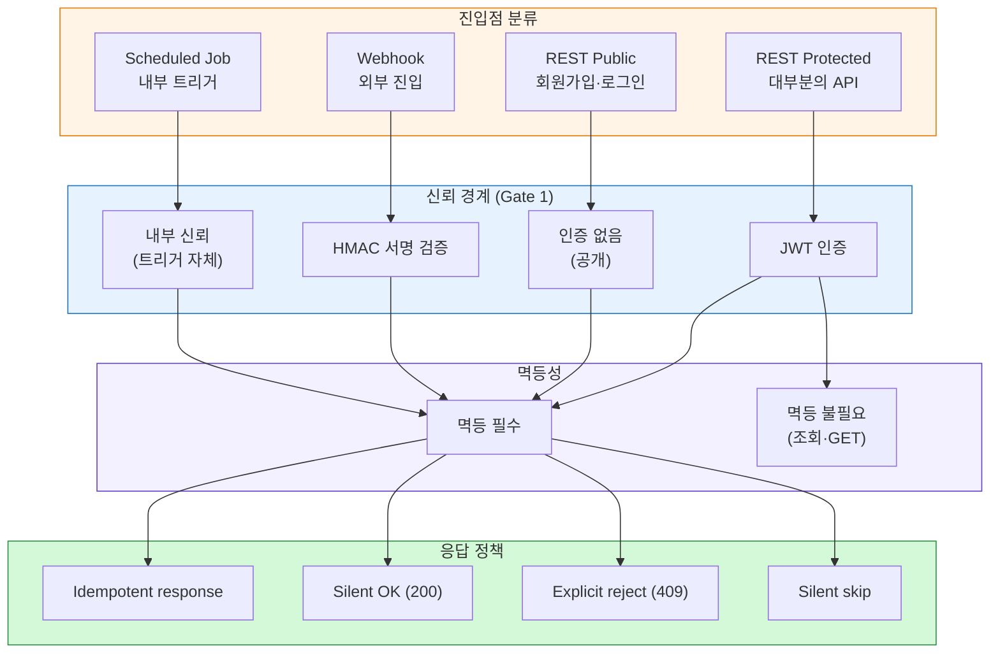

## API Topology

# API Topology

> 이 문서는 본 시스템의 **API의 위상**을 정의한다.
진입점·URL·메서드·DTO/응답이 *어떤 원칙으로 배치되는가*에 집중한다.
Layer 2의 Area Topology에 속한다 — 본 프로젝트의 핵심 진입점에 특화.
구체 어휘(URL 경로·DTO 클래스명·필드명)는 의도적으로 배제. 그건 OpenAPI 명세와 코드가 source of truth.
*HTTP 표준 어휘*(메서드 이름·상태 코드·헤더 이름)는 사용.
>
>
> **Part 1/2** (이 문서): 구조와 표현 (선언·매트릭스·진입점·URL·메서드·DTO/응답)
> **Part 2/2**: 정책과 운영 (인증·멱등성·Webhook·진화·안티패턴·점검·부록)
>

---

## 0. One-Line Declaration

> **모든 API 진입점은 진입점 분류·신뢰 경계·멱등성 정책을 가지며, URL은 Aggregate Root만 노출한다. 응답은 항상 DTO이고, 에러는 표준 구조로만 반환한다. 액션 엔드포인트는 결제 도메인의 상태 전이에 한해 허용한다.**
>

API는 *시스템의 표면적*. 표면적의 일관성이 *결정 비용·신뢰·디버깅 비용*을 결정한다.

---

## 1. API 결정의 매트릭스



**다이어그램 읽는 법**

- 진입점 → 신뢰 경계 → 멱등성 → 응답 정책의 *결정 흐름*
- 새 API 추가 시 이 흐름을 따라 *4가지 분류* 모두 결정해야 함

---

## 2. 진입점 분류와 위상

### 2-1. 진입점 종류 분류 (A-1)

본 프로젝트의 4가지 진입점:

| 진입점 | 정의 | 호출자 |
| --- | --- | --- |
| **REST Protected** | 인증된 사용자의 자원 조작 | 우리 시스템의 클라이언트 (브라우저·앱) |
| **REST Public** | 인증 없이 접근 가능 | 익명 사용자 |
| **Webhook** | 외부 시스템의 능동적 통지 수신 | PortOne 등 외부 시스템 |
| **Scheduled Job** | 시스템 내부의 시간 기반 트리거 | 우리 시스템 자체 |

**원칙**: 모든 새 API는 *위 4가지 중 하나*에 분류됨. 분류되지 않는 진입점은 *새 카테고리를 추가*하는 것이 첫 단계.

### 2-2. 본 프로젝트 진입점 카탈로그 (A-2)

> 본 카탈로그는 *현재 시점의 진단*. 새 API 추가 시 갱신 (Part 2 9-1).
>

| 컨텍스트 | 카테고리 | 진입점 분류 |
| --- | --- | --- |
| **Auth** | 회원가입 / 로그인 / 토큰 재발급 | REST Public |
| **Auth** | 회원 정보 조회·수정 / 탈퇴 | REST Protected |
| **Product** | 상품 목록·상세 조회 | REST Public 또는 Protected (정책 결정) |
| **Cart** | 장바구니 조회·추가·수정·삭제 | REST Protected |
| **Order** | 주문 생성·조회·취소 | REST Protected |
| **Payment** | 결제 확정 (Confirm API) | REST Protected |
| **Payment** | 결제 결과 통지 수신 | Webhook |
| **Refund** | 환불 요청·조회 | REST Protected |
| **Point** | 포인트 잔액 조회·내역 조회 | REST Protected |
| **Membership** | 멤버십 등급 조회 | REST Protected |
| **Subscription** (도전) | 구독 시작·해지·조회 | REST Protected |
| **Subscription** (도전) | 정기 결제 실행 | Scheduled Job |

**관찰**

- *대부분이 REST Protected* — 인증된 사용자 자원 조작
- *Webhook은 결제 결과 통지 하나*. 외부 진입이 단일 채널
- *Scheduled Job은 구독 정기 결제 하나*. 도전 기능

### 2-3. 진입점별 신뢰 경계 매핑 (A-3)

`trust-design-topology-part1` Gate 1과 정확히 일치.

| 진입점 | Gate 1 검증 항목 | 통과 시 신뢰 수준 |
| --- | --- | --- |
| **REST Protected** | JWT 검증 + Bean Validation | UNTRUSTED → SEMI-TRUSTED |
| **REST Public** | Bean Validation만 | UNTRUSTED → SEMI-TRUSTED |
| **Webhook** | HMAC 서명 검증 + 페이로드 형식 | UNTRUSTED → SEMI-TRUSTED |
| **Scheduled Job** | (트리거 자체가 내부) | SEMI-TRUSTED (시작점) |

**원칙**: 진입점이 결정되면 신뢰 경계 정책이 *자동 따라옴*. 분리해서 결정하지 않음.

---

## 3. URL 구조와 자원 명명

### 3-1. 자원 식별 위상 (B-1)

**원칙**: URL은 *Aggregate Root만* 식별. Internal Entity는 *AR을 통한 nested*로만.

**자원 식별의 위계**

| 위계 | 표현 | 본 프로젝트 예시 위상 |
| --- | --- | --- |
| **컨텍스트 prefix** | `/{context}/...` | `/orders/`, `/payments/`, `/refunds/` |
| **AR 컬렉션** | `/{resources}` | `/orders` (목록) |
| **AR 단일** | `/{resources}/{id}` | `/orders/{orderId}` |
| **AR 액션** | `/{resources}/{id}/{action}` | `/payments/{id}/confirm` (4-2 참조) |
| **Nested (제한적)** | `/{parents}/{pid}/{children}` | 거의 사용 안 함 (3-2 참조) |

**원칙**

- URL의 ID는 *AR의 strong identity* (table-relationship 3-4)
- *외부 노출 가능한 ID*만 URL에 등장 (trust-design 4-3)
- Internal Entity의 ID는 URL에 *직접 등장 안 함*

### 3-2. 자원 계층 깊이 정책 (B-2)

**원칙**: **얕은 계층 유지.** Nested resource는 *최대 1단계*까지.

**권장 패턴**

- ✅ `/orders/{orderId}` (단일 AR)
- ✅ `/orders/{orderId}/cancel` (액션)
- 🔶 `/orders/{orderId}/items` (Order의 OrderItem 목록 조회 — Read에 한정 OK)
- ❌ `/orders/{orderId}/items/{itemId}/details/{detailId}` (3단계 이상 비추천)

**얕은 계층 선호 이유**

- 깊은 URL은 *변경에 취약* — 중간 계층 변경 시 모든 하위 URL 영향
- *클라이언트 측 URL 구성 복잡도* 증가
- *Aggregate 경계가 흐려질 위험* — 깊은 nested는 Internal Entity 노출 유혹

### 3-3. Aggregate 경계와 URL의 관계 (B-3)

**원칙**: URL의 *resource*는 *Aggregate Root*. 그 외 등장 안 함.

**구체 정책**

- AR마다 *컬렉션 URL (`/orders`)*과 *단일 URL (`/orders/{id}`)*을 가짐
- Internal Entity는 *URL의 path segment로 직접 등장 안 함*
- Internal Entity 정보는 *AR 응답의 nested 필드*로만 제공

**예외 인정**

- *Read 전용*으로 Internal Entity 목록 조회가 매우 자주 필요한 경우 → `/orders/{id}/items` 같은 nested 조회 OK
- 그러나 *수정 작업*은 AR을 통해서만: `PATCH /orders/{id}` (body에 items 포함)

### 3-4. 컨텍스트 경계와 URL prefix

**원칙**: URL prefix가 *컨텍스트 경계와 일치*. 한 prefix는 한 컨텍스트만.

**구체**

- `/orders/*` → Order 컨텍스트
- `/payments/*` → Payment 컨텍스트
- 한 URL이 *여러 컨텍스트의 자원을 동시에 다루지 않음*
- 다중 컨텍스트 작업은 *각 컨텍스트의 API를 순차 호출*하거나 *해당 컨텍스트가 조율*

---

## 4. HTTP 메서드와 의미

### 4-1. 메서드 의미 매트릭스 (C-1)

| 메서드 | 의미 | 멱등성 | 안전성 | 본 프로젝트 사용 |
| --- | --- | --- | --- | --- |
| **GET** | 자원 조회 | ✅ | ✅ | ✅ 모든 조회 |
| **POST** | 자원 생성 또는 액션 | ❌ 기본 비멱등 (본 프로젝트는 멱등화) | ❌ | ✅ 생성·액션 |
| **PUT** | 자원 전체 교체 | ✅ | ❌ | 🔶 거의 사용 안 함 (대신 PATCH) |
| **PATCH** | 자원 부분 수정 | 🔶 멱등 권장 (보장 안 됨) | ❌ | ✅ 부분 수정 |
| **DELETE** | 자원 삭제 | ✅ | ❌ | 🔶 제한적 (Soft delete가 기본) |

**원칙**

- *GET은 항상 안전 + 멱등* — 사이드 이펙트 절대 없음
- *POST는 비멱등 기본이지만 본 프로젝트는 멱등화* — 결제·환불 critical (4-3 참조)
- *PUT vs PATCH*: 본 프로젝트는 *PATCH 위주*. 전체 교체보다 부분 수정이 일반적
- *DELETE는 제한적*: Soft delete가 기본이므로 *실제 DELETE는 거의 없음*. 대신 *상태 전이*로 표현 (예: 주문 취소는 `POST /orders/{id}/cancel`)

### 4-2. 액션 vs 자원 표현 (C-2)

**본 프로젝트 정책**: **액션 엔드포인트 허용** (조건부).

**순수 RESTful의 한계**

- 결제 도메인은 *상태 전이*가 비즈니스 의미 (결제 확정·환불·구독 해지 등)
- 순수 RESTful로 표현하려면 *PATCH로 상태 필드만 변경* — *어떤 작업인지가 흐려짐*
- 액션 동사가 *명세 가독성·디버깅·로깅* 모두에서 우월

**액션 엔드포인트 허용 기준**

| 조건 | 정책 |
| --- | --- |
| 비즈니스 상태 전이를 표현 | ✅ 허용 (`/payments/{id}/confirm`, `/subscriptions/{id}/cancel`) |
| 멱등성·검증 정책이 일반 PATCH와 다름 | ✅ 허용 (액션이 별도 의미 가짐) |
| 단순 필드 수정 | ❌ 비추천 — PATCH 사용 |
| 일반 CRUD 표현 가능 | ❌ 비추천 — 표준 메서드 사용 |

**액션 엔드포인트의 일관성 규칙**

- URL: `/{resources}/{id}/{action-verb}`
- 메서드: **항상 POST** (자원 상태 변경이므로)
- 액션 이름: *동사 원형* (cancel, confirm, refund) — 시제 통일

**본 프로젝트 액션 엔드포인트 예시 위상**

- `POST /payments/{id}/confirm` — 결제 확정
- `POST /orders/{id}/cancel` — 주문 취소
- `POST /refunds/{id}/cancel` — 환불 취소 (만약 있다면)
- `POST /subscriptions/{id}/cancel` — 구독 해지

### 4-3. POST의 멱등성 보장 메커니즘 (C-3) — **가장 미묘한 결정**

**문제**: POST는 *HTTP 의미상 비멱등*. 그러나 결제·환불·주문 생성은 *반드시 멱등*이어야 함.

**해결 메커니즘** (idempotency-design-topology 카탈로그)

| 멱등 지점 | 메커니즘 | API 측면 표현 |
| --- | --- | --- |
| **결제 확정 (Confirm)** | `portonePaymentId`로 멱등 + DB UNIQUE | 같은 ID로 N회 호출 → 같은 응답 |
| **주문 생성** | 서버 채번 + 응답에 orderId 포함 | 클라이언트가 중복 요청 시 새 주문 생성 가능성 (4-4 참조) |
| **환불 요청** | 비즈니스 식별자 (orderId + 환불 대상) | 잔여 환불 가능 수량 검증으로 중복 차단 |
| **장바구니 추가** | (회원 ID + 상품 ID) 합산 | 수량 합산이 자연스러운 멱등 |
| **회원가입** | 이메일 UNIQUE | 중복 시 명시적 거부 (409) |

### 4-4. 주문 생성의 멱등성 특수성

**문제**: 주문 생성 POST는 *멱등하기 어려움*. 같은 요청 두 번이면 *두 주문이 정상*인 경우도 있음 (같은 상품 두 번 사고 싶을 때).

**대응 옵션**

| 옵션 | 설명 | 본 프로젝트 채택 |
| --- | --- | --- |
| **클라이언트 측 더블 클릭 방지** | 프론트엔드가 버튼 비활성화 | ✅ UX 보조 |
| **Idempotency-Key 헤더** | 클라이언트가 요청마다 키 생성 | ❌ 채택 안 함 (idempotency-design 4-2) |
| **서버 사이드 짧은 window 멱등** | N초 안에 같은 사용자의 같은 요청 차단 | 🔶 고려 가능 (운영 단계) |
| **자연스러운 멱등 없음** | 같은 요청 두 번이면 두 주문 정상 | ✅ 본 프로젝트 표준 |

**원칙**: 주문 생성은 *완전한 멱등 보장 안 함*. 사용자가 *실수로 두 번 누르면 두 주문이 정상*. 결제 단계에서 *결제 확정 멱등성*이 안전망.

---

## 5. 요청/응답 형식

### 5-1. Request DTO 정책 (D-1)

**원칙**: 모든 요청 본문은 *명시적 DTO*. Entity를 직접 받지 않음.

**구체**

- 각 엔드포인트가 *자기 전용 Request DTO* 가짐
- DTO에 Bean Validation 어노테이션 적용 (`@NotNull`, `@Size` 등)
- DTO는 *Inbound Layer*에 속함. Domain·Persistence와 분리.

**예외 없음**: 본 프로젝트의 모든 변경 작업이 DTO 사용.

### 5-2. Response DTO 정책 (D-2)

**원칙**: 모든 응답은 *명시적 DTO*. Entity를 *절대 직접 반환하지 않음*.

**근거** (trust-design 9-1)

- Entity 직접 반환 시 *민감 필드 노출 위험*
- Internal 구조 노출 → 변경에 취약
- Lazy loading 위험 (트랜잭션 외부 직렬화)

**구체**

- 각 응답이 *자기 전용 Response DTO* 가짐
- DTO에 *노출 가능한 필드만* 포함 (마스킹보다 *제거*가 우선)
- Internal Entity ID는 *외부에 노출하지 않음* (table-relationship 3-4)

### 5-3. 응답 구조 표준 (D-3)

**원칙**: 모든 응답이 *일관된 구조*. 클라이언트의 응답 파싱 비용 절감.

**표준 구조 (성공 응답)**

| 영역 | 의미 |
| --- | --- |
| **data** | 실제 응답 데이터 (DTO) |
| **meta** (선택적) | 페이지네이션·총 개수·서버 시각·요청 ID |

**원칙**

- 단순 응답은 *data*만
- 목록·페이지네이션이 있으면 *data + meta*
- 추가 정보 필요 시 *meta에 추가* (응답 스키마 변경 최소)

**상태 코드 정책**

| 상황 | HTTP 코드 |
| --- | --- |
| 정상 조회 | 200 OK |
| 정상 생성 | 201 Created |
| 정상 처리 (멱등 응답 포함) | 200 OK |
| 비동기 수락 | 202 Accepted (현재 사용 안 함) |
| 처리 완료 + 응답 본문 없음 | 204 No Content |

### 5-4. 에러 응답 표준 (D-4) — **error-handling 4장의 API 표현**

**원칙**: *모든 에러 응답이 동일한 구조*. 클라이언트가 *일관되게 파싱·표시*.

**표준 에러 구조**

| 필드 | 의미 |
| --- | --- |
| **errorCode** | 비즈니스 에러 코드 (애플리케이션 정의) |
| **message** | 사용자 노출 가능한 메시지 (i18n 가능) |
| **details** (선택적) | 추가 정보 (필드별 검증 실패 등) |

**HTTP 상태 코드 정책** (error-handling-topology 4-4 + trust-design)

| 상황 | HTTP 코드 | 사용 예 |
| --- | --- | --- |
| **검증 실패 (형식)** | 400 | 필수 필드 누락·타입 오류 |
| **인증 실패** | 401 | JWT 무효·만료 |
| **인가/소유권 위반** | 403 | 남의 주문 접근 시도 |
| **자원 없음** | 404 | 존재하지 않는 ID |
| **충돌 (멱등성·상태)** | 409 | 이미 처리됨·잘못된 상태 전이 |
| **요청 본문 처리 불가** | 422 | 비즈니스 규칙 위반 (잔액 부족 등) |
| **내부 서버 에러** | 500 | 예상 못 한 예외 |
| **외부 시스템 장애** | 502/503 | PortOne 장애 등 |

**중요 원칙**

- *내부 정보 노출 금지* (스택 트레이스·DB 컬럼명 등) — 안티패턴 M-5
- *401 vs 403 구분 명시* — 401은 *누구인지 모름*, 403은 *알지만 권한 없음*
- *404 vs 403 구분* — 자원 존재 여부를 *권한 없는 사용자에게* 알려야 하는가는 정책 결정 (보안 우선 시 *모두 404*도 가능)

### 5-5. 페이지네이션 정책 (D-5)

**원칙**: **Cursor 기반 페이지네이션 권장** (Offset 기반은 보조).

**근거**

- 결제·환불·포인트 내역 같은 *시간 기반 조회*가 많음 — Cursor 자연스러움
- Offset은 *데이터 증가 시 성능 저하* (skip이 느림)
- Cursor는 *중복·누락 없음* (Offset은 데이터 추가 시 발생 가능)

**구체 정책**

- 기본 페이지네이션 방식: Cursor (시간 + ID 조합)
- 페이지 크기 기본값 명시 (예: 20)
- 페이지 크기 상한 명시 (예: 100)
- *meta*에 다음 cursor 포함

**Offset 사용 영역**

- 관리자 화면의 *전체 목록 페이지*
- 페이지 번호 표시가 필수인 경우 (UX 결정)

**원칙**: *Cursor·Offset 둘 다 지원하지 않음*. 엔드포인트마다 *하나의 방식*만.

---

## 6. 인증과 인가의 API 표현

### 6-1. 인증 방식 (E-1)

**원칙**: **JWT Bearer 토큰** (Header 기반).

**구체**

- HTTP `Authorization` 헤더: `Bearer {token}` 형식
- 토큰 검증은 *Filter 단계* (cross-cutting-concerns 3-1)
- Controller 메서드는 *이미 인증된 상태*에서 시작

**자세한 정책**: `auth-topology` (예정) 참조.

### 6-2. 인증 필요/불필요 API 분류 (E-2)

| 분류 | 적용 영역 | 인증 방식 |
| --- | --- | --- |
| **REST Public** | 회원가입 / 로그인 / 토큰 재발급 / (선택) 상품 조회 | 없음 |
| **REST Protected** | 그 외 모든 비즈니스 API | JWT |
| **Webhook** | 외부 시스템 진입 | HMAC 서명 검증 (JWT 아님) |
| **Scheduled Job** | (외부 호출 안 받음) | 해당 없음 |

**원칙**: *기본은 Protected*. Public은 *명시적 예외*. 새 API 추가 시 *왜 Public인지 정당화*.

### 6-3. 인가 정보의 API 표현 (E-3)

**핵심 결정**: 401 vs 403 vs 404의 분기.

| 상황 | HTTP 코드 | 의미 |
| --- | --- | --- |
| **인증 정보 없음·만료·무효** | 401 Unauthorized | "당신이 누구인지 모릅니다" |
| **인증됐지만 권한 없음** | 403 Forbidden | "당신을 알지만 이 작업은 안 됩니다" |
| **자원이 존재하지 않음** | 404 Not Found | "그 자원 없습니다" |

**미묘한 결정: 소유권 위반 시 응답**

남의 자원 접근 시도 시 *어떤 응답*을 줄지의 결정:

| 옵션 | 응답 | 트레이드오프 |
| --- | --- | --- |
| **명시적 403** | "권한 없음" | 명확함 / *자원 존재 여부 노출* |
| **404로 위장** | "찾을 수 없음" | 보안 우선 / *디버깅 어려움* |
| **혼합 (정책 결정)** | 영역별 차등 | 일관성 손상 |

**본 프로젝트 권장**: **403 명시** — 결제 도메인 사용자가 *자기 자원 접근 시 명확한 에러*가 필요. *완전 보안*은 결제 도메인 우선순위가 아님.

**원칙**: 어떤 정책이든 *일관성 유지*. 한 곳은 403, 다른 곳은 404로 위장은 안 됨.

---

## 7. 멱등성과 API

### 7-1. 진입점별 멱등성 정책 (F-1)

idempotency-design 3-2 카탈로그의 *API 측면*.

| 진입점 종류 | 멱등성 정책 |
| --- | --- |
| **GET (모든 종류)** | ✅ 본질적 멱등 (별도 처리 불필요) |
| **POST (상태 변경)** | ✅ 멱등 보장 필수 |
| **POST (자원 생성)** | 🔶 영역별 결정 (주문 생성 등은 자연 멱등 어려움) |
| **PATCH** | 🔶 권장 (보장 안 됨) |
| **DELETE** | ✅ 본질적 멱등 (이미 삭제됐으면 그냥 200) |
| **Webhook** | ✅ 멱등 필수 (외부 재시도) |
| **Scheduled Job** | ✅ 멱등 필수 (중복 실행) |

### 7-2. 멱등성 키 전달 방식 (F-2)

**본 프로젝트는 별도 멱등성 키 헤더 사용 안 함** (idempotency-design 4-2).

**대신 사용하는 키 출처**

| 멱등 작업 | 키 출처 | API 측면 표현 |
| --- | --- | --- |
| **결제 확정** | `portonePaymentId` (서버 채번) | URL path 또는 body |
| **환불 요청** | (orderId + 환불 대상 + 수량) | request body |
| **회원가입** | 이메일 | request body |
| **장바구니 추가** | (회원 ID + 상품 ID) | URL + body |
| **구독 청구** | (구독 ID + 청구 주기) | 내부 트리거 (API 아님) |

**원칙**: 비즈니스 식별자 또는 서버 채번 ID가 *자연스럽게 멱등 키 역할*. 별도 `Idempotency-Key` 헤더 도입 시 *복잡도만 증가*.

**향후 가능성**: 외부 파트너 API 도입 시 *Idempotency-Key 헤더 도입* 검토 (ADR).

### 7-3. 멱등 응답의 HTTP 상태 코드 (F-3)

idempotency-design 6-3과 결합. 4가지 응답 정책의 API 표현:

| 응답 정책 | HTTP 코드 | 적용 예 |
| --- | --- | --- |
| **Idempotent response** | 200 OK (또는 201 일관) | 결제 확정 — 첫·두 번째 호출 모두 동일 응답 |
| **Silent OK** | 200 OK | Webhook 결제 통지 — 처리됨·이미 처리됨 모두 200 |
| **Explicit reject** | 409 Conflict | 이미 가입된 이메일·이미 환불 처리됨 |
| **Silent skip** | (응답 없음 — 내부 트리거) | Scheduled Job 중복 실행 |

**미묘한 결정: 첫 처리 vs 두 번째 호출의 상태 코드**

| 옵션 | 첫 처리 | 두 번째 호출 | 트레이드오프 |
| --- | --- | --- | --- |
| **일관 200** | 200 | 200 | 단순·일관 / 첫 생성 명시 손실 |
| **차별화 (201 vs 200)** | 201 Created | 200 OK | RESTful 의미 / 클라이언트 분기 복잡 |

**본 프로젝트 권장**: **일관 200**. 클라이언트가 *코드 분기 없이 동일하게 처리*. 단순성 우선.

**예외**: 명시적으로 *새 자원 생성*을 강조해야 하는 경우 201 사용. 그러나 *첫 vs 두 번째* 구분에 사용하지 않음.

---

## 8. Webhook의 API 위상

### 8-1. Webhook 엔드포인트의 특수성 (G-1)

**일반 API와 다른 점**

| 측면 | REST Protected | Webhook |
| --- | --- | --- |
| **호출자** | 우리 클라이언트 | 외부 시스템 |
| **인증** | JWT | HMAC 서명 |
| **응답 시간 제약** | 사용자 인내력 (수 초) | 외부 타임아웃 (보통 짧음, 수 초) |
| **재시도 정책** | 클라이언트가 결정 | 외부 시스템이 자동 재시도 |
| **페이로드 신뢰** | 비교적 신뢰 (JWT 검증 후) | *서명 OK라도 페이로드 비신뢰* (재조회 필수) |

**자세한 정책**: `trust-design-topology-part1` 7장 (외부 시스템 신뢰).

### 8-2. Webhook 응답 코드 정책 (G-2) — **본 프로젝트 가장 미묘한 결정**

**원칙**: PortOne의 재시도 정책을 의식한 *4분류 응답*.

| 상황 | HTTP 코드 | 외부 시스템 동작 |
| --- | --- | --- |
| **정상 처리 완료** | 200 OK | 재시도 안 함 |
| **이미 처리됨 (멱등 응답)** | 200 OK (Silent OK) | 재시도 안 함 |
| **검증 실패 — 영구 (서명 위조 등)** | 4xx (400 또는 401) | 재시도 안 함 |
| **검증 실패 — 일시 (재조회 실패 등)** | 5xx (500 또는 503) | 재시도 받음 |

**핵심 규칙**

| 규칙 | 이유 |
| --- | --- |
| **이미 처리됨 → 200** | PortOne 무한 재시도 방지 |
| **위변조 의심 → 4xx** | 재시도 받아도 의미 없음 |
| **일시 장애 → 5xx** | 재시도가 성공 가능성 있음 |
| **우리 측 처리 실패 → 5xx** | 외부 시스템에 알려 재시도 유도 |

**이 분류가 흐려지면**

- 200을 주지 않으면 → PortOne 무한 재시도 → 우리 시스템 부하 + 멱등 검증 비용 누적
- 5xx를 주지 않으면 → 일시 장애 시 영구 손실 → 데이터 불일치
- 4xx를 주지 않으면 → 위변조 페이로드도 무한 재시도

### 8-3. Webhook 처리 시간 제약 (G-3)

**원칙**: Webhook은 *짧은 시간 안에* 200 응답. 무거운 처리는 *비동기 분리*.

**구체 정책**

| 작업 | 동기/비동기 |
| --- | --- |
| **서명 검증** | 동기 (즉시) |
| **portonePaymentId 추출** | 동기 |
| **PortOne 재조회** | 동기 (외부 호출이지만 필요) |
| **멱등성 검사** | 동기 |
| **결제 확정 트랜잭션** | 동기 (Phase 2, 짧음) |
| **AFTER_COMMIT 부수 효과** | 비동기 (이벤트 핸들러) |
| **알림 발송 등** | 비동기 (이벤트 핸들러) |

**원칙**: Webhook 처리의 *core path*는 짧게 (수 초 이내). 부수 효과는 *AFTER_COMMIT 이벤트로 분리* (tx-topology 8장).

**향후 검토**: 트래픽 증가 시 *Webhook을 메시지 큐로 enqueue*하고 200 응답 즉시 반환하는 패턴. 현재는 *동기 처리 + AFTER_COMMIT 이벤트*로 충분.

---

## 9. API 진화 정책

### 9-1. 새 API 추가 시 절차 (L-1)

**PR 게이트 체크리스트**

- [ ]  어느 컨텍스트에 속하는가? (`context-dependency-graph-topology` 매핑 확인)
- [ ]  진입점 분류는? (Part 1 2-1의 4가지 중)
- [ ]  신뢰 경계 정책은? (Part 1 2-3 매핑)
- [ ]  URL이 *AR만 노출*하는가? Internal Entity가 URL에 직접 등장하지 않는가?
- [ ]  HTTP 메서드 선택이 정책과 일치하는가? (Part 1 4-1)
- [ ]  액션 엔드포인트라면 *4-2 허용 기준* 만족하는가?
- [ ]  Request·Response DTO가 정의되어 있는가? Entity 직접 노출 안 되는가?
- [ ]  응답 구조 표준 (data + meta) 따르는가? (Part 1 5-3)
- [ ]  에러 응답 표준 (errorCode + message + details) 따르는가? (Part 1 5-4)
- [ ]  상태 변경 작업이면 *멱등성 정책*이 명시되었는가? (7-1)
- [ ]  진입점 카탈로그(Part 1 2-2)가 갱신되었는가?

### 9-2. API 변경의 영향 분류

| 변경 | 영향 | 정책 |
| --- | --- | --- |
| **새 필드 추가 (선택적)** | Non-breaking | ✅ 자유 변경 |
| **선택적 필드 → 필수** | Breaking | ❌ 마이그레이션 또는 새 엔드포인트 |
| **필드 제거** | Breaking | ❌ Deprecation 절차 (운영 후) |
| **타입 변경** | Breaking | ❌ 새 엔드포인트 |
| **HTTP 메서드 변경** | Breaking | ❌ 새 엔드포인트 |
| **URL 구조 변경** | Breaking | ❌ 새 엔드포인트 |
| **에러 코드 추가** | Non-breaking (보통) | ✅ 자유 변경 |

**현재 단계**: MVP라 *Breaking change 자유로움*. 운영 시작 후 *호환성 정책 강화*.

---

## 10. 안티패턴

### 10-1. Entity 직접 노출 (M-1)

**증상**: Response가 JPA Entity를 그대로 반환.

**위험**

- 민감 필드 노출 (createdBy·deletedAt 등 의도하지 않은 필드)
- Internal 구조 변경 시 *클라이언트 영향*
- Lazy loading 트랜잭션 외부 트리거 → 예외

**대응**: 모든 응답에 *명시적 DTO*. Entity 직접 반환 금지.

### 10-2. Internal Entity ID 노출 (M-2)

**증상**: OrderItem의 ID 같은 *AR에 종속된 Entity ID*를 외부 API에 노출.

**위험** (table-relationship 3-4)

- 클라이언트가 *그 ID로 직접 조작* 시도 — Aggregate 경계 무력화
- ID 형식 변경 시 영향 광범위

**대응**: 외부 API에는 *AR ID만* 노출. Internal Entity는 *AR을 통해서만* 접근.

### 10-3. 멱등성 없는 결제·환불 API (M-3)

**증상**: 같은 결제 확정 요청을 두 번 보내면 *두 번 처리*.

**위험**

- 더블 클릭 → 이중 결제 (PortOne은 멱등이라 안 됨이지만 우리 측 부수 효과는 이중)
- 재전송 → 이중 적립
- Webhook 재시도 → 이중 처리

**대응** (idempotency-design 5-2): DB UNIQUE + 사전 조회 이중 보장. S+급 멱등성.

### 10-4. 액션 엔드포인트 남용 (M-4)

**증상**: *모든* 작업이 `/resources/{id}/action` 형태. PATCH·PUT 사용 안 함.

**위험**

- RESTful 의미 손실
- 단순 필드 수정도 *액션 엔드포인트*가 되어 일관성 손상
- HTTP 캐시·중간 프록시의 의미 손실

**대응**: 액션 엔드포인트는 *비즈니스 상태 전이*에만 (Part 1 4-2 허용 기준). 단순 수정은 PATCH.

### 10-5. 에러 응답에 내부 정보 노출 (M-5)

**증상**: 500 응답에 스택 트레이스·DB 컬럼명·내부 구조 노출.

**예**

```
{"error": "java.sql.SQLException: Duplicate entry 'a@example.com' for key 'users.email_unique'"}
```

**위험**

- 시스템 구조 노출 → 공격 표면 확대
- 사용자 혼란 (기술 메시지)
- *PII 노출 가능성* (예제 이메일이 진짜 이메일)

**대응**: 에러 응답 표준 (Part 1 5-4) 사용. 내부 정보는 *로그에만*, 외부 응답은 *사용자 노출 가능 메시지*만.

### 10-6. 다른 사용자 데이터 silent 반환 (M-6)

**증상**: 소유권 검증 누락으로 *남의 자원이 자기 자원처럼* 응답.

**예**: `GET /orders/{id}`에서 `id`가 다른 사용자 것인데 *403 없이 데이터 반환*.

**위험**

- *개인정보 노출 사고*
- 결제 정보·주소 등 *법적 리스크*

**대응**: 모든 조회·수정 API에 *명시적 소유권 검증* (cross-cutting-concerns 3-2). AOP 아닌 명시적 코드.

### 10-7. Webhook을 동기 처리로 무겁게 (M-7)

**증상**: Webhook 처리가 *수십 초* 걸려 외부 타임아웃 발생.

**위험**

- 외부 시스템이 *5xx로 인지* → 재시도 → 중복 처리 부담
- 우리 시스템은 *처리 완료했는데* 외부는 재시도

**대응** (8-3 정책): Webhook *core path*는 짧게. 부수 효과는 AFTER_COMMIT 이벤트로 비동기.

---

## 11. 위반 감지

| 감지 방식 | 적용 |
| --- | --- |
| **API 통합 테스트** | 응답 구조·상태 코드·에러 응답 표준 검증 |
| **OpenAPI 명세 검증** | Entity 노출·Internal ID 노출 정적 검증 |
| **계약 테스트** | 클라이언트와 *API 계약* 일치 검증 |
| **소유권 검증 테스트** | 다른 사용자 자원 접근 시 403 검증 |
| **Webhook 응답 코드 테스트** | 4분류 응답 (200·4xx·5xx) 검증 |
| **PR 리뷰 체크리스트** | 9-1 게이트 |

**현재 단계 적용**

- 핵심 시나리오 통합 테스트 — 가장 critical
- 소유권 검증 테스트 — 보안 critical
- Webhook 응답 코드 테스트 — 외부 재시도 정책 검증

---

## 12. 이 topology가 다루지 않는 것

| 다루지 않는 것 | 어디에 있는가 |
| --- | --- |
| 구체 URL 경로 (`/api/v1/...`) | OpenAPI 명세 + 코드 |
| 필드 명명 컨벤션 (camelCase 등) | 코딩 컨벤션 |
| CORS·보안 헤더 정책 | 보안 정책 문서 |
| Rate Limiting·Throttling | 운영 정책 (MVP 후) |
| API 응답 시간 SLO | 운영 topology (예정) |
| OpenAPI 자동 생성 | 개발 가이드 |
| 클라이언트 SDK 정책 | 별도 결정 (현재 의미 낮음) |
| 버전 관리 (`/v1`, `/v2`) | MVP 후 결정 |
| Deprecation 정책 | 운영 후 결정 |
| JWT 토큰 형식·refresh | `auth-topology` (예정) |
| HMAC 알고리즘·키 관리 | `payment-topology` (예정) |
| 인증·인가의 코드 위치 | `cross-cutting-concerns-location-topology` |
| 트랜잭션·외부 호출 시퀀스 | `tx-topology` |

---

## 13. 자가 점검 질문

1. 새 API가 4가지 진입점 분류(Part 1 2-1) 중 *명시적으로* 분류되었는가?
2. URL에 Internal Entity ID가 *직접 등장*하지 않는가? (M-2)
3. 자원 계층이 *2단계 이상* 깊은 URL이 있는가?
4. POST의 *멱등성 정책*이 명시되었는가? (7-1)
5. Response가 Entity를 *직접 반환*하는 곳이 있는가? (M-1)
6. 에러 응답이 *내부 정보를 노출*하는가? (M-5)
7. 401·403·404가 *일관된 의미*로 사용되는가?
8. 소유권 검증이 *누락*된 조회·수정 API가 있는가? (M-6)
9. Webhook 응답이 *4분류 (200/4xx/5xx)*를 따르는가? (G-2)
10. Webhook *core path*가 짧은가? 무거운 작업이 AFTER_COMMIT 이벤트로 분리되었는가?
11. 액션 엔드포인트가 *허용 기준* 만족하는가? (Part 1 4-2)
12. 진입점 카탈로그(Part 1 2-2)가 *현재 코드와 일치*하는가?
13. 새 API 추가 시 9-1 PR 게이트가 통과되었는가?

---

## 14. 변경 정책

이 문서는 Layer 2 Area Topology다. API 구조와 정책은 비교적 안정적이지만 새 API 추가 시 갱신.

- **자유롭게 변경 가능**: 자가 점검 질문, 다이어그램 시각 표현
- **PR 게이트 통과 필요**: 진입점 카탈로그(Part 1 2-2) 갱신, 새 API의 4분류 명시
- **ADR 필요**: 새 진입점 종류 추가, 액션 엔드포인트 허용 기준 변경, 멱등성 키 헤더(`Idempotency-Key`) 도입, 버전 관리 정책 도입, Webhook 응답 코드 정책 변경
- **거의 발생 안 함**: 4가지 진입점 분류, "URL은 AR만 노출" 원칙, "Entity 직접 노출 금지", DTO 필수, 표준 에러 응답 구조, Webhook 4분류 응답

---

## 부록 A: 이 문서가 구현하는 가치

`system-value-topology`의 다음 가치와 결합:

- **신뢰 (Tier 1)**: 인증·인가의 명시적 응답 코드. 에러 응답에 내부 정보 노출 차단. 소유권 검증 강제.
- **멱등성 (Tier 1)**: 진입점별 멱등성 정책. POST 멱등화 메커니즘 명시.
- **추적성 (Tier 1)**: 표준 에러 응답 + correlation ID로 모든 요청 추적.
- **명료성 (Tier 2)**: 표준 응답 구조·표준 에러 구조·URL 위계 — 클라이언트의 *예측 가능성*.
- **복잡도 관리 (Tier 2)**: 진입점 4종 분류 + 매트릭스로 *결정 비용 절감*. 새 API의 정책이 자동 따라옴.
- **협력 (Tier 2)**: 일관된 API 표면 → *AI·신규 개발자가 패턴 즉시 인지*.

---

## 부록 B: 다른 Topology와의 관계

**Trust Design Topology — 가장 직접적 관계**

- 본 문서 Part 1 2-3 (신뢰 경계 매핑)은 trust-design Gate 1과 일치
- 본 문서 5-4 (에러 응답)는 trust-design 6장 인가/소유권의 API 표현
- 본 문서 8-1 (Webhook 페이로드 비신뢰)는 trust-design 7-3 재조회 패턴

**Idempotency Design Topology**

- 본 문서 7-1 (진입점별 멱등성)은 idempotency-design 3-2 카탈로그의 API 측면
- 본 문서 7-2 (키 전달 방식)는 idempotency-design 4-2 키 출처 결정의 API 표현
- 본 문서 7-3 (멱등 응답 코드)는 idempotency-design 6-1 응답 정책의 HTTP 표현

**Context Dependency Graph Topology**

- 본 문서 Part 1 3-4 (컨텍스트 prefix)는 context-dependency 컨텍스트 경계의 URL 표현

**Table Relationship Graph Topology**

- 본 문서 Part 1 3-3 (Aggregate 경계와 URL)은 table-relationship 3-4 strong identity 결정
- 본 문서 10-2 (Internal Entity ID 노출 안티패턴)은 table-relationship의 Loading 권한과 일관

**Error Handling Topology**

- 본 문서 Part 1 5-4 (에러 응답 표준)는 error-handling 4장 종착 처리(HTTP 응답 변환)의 명세

**Cross-Cutting Concerns Location Topology**

- 본 문서 6장 (인증·인가)는 cross-cutting 3-1, 3-2의 API 표현
- 본 문서 5-1, 5-2 (DTO)는 cross-cutting의 *Inbound Layer 책임* 직접 적용

**Transaction Topology (tx-topology)**

- 본 문서 8-3 (Webhook 처리 시간)는 tx-topology 11-3 Webhook 시나리오의 API 측면
- 본 문서 7-3 (멱등 응답 코드)는 tx-topology 10장 트랜잭션-멱등성의 API 표현

**Consistency Design Topology**

- 본 문서 8-2 (Webhook 응답 코드)는 consistency-design 7-3 Webhook 양방향 동기화의 API 표현

---