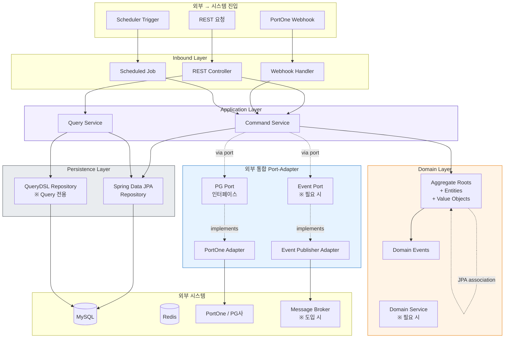

## Architecture Style Topology

# Architecture Style Topology

> 이 문서는 프로젝트의 아키텍처 스타일을 **위상(topology) 관점**에서 정의한다.
한 번 정하면 코드베이스 재구조화 없이는 바꾸기 어려우므로 Layer 1(불변)에 속한다.
구체 어휘(클래스명·패키지명·인터페이스명)는 의도적으로 배제했다.
>

---

## 0. One-Line Declaration

> **표준 Layered + DDD-lite + CQRS-lite + 외부 통합 Port-Adapter**
>

네 요소를 결합한다. 핵심은 **port-adapter를 외부 시스템 통합에만 선택적으로 적용**한다는 점이다. 영속성은 Spring Data JPA / QueryDSL을 직접 사용하고, 도메인은 JPA 연관관계를 직접 활용한다. 학습 효율과 실용성의 균형을 잡은 조합이다.

---

## 1. Diagram



---

## 2. Nodes (역할)

| 노드 | 책임 | 외부에 대해 |
| --- | --- | --- |
| **Inbound Layer** | 외부 프로토콜 → Application 호출로 변환 | HTTP·Webhook 표현 형식 앎 |
| **Application Layer** | Use case 조율, 트랜잭션 경계 | Repository와 외부 Port를 알지만 외부 시스템 자체는 모름 |
| **Domain Layer** | 도메인 모델, 불변식, 도메인 이벤트 | 외부 시스템 모름. JPA는 알 수 있음 |
| **Persistence Layer** | Spring Data JPA Repository, QueryDSL | JPA·DB 앎 |
| **External Port** | 외부 시스템과 대화하는 추상 출구 | — |
| **External Adapter** | Port를 구체 외부 시스템으로 구현 | 외부 SDK·HTTP 클라이언트 앎 |

---

## 3. Edges (의존 방향)

**비대칭 의존 규칙**: 외부 시스템에는 port를 두지만, 영속성에는 두지 않는다.

```
[Inbound]      →  [Application]
[Application]  →  [Domain]            (직접 사용)
[Application]  →  [Persistence]       (직접 사용, port 없음)
[Application]  →  [External Port]     (port 경유, 필수)
[External Port] ← [External Adapter]  (어댑터가 구현)
[Domain]       ↔  [Domain]            (JPA 연관관계로 직접 참조)
```

읽는 법:

- Application은 Domain·Persistence를 **직접** 호출한다. Port 없음.
- Application은 외부 시스템(PG·MQ 등)을 **반드시 Port 경유**로 호출한다.
- Domain은 JPA 연관관계를 통해 다른 Domain 객체를 직접 참조할 수 있다.

---

## 4. Boundaries (경계)

### 4-1. Application–Domain 경계

- **안쪽 (Domain)**: 불변식, 비즈니스 규칙, 도메인 이벤트
- **바깥쪽 (Application)**: 트랜잭션, 영속성 조율, 외부 시스템 호출
- **통과 원칙**: 비즈니스 규칙은 Domain이 강제한다. Application은 흐름만 조율한다.

### 4-2. Application–Persistence 경계 (port 없음)

- Application은 Repository를 **직접 주입받아 호출**한다.
- Repository는 Spring Data JPA 인터페이스 또는 QueryDSL 구현체.
- **트레이드오프 인정**: JPA에 대한 결합이 Application Layer에 노출된다. 학습/개발 속도를 위해 수용.

### 4-3. Application–External 경계 (port 적용)

- Application은 PG/외부 API/MQ를 **반드시 Port 인터페이스 경유**로 호출.
- Adapter가 Port를 구현. Adapter 교체로 외부 시스템 변경을 흡수.
- 이 경계는 외부 시스템 장애 격리·테스트 격리의 핵심.

### 4-4. Command–Query 경계 (CQRS-lite)

- **Command 경로**: Controller/Webhook/Job → Command Service → Aggregate (load → mutate → save) → Repository
- **Query 경로**: Controller → Query Service → QueryDSL projection → DTO (도메인 엔티티 우회 가능)
- **통과 원칙**: 상태 변경은 반드시 Command 경로. 조회는 Query 경로(성능을 위해 도메인 엔티티 우회 허용).

### 4-5. Transaction 경계

- **단위**: Use case 단위 (Command Service 메서드 단위)
- **주인**: Application Layer
- **원칙**: 외부 Port 호출은 가급적 트랜잭션 바깥. DB 커밋 후 외부 호출, 외부 실패는 보상으로 처리.
- 자세한 정책은 별도 `tx-topology.md`에서 다룬다.

---

## 5. Invariants

깨지면 안 되는 규칙들.

1. **Controller는 Repository를 직접 호출하지 않는다.**
   반드시 Application Service 경유. Controller에서 `repository.findById()` 같은 호출 금지.
2. **Application은 외부 시스템(PG·외부 API·MQ 등)을 직접 호출하지 않는다.**
   반드시 Port 인터페이스 경유. `RestTemplate`이나 외부 SDK가 Application에 import되면 위반.
3. **Domain Layer는 외부 시스템(PG·외부 API)을 직접 호출하지 않는다.**
   JPA에 대한 의존은 허용. 외부 시스템 의존은 금지.
4. **Command는 상태를 변경하고, Query는 변경하지 않는다.**
   Query Service에서 `INSERT/UPDATE/DELETE` 또는 도메인 객체의 상태 변경 호출 금지.
5. **트랜잭션 경계는 Application Layer가 결정한다.**
   Domain Aggregate에 `@Transactional` 금지. Repository 메서드에 `@Transactional` 붙이지 않는 것이 기본.
6. **도메인 이벤트는 Aggregate 내부에서 발생한다.**
   Application이 이벤트를 직접 생성하지 않는다. Aggregate가 만든 이벤트를 Application이 외부로 흘려보낸다.
7. **외부 시스템 호출의 결과로 도메인 상태를 즉시 변경하지 않는다.**
   외부 응답 → Application 수신 → Aggregate에 위임 → Aggregate가 자기 규칙으로 변경.
8. **JPA 연관관계는 같은 트랜잭션 안에서만 traverse 한다.**
   Lazy 객체를 트랜잭션 밖에서 만지지 않는다. DTO 변환은 트랜잭션 안에서 끝낸다.

---

## 6. CQRS-lite의 의미 — "lite"의 정의

**lite로 분리하는 것**

- 읽기 경로와 쓰기 경로의 **코드 경로** (Command Service / Query Service)
- 읽기 경로는 도메인 엔티티를 거치지 않고 **QueryDSL projection → DTO**로 직행 가능

**lite가 분리하지 않는 것**

- 데이터베이스 (단일 DB 사용)
- 별도 Read Model 저장소
- Event Sourcing

**이유**

- 결제 조회(주문 목록·결제 내역·포인트 거래)는 도메인 엔티티를 거치면 무겁다 — N+1, 불필요한 lazy loading.
- QueryDSL projection으로 DTO 직행하면 SQL 한 방으로 끝난다.
- 그러나 별도 저장소까지 가면 정합성 비용이 본 프로젝트 범위를 초과.

**미래 변경 가능성**

- 트래픽 증가 시 Read Model 별도 저장소화 가능. 그 시점에 ADR.

---

## 7. Port-Adapter를 선택적으로만 적용하는 이유 (비대칭의 정당화) - 결제 파트에서만 활용 예정

본 프로젝트는 **전형적 Hexagonal Architecture를 채택하지 않는다.** 의도된 선택이다. 비대칭의 근거를 명시적으로 박제한다.

### 왜 영속성에는 port를 두지 않는가

- Spring Data JPA가 이미 충분히 추상화되어 있다. 그 위에 또 port를 만들면 추상화 중복.
- JPA를 다른 ORM이나 NoSQL로 바꿀 가능성이 거의 없다. 본 프로젝트의 합리적 시나리오가 아니다.
- 직접 사용 시 학습 효율이 높다. JPA 영속성 컨텍스트·쿼리·연관관계 운용은 그 자체로 학습 목표.
- **단점 인정**: Application Layer가 JPA에 결합된다. 단위 테스트에서 mock 부담이 있다.

### 왜 외부 시스템에는 port를 두는가

- PG·PortOne API는 운영 중 변경 가능성이 높다 (다른 PG 추가, 정책 변경, 신규 결제 수단).
- 외부 시스템 장애가 도메인 로직을 흔들면 안 된다 — 격리가 필수.
- 테스트에서 외부 호출을 mock 하는 것은 매우 자주 필요하다.
- 외부 의존성의 인터페이스를 **도메인 용어로 정의**하면 도메인 명확성이 올라간다.

### 왜 도메인 간 JPA 연관관계를 허용하는가

- Strict DDD의 "Aggregate 간 ID로만 참조" 원칙은 본 프로젝트 규모에서 과잉.
- JPA 연관관계 직접 사용 시 cascade·fetch·트랜잭션 처리가 단순해진다.
- **단점 인정**: Aggregate 경계가 흐려진다. 큰 Aggregate 그래프가 형성될 위험. 이 부담은 코드 리뷰와 도메인 모델링 단계에서 흡수.

### 종합

이 비대칭은 **학습 비용·개발 속도·격리 가치** 세 축의 균형점이다. 순수성을 포기하는 대신 실용성을 얻는다. 단, 비대칭이 흐려지면(예: 영속성에 port를 슬쩍 추가, 외부 호출을 service에 직접 박음) 일관성이 무너지므로 5장 invariants를 엄격히 지킨다.

---

## 8. Decision History (왜 이 스타일인가)

**왜 표준 Layered (풀 Hexagonal 아님)**

- 본 프로젝트는 단일 팀, 단일 백엔드, 단일 DB. 풀 헥사고날의 격리 이득보다 비용이 크다.
- 영속성 port-adapter는 Spring Data JPA 위에 또 한 층을 얹는 것 — 학습 비용 대비 실익이 작다.
- 표준 Layered는 Spring Boot 커뮤니티 표준에 가까워 협업자/AI 모두에게 친숙.

**왜 DDD-lite (strict DDD 아님)**

- 결제의 핵심은 불변식(멱등성, 금액 일치, 상태 전이)이다. Aggregate에 행위가 있어야 한다 (Anemic 금지).
- 그러나 strict aggregate boundary(ID로만 참조)는 본 프로젝트 규모에서 과잉.
- JPA 연관관계를 직접 사용 — Aggregate 간 트랜잭션 처리가 단순해진다.

**왜 CQRS-lite (full CQRS 아님)**

- 결제 조회는 도메인 엔티티를 거치기에 무겁다 (위 6장 참조).
- QueryDSL projection만으로도 trade-off의 핵심을 다룰 수 있다.

**왜 외부 통합에만 Port-Adapter**

- 외부 시스템은 변경 가능성·장애 격리·테스트 격리 세 측면 모두에서 추상화 가치가 크다.
- 영속성에 비해 ROI가 훨씬 높다.

**대안과 안 고른 이유**

- *풀 Hexagonal* — 영속성 port-adapter의 학습 비용이 실익을 초과.
- *전통적 Layered (port 없음)* — 외부 시스템 변경/장애 격리/테스트에서 비용이 커짐.
- *Full CQRS + Event Sourcing* — 학습/운영 비용 과도. 본 프로젝트 범위 밖.

---

## 9. 이 topology가 다루지 않는 것 (어휘는 어디에 있는가)

| 다루지 않는 것 | 어디에 있는가 |
| --- | --- |
| 패키지/모듈 구조의 구체 명명 | 별도 코딩 컨벤션 문서 |
| 구체 Port 인터페이스 이름 | 영역별 topology (예: `payment-topology.md`) |
| Aggregate의 구체 구성·관계·JPA 연관관계 매핑 | `data-topology.md` |
| 트랜잭션의 구체 범위·외부 호출 위치·분산 락 | `tx-topology.md` |
| 도메인 이벤트의 구체 카탈로그 | `event-topology.md` |
| API URL/필드 명세 | `api-topology.md` |
| 인증/인가 경계 | `auth-topology.md` |
| QueryDSL projection 패턴 | 코드 컨벤션 또는 `query-topology.md` |

---

## 10. 자가 점검 질문

이 스타일이 살아있는지 정기적으로 점검할 때 던지는 질문들. 하나라도 YES면 위반 또는 위반 위험.

1. Controller에서 Repository를 직접 호출하는 코드가 있는가?
2. Application Layer에 외부 SDK(`RestTemplate`, `WebClient`, PortOne SDK 등)가 직접 import되어 있는가?
3. Domain Entity에 외부 시스템 호출 코드가 있는가?
4. Query Service에서 도메인 객체의 상태를 바꾸는 호출이 있는가?
5. Aggregate에 `@Transactional`이 붙어 있는가?
6. 외부 Port 호출이 트랜잭션 안에서 일어나고 있는가? (의도된 예외라면 ADR 박제되어 있는가?)
7. JPA Lazy 객체를 트랜잭션 밖에서 traverse하는 코드가 있는가? (LazyInitializationException 위험)
8. Application Service가 비즈니스 규칙 검증으로 비대해지고 있는가? (Anemic 신호)
9. 영속성에 port가 슬그머니 추가되어 있지 않은가? (비대칭 일관성 신호)

---

## 11. 변경 정책

이 문서는 Layer 1이다. 변경은 거의 발생하지 않아야 한다.

- **자유롭게 변경 가능**: 자가 점검 질문, 다이어그램 시각 표현
- **ADR 필요**: 영속성 port-adapter 도입, CQRS-lite 범위 변경(별도 Read Model), 새 외부 시스템 추가 시 port 표준 변경, JPA 연관관계 정책 변경(ID 참조로 회귀 등)
- **거의 발생 안 함**: 의존 방향 원칙, 외부 통합 port-adapter 채택 여부, 비대칭 정책 자체

---