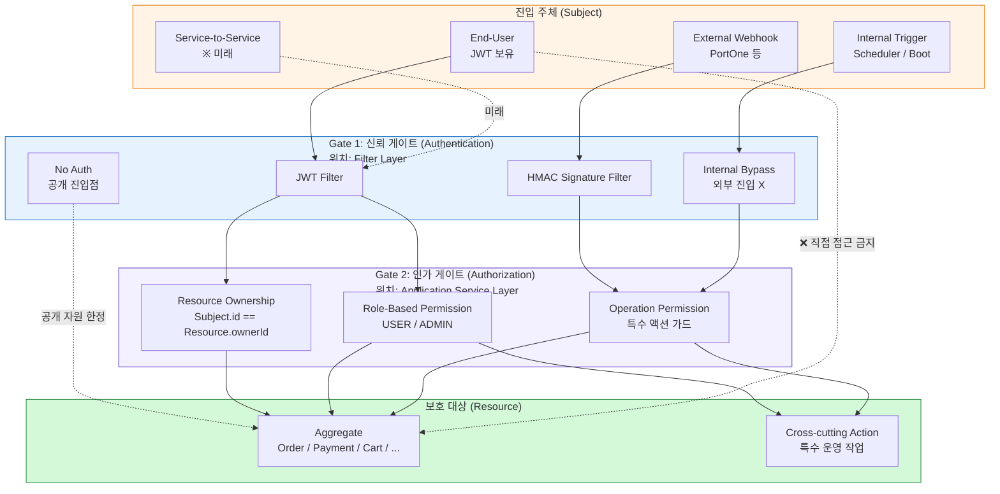

## Authentication & Authorization Topology

# Authentication & Authorization Topology

> 이 문서는 프로젝트의 **인증(Authentication)과 인가(Authorization)의 위상**을 정의한다.
한 번 정하면 코드베이스 전반의 보안 결정에 영향을 미치므로 Layer 1(불변)에 속한다.
구체 어휘(클래스명·필터명·역할 명칭·필드명)는 의도적으로 배제. 그건 Spring Security 설정과 코드가 source of truth.
*Spring Security 표준 어휘*(`Filter`, `AuthenticationManager`, `@AuthenticationPrincipal` 등)는 사용.

---

## 0. One-Line Declaration

> **모든 진입은 두 게이트를 순차 통과한다 — (1) 신뢰 게이트 "누구의 호출인가" 인증, (2) 인가 게이트 "그 주체가 이 자원·연산에 접근 가능한가" 검증. 두 게이트는 서로 다른 layer에 위치하며 절대 합쳐지지 않는다. 사용자 자원 접근은 항상 소유권 검증을 통과한다.**

세 가지 결정이 이 문서를 좌우한다. **두 게이트의 분리**, **게이트별 layer 고정**, **소유권 검증의 단일성**. 셋이 *모든 진입점에 일관되게 적용*되어야 한다.

---

## 1. Diagram



**다이어그램 읽는 법**

- 모든 화살표는 위에서 아래로만 흐름 — 두 게이트를 우회한 직접 접근은 위반
- 신뢰 게이트는 *어떤 주체인지*만 판별. *무엇을 해도 되는지*는 판단 안 함
- 인가 게이트는 *주체의 정체를 신뢰한 후* 자원별 결정. 자원·연산의 의미는 도메인에 있으므로 인가도 도메인 가까이(Application Service)에 있어야 함

---

## 2. Nodes — 주체·게이트·자원의 분류

### 2-1. Subject (진입 주체)

본 시스템에 진입할 수 있는 주체는 네 종류뿐.

| 주체 | 인증 수단 | 신원 정보 | 비고 |
| --- | --- | --- | --- |
| **End-User** | JWT (Bearer) | `userId` (Long), `role` (Enum) | 사용자-facing API의 99% |
| **External Webhook** | HMAC 서명 | 외부 식별자 (PortOne paymentId 등) | 사용자 신원 없음 — 자원 식별만 |
| **Internal Trigger** | 트리거 자체 신뢰 | 트리거 종류 (Scheduler / Boot Init) | 외부 진입 X. 인증 절차 무의미 |
| **Service-to-Service** ※ 미래 | 별도 토큰 / mTLS | Service ID | 본 Phase에서는 미정 |

> **불변**: 새 주체 종류 추가는 §5 re-pin trigger.

### 2-2. Gate 1 — Trust Gate (Authentication)

진입 주체가 신원을 증명하는 게이트. **"누가 호출했는가"만 판별**.

| 게이트 | 위치 | 통과 후 노출 정보 |
| --- | --- | --- |
| **JWT Filter** | Filter Layer (Spring Security chain) | `userId`, `role` |
| **HMAC Filter** | Filter Layer (Security chain 안 또는 별도) | 페이로드의 외부 식별자 |
| **Internal Bypass** | 진입점 자체 (HTTP 미경유) | 트리거 종류 |
| **No Auth** | Filter chain `permitAll()` | (없음 — 공개 자원만) |

### 2-3. Gate 2 — Authorization Gate (Authorization)

신뢰된 주체가 자원·연산에 접근 가능한지 판별. **"무엇을 해도 되는가"만 판단**.

| 게이트 종류 | 검증 | 위치 | 예 |
| --- | --- | --- | --- |
| **Resource Ownership** | `Resource.ownerId == Subject.userId` | Application Service 또는 Aggregate 메서드 | 본인 주문/결제/장바구니만 |
| **Role-Based Permission** | `Subject.role` ∈ 허용 역할 집합 | Application Service | 관리자 전용 통계 조회 |
| **Operation Permission** | 비즈니스 가드 (상태·시점·횟수) | Aggregate 도메인 메서드 | "이미 환불된 주문은 다시 환불 X" |

### 2-4. Resource (보호 대상)

- **Aggregate**: Order, Payment, Cart, Product, User 등의 Aggregate Root. 인가의 1차 단위.
- **Cross-cutting Action**: 특정 Aggregate에 속하지 않는 운영 작업(통계 조회·일괄 보상 등). 인가는 Role-Based 또는 Operation Permission으로.

---

## 3. Edges — 게이트 통과의 흐름

### 3-1. 진입점 → Trust Gate (1:1)

모든 진입점은 **단 하나의 Trust Gate**에 묶인다.

```
REST 인증 자원        → JWT Filter
REST 공개 자원        → No Auth
Webhook              → HMAC Filter
Scheduler / Boot Init → Internal Bypass
```

**불변**: 한 진입점이 두 Trust Gate를 동시에 통과하는 구조 금지 (예: JWT *또는* HMAC을 선택 통과 X).

### 3-2. Trust Gate → Authorization Gate

신뢰 게이트를 통과해야만 인가 게이트에 진입. **인증 결과는 인가 입력**.

| 신뢰 게이트 출력 | 인가 게이트 입력 |
| --- | --- |
| JWT subject(`userId`, `role`) | Ownership 검증 + Role 검증 |
| HMAC 페이로드(외부 식별자) | Operation Permission (사용자 자원 의미 없음) |
| Internal Trigger | Operation Permission만 |
| No Auth | 인가 불요 (공개 자원) |

### 3-3. Authorization Gate → Resource

인가 게이트를 통과해야만 자원에 도달. **자원·연산에 따라 다른 게이트 종류 적용**.

### 3-4. ❌ 금지 엣지

- Subject → Resource 직접 접근 (두 게이트 우회)
- Inbound Layer(Controller)에서 인가 결정 (Application Service의 책임)
- Domain Layer에서 인증 토큰 접근 (Domain은 인증 모름)

---

## 4. Boundaries — Layer 분리

### 4-1. Filter Layer ← Authentication만

- 인증 = Filter Layer. Spring Security Filter chain 안에서.
- 인가 = Filter에서 절대 결정하지 않음 (URL 패턴 기반 `permitAll` / `authenticated`까지만 OK, **자원 ID 기반 인가는 금지**)
- 통과 후: `SecurityContextHolder` 또는 `@AuthenticationPrincipal`로 신원만 노출

### 4-2. Inbound Layer (Controller) ← 인증 추출 + 위임

- `@AuthenticationPrincipal`로 Subject 정보 추출
- 인가 결정 금지 — Application Service로 위임
- Subject 정보는 *형식 변환 없이* Application Service에 전달 (예: `userId` 그대로)

### 4-3. Application Service Layer ← Authorization

- 인가 결정의 SSOT
- Resource Ownership / Role / Operation Permission 모두 여기서
- 검증 실패 시 **`BusinessException` throw** (예외 처리는 `Error-Handling-Topology`에 위임)

### 4-4. Domain Layer ← 인증·인가 어휘 모름

- Domain은 `userId`(원시 식별자)만 받고 인증 토큰·역할 어휘를 모름
- 단, **Operation Permission**은 도메인 메서드로 표현 가능 (예: `Order.cancel()` 안에서 상태 가드)
- Domain에서 Spring Security 어휘 import 금지

### 4-5. Persistence Layer ← 인가 우회 가능 (위험)

- Repository는 자체로 인가하지 않음 — Application Service가 인가 후 호출
- **반대로**: Application을 우회한 직접 Repository 호출은 인가 우회 → 금지

---

## 5. Invariants — 이 구간 동안 절대 안 깨짐

다음 불변식은 PR/리뷰에서 ArchUnit 또는 슬라이스 테스트로 강제:

1. **소유권 일치 불변식**: 사용자 자원 변경 진입점은 `Subject.userId == Resource.ownerId` 검증을 반드시 통과한다.
   - 감지법: Application Service 슬라이스 테스트 — 타인의 자원 변경 시도 시 `BusinessException` 발생
2. **하드코딩 ID 금지**: Controller·Service에 `userId = N` 형태의 상수 하드코딩 금지.
   - 감지법: PR 리뷰 + ArchUnit 룰 (`@AuthenticationPrincipal` 없이 사용자-facing 메서드 시그니처 거부)
3. **Controller 인가 결정 금지**: Controller는 `@AuthenticationPrincipal` 추출만, `if (role == "ADMIN")` 류 분기 금지.
   - 감지법: 컨트롤러 슬라이스 테스트 + 리뷰
4. **Domain 무지 불변식**: Domain Layer는 `org.springframework.security.*`, `JWT*`, `Auth*` 타입을 import하지 않는다.
   - 감지법: ArchUnit 패키지 제약
5. **단일 Trust Gate**: 한 진입점은 단 하나의 Trust Gate를 통과한다.
   - 감지법: Security 설정 리뷰
6. **Repository 직접 접근 금지**: Inbound(Controller·Webhook·Job)에서 Repository 직접 주입 금지.
   - 감지법: ArchUnit + 리뷰

---

## 6. 어휘는 어디에 (이 파일이 다루지 않는 것)

- 구체 Filter 클래스·역할 enum·예외 메시지 → `common/config/SecurityConfig`, `auth/**`
- JWT 클레임·만료 정책 → `application.yml`의 `jwt.*` + JWT 발급/검증 코드
- HMAC 시그니처 구체 알고리즘 → `payment/infrastructure/webhook/*` + `Error-Handling-Topology` §종착 처리
- 보안 민감 메시지 마스킹 정책 → `Error-Handling-Topology` (외부 메시지 통일)
- 진입점 카탈로그 → `API-Topology` §신뢰 경계
- 멱등성 키와 주체의 관계 → `idempotency-Design-Topology` §키 출처

---

## 7. 안티패턴 (위반 사례)

다음은 본 시스템에서 이미 관측되었거나 명백히 위상 위반:

| 안티패턴 | 위반 게이트 | 이유 |
| --- | --- | --- |
| `Long memberId = 1L;` (Controller에서) | 인증 우회 | 신뢰 게이트가 작동하지 않음. 모든 호출이 동일 주체로 식별됨 |
| `@AuthenticationPrincipal` 없이 자원 변경 메서드 | 인증 우회 | 주체 불명 상태로 도메인 진입 |
| `Service.findByIdNoOwnerCheck(id)` | 인가 우회 | 소유권 검증 없이 자원 노출 |
| Controller에서 `if (jwt.role == "ADMIN")` 분기 | 인가 layer 위반 | Application Service에서 결정해야 함 |
| Domain에서 `SecurityContextHolder.getContext()` | Domain 무지 위반 | Domain은 Spring Security 어휘 모름 |
| `@PreAuthorize`를 Controller에서 자원 ID 기반으로 작성 | Filter layer 인가 침범 | URL 기반 외의 인가는 Application Service로 |
| 같은 URL을 JWT *또는* HMAC 둘 다 받게 설정 | 단일 Trust Gate 위반 | 진입점 모호성 + 보안 결정 분산 |

---

## 8. 자가 점검 (하나라도 YES면 위상 위반 가능)

- [ ] Controller 메서드에 사용자 ID 하드코딩이 있는가
- [ ] 사용자 자원을 다루는 Service 메서드가 `userId` 인자를 받지 않는가
- [ ] 같은 URL 패턴에 두 가지 인증 게이트가 동시 설정돼 있는가
- [ ] Repository를 Controller·Webhook·Job에서 직접 주입하는가
- [ ] Domain 패키지에서 Spring Security 타입을 import하는가
- [ ] Application Service의 자원 변경 메서드가 소유권 검증 없이 자원을 수정하는가
- [ ] `@PreAuthorize` 표현식이 자원 ID·상태·소유권 등 도메인 의미를 다루는가
- [ ] 인가 실패가 `BusinessException`이 아닌 다른 타입(`AccessDeniedException` 외)으로 던져지는가

---

## 9. Re-pin Trigger — 이 topology를 다시 박아야 하는 신호

다음 중 하나라도 발생하면 Desktop에서 재고정. Code 세션에서 즉흥 변경 금지:

- 새 주체 종류 추가 (예: Service-to-Service 도입, OAuth 제공자 추가)
- 새 인증 수단 도입 (예: mTLS, API Key, Magic Link)
- 새 인가 모형 도입 (예: ABAC, 정책 엔진 외부화)
- 새 역할(Role) 카테고리 도입 — 기존 USER/ADMIN 외 다층 역할 도입 시
- 인가 결정 위치 이동 (예: Application → Domain으로 Operation Permission 일괄 이동)
- IdP(Identity Provider) 외부화 (Keycloak, Auth0, AWS Cognito 등)
- 다중 테넌트 도입 — 자원에 `tenantId`가 추가되어 소유권 모델이 2축이 됨

> 트리거가 안 걸리는 한 이 파일은 **이번 구간 동안 질문 없이 따르는 단단한 제약**이다.

---

## 10. 변경 정책

- **자유 변경**: 안티패턴 카탈로그(§7), 자가 점검(§8) 항목
- **ADR 필요**: 단일 Trust Gate 원칙 완화, 인가 위치 변경(Application → Filter 또는 Domain), 클라이언트 제공 인증 토큰 도입
- **거의 없음**: 두 게이트 분리 원칙, Domain 무지 불변식
