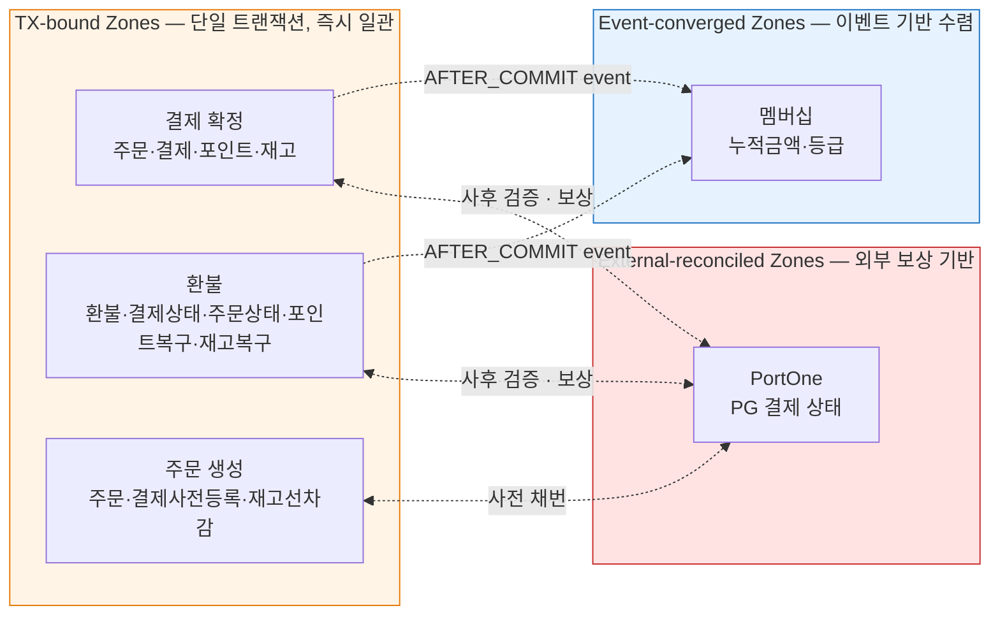

## Consistency Design Topology

# Consistency Design Topology

> 이 문서는 **시스템 가치(정합성)를 어떻게 설계할 것인가**를 위상 관점에서 정의한다.
`system-value-topology` Tier 1 가치 *정합성*의 구체 설계 영역이다.
Layer 1에 속한다 — 정합성 모델 자체는 거의 변하지 않음. Zone 매핑(B-2)만 Layer 2적으로 진화.
구체 어휘(테이블·컬럼·SQL·메서드명)는 의도적으로 배제했다.
>

---

## 0. One-Line Declaration

> **본 시스템의 정합성은 세 종류의 Zone — TX-bound · Event-converged · External-reconciled — 으로 분할되어 설계된다. 각 zone 내부는 명시된 보장을 받으며, zone 경계 통과는 명시적 메커니즘을 통해서만 일어난다.**
>

세 가지 zone 외의 정합성 모델은 채택하지 않는다. 모델 수가 늘어나면 추론 비용이 폭증하기 때문이다. 모든 새로운 데이터·연산은 셋 중 하나에 명시적으로 할당된다.

---

## 1. Zone 지형도



**다이어그램 읽는 법**

- 같은 zone 안의 데이터는 *항상 같은 트랜잭션 또는 같은 보장 메커니즘*으로 묶임
- Zone 간 화살표는 *경계 통과 메커니즘*을 표시
- 색상: 주황(TX-bound) / 파랑(Event-converged) / 빨강(External-reconciled)

---

## 2. 채택할 정합성 모델

### 2-1. 채택과 거부 (A-1)

| 모델 | 채택 여부 | 본 프로젝트에서의 의미 |
| --- | --- | --- |
| **강한 정합성 (Strong)** | ✅ 채택 | 단일 트랜잭션 내 즉시 일관. Spring `@Transactional` + DB 격리 수준으로 보장. |
| **결과적 정합성 (Eventual)** | ✅ 채택 | 이벤트 기반으로 수렴. AFTER_COMMIT 이벤트 리스너로 구현. |
| **외부 결과적 정합성 (External-reconciled)** | ✅ 채택 | 외부 시스템과의 정합성. 보상 트랜잭션 + 사후 검증으로 보장. |
| **Read-after-write** | ✅ 묵시적 | 단일 DB이므로 자동 보장. 별도 설계 불필요. |
| **단조 정합성 (Monotonic Reads/Writes)** | ❌ 거부 | 단일 DB라 자동 보장됨. 별도 어휘 불필요. |
| **인과 정합성 (Causal)** | ❌ 거부 | 복잡도 대비 가치 낮음. 단일 DB에서 의미 희박. |
| **Linearizability (분산)** | ❌ 거부 | 분산 시스템 아님. |

### 2-2. 본 시스템의 정합성 어휘 (A-2) - 정합성 관리

토론 비용을 줄이기 위해 어휘 통일.

| 본 시스템 어휘 | 정의 |
| --- | --- |
| **TX-bound** | 같은 트랜잭션 안에서 모든 데이터가 일관됨. 트랜잭션 커밋 시점에 완전 일관. |
| **Event-converged** | 트리거 zone 커밋 후 이벤트로 비동기 갱신. 수렴 시간 *짧음* (밀리초~초). |
| **External-reconciled** | 외부 시스템과의 정합성. 동기 호출 + 사후 검증 + 보상으로 보장. 수렴 시간 *명시적이지 않음* (네트워크/외부 시스템 의존). |

**원칙**: 이 세 어휘 외의 정합성 표현은 쓰지 않는다. "결과적으로 같아진다", "거의 일관", "보통은 맞다" 같은 모호한 표현이 발견되면 위반 신호.

---

## 3. Zone 식별과 매핑

### 3-1. Zone 식별 기준 (B-1)

새 데이터·연산을 만났을 때 어느 zone에 속하는지 판단하는 휴리스틱.

다음 셋 이상 만족 → **같은 TX-bound zone**:

1. 같은 트랜잭션 안에서 항상 함께 변경됨
2. 비즈니스 불변식을 공유 (예: "결제 금액과 적립 금액 일치")
3. 한쪽 변경이 다른 쪽 변경 없이는 의미 없음
4. 같은 사용자 액션의 일부

다음 신호 중 하나라도 → **별도 zone**:

- 다른 lifecycle (생성·소멸 주기 다름)
- 다른 변경 빈도 (한쪽은 거의 안 변하고 다른 쪽은 자주 변함)
- 한쪽이 실패해도 다른 쪽은 진행되어야 함
- 외부 시스템과 통신 필요

### 3-2. 본 프로젝트의 Zone 매핑 (B-2) — **현재 진단**

> 이 매핑은 *현재 시점의 진단*이다. 도전 기능 진입·새 기능 추가 시 갱신.
>

| Zone | 종류 | 포함 데이터/연산 | 트리거 |
| --- | --- | --- | --- |
| **결제 확정** | TX-bound | 주문 완료 상태, 결제 완료 상태, 포인트 사용/적립, 재고 (선차감 상태 유지), 장바구니 초기화 | Confirm API / Webhook |
| **환불** | TX-bound | 환불 기록, 결제 부분/전액환불 상태, 주문 상태, 포인트 복구(사용분 반환·적립분 차감), 재고 복구 | 환불 API |
| **주문 생성** | TX-bound | 주문 결제대기, 결제 사전 등록(`portonePaymentId` 채번), 재고 선차감 | 주문 생성 API |
| **주문 취소** | TX-bound | 주문 취소 상태, 결제 실패 상태, 재고 복구 | 주문 취소 API |
| **멤버십 누적·등급** | Event-converged | 회원별 누적 결제 금액, 등급 | 결제 확정 / 환불 이벤트 |
| **구독 갱신**(도전) | TX-bound (각 1회 결제 단위) | 구독 상태, 청구 기록, 다음 결제일 | Scheduler |
| **PortOne 결제 상태** | External-reconciled | 외부 PG의 결제 상태 | (외부) |

### 3-3. Zone 경계의 위치 (B-3)

같은 컨텍스트 안에서도 zone이 갈라지는 지점.

- **결제 컨텍스트 내부**: 결제 확정 zone과 결제 사전 등록 zone은 다른 zone. 같은 결제 데이터를 다루지만 *다른 시점·다른 트랜잭션*.
- **포인트 컨텍스트 내부**: 잔액 갱신은 TX-bound (결제 zone에 흡수), 거래 내역은 append-only. 둘은 같은 트랜잭션 안에 있지만 *읽기 패턴*과 *갱신 패턴*이 명확히 다름.
- **멤버십 컨텍스트 내부**: 누적 금액과 등급은 같은 Event-converged zone. 그러나 *적립률 조회*는 결제 확정 zone에서 *직전 누적 기준*으로 읽음 (TX-bound zone에서 Event-converged zone을 읽는 패턴 — 4-2 참조).

### 3-4. 외부 시스템의 Zone 표현 (B-4)

- **PortOne은 항상 별도 zone (External-reconciled)으로 표시.** 내부 zone에 포함시키지 않음.
- **여러 컨텍스트가 PortOne과 통신해도 zone은 하나.** PortOne 자체가 하나의 시스템.
- **내부 zone ↔ PortOne zone 경계는 항상 ACL을 통과** (context-dependency 4-2와 일치).
- **PortOne의 *상태*를 우리 zone의 진실로 가정하지 않는다.** 우리 zone과 PortOne zone은 다른 진실을 가질 수 있으며, *둘 다 보존하고 차이를 해소*하는 방식으로 설계.

---

## 4. Zone 경계 통과 정책

Zone 경계 통과는 정합성 사고가 가장 자주 발생하는 지점. 명시적 정책 필수.

### 4-1. 강 → 약 전이 (C-1)

TX-bound zone의 데이터가 Event-converged zone으로 흘러가는 경우.

**메커니즘**: `@TransactionalEventListener(phase = AFTER_COMMIT)`

**규칙**

1. **이벤트 발행은 트랜잭션 안에서, 처리는 커밋 후에.** 트랜잭션 안에 발행해야 트랜잭션이 롤백되면 이벤트도 없던 일이 됨.
2. **이벤트 처리 실패가 트리거 zone의 커밋을 무효화하지 않는다.** 강 zone은 이미 커밋됨. 약 zone의 처리는 별도 책임.
3. **이벤트 처리는 멱등이어야 한다.** 재시도 가능성을 전제 (`idempotency-design-topology` 참조).
4. **수렴 시간을 정의한다 (가능하면).** 본 프로젝트는 단일 인스턴스라 수렴이 빠르지만, 트래픽 증가 시 측정 SLI 도입 가능.

**적용 예**: 결제 확정 (TX-bound) → 멤버십 누적 갱신 (Event-converged)

### 4-2. 약 → 강 전이 (C-2) — **가장 위험한 패턴**

Event-converged zone의 데이터를 TX-bound zone에서 *읽어서 결정에 사용*하는 경우.

**핵심 위험**: 약 zone의 데이터는 *stale 가능성*을 항상 갖는다. 그 stale 값으로 강 zone에서 결정을 내리면, 결정 자체는 일관되어도 *비즈니스 결과*는 일관되지 않을 수 있다.

**규칙**

1. **약 zone 데이터는 "현재 시점의 추정"이지 "확정된 사실"이 아님을 의식.**
2. **약 zone 데이터로 결정해도 비즈니스적으로 OK인 경우만 허용.** 일시적 stale이 손해를 일으키지 않는 영역.
3. **약 zone 데이터에 *최신성*이 critical하면 zone 재설계.** TX-bound로 끌어들이거나, 다른 메커니즘 도입.

**본 프로젝트 적용 예**: 결제 확정 zone에서 멤버십 등급(Event-converged) 조회 후 적립률 결정.

- **OK인 이유**: 명세상 "*직전 누적 기준*"으로 적립률 결정. 약간의 stale은 *비즈니스 정의 자체에 흡수됨*. 현재 결제 금액은 다음 결제부터 등급에 반영.
- **NG였을 시나리오**: 만약 "*현재 결제 직후*"의 등급으로 적립률을 정해야 한다면, 멤버십을 TX-bound로 끌어들여야 함.

이 결정이 명시되지 않으면 누군가 "더 정확하게" 만들려고 멤버십을 TX-bound로 옮기다 zone 경계를 무너뜨림.

### 4-3. 외부 zone 경계 보장 (C-3)

내부 zone ↔ PortOne zone 사이의 정합성.

**전제**: 두 zone은 *언제든 다른 진실을 가질 수 있다.* 이를 부정하지 말고 *해소 메커니즘*을 둔다.

**경계 통과 시 의무**:

1. **모든 외부 호출은 멱등성 키 제공.** 중복 호출이 부작용 없음.
2. **응답을 *받지 못한 경우*와 *실패 응답을 받은 경우*를 구분.** 전자는 *상태 모름*, 후자는 *실패 확정*. 두 경우의 처리가 다름.
3. **상태 모름 시 재조회로 해소.** 외부에 *진실의 출처*가 있다고 가정하고 다시 묻는다.
4. **양방향 동기화는 모두 멱등.** Webhook과 Confirm API가 같은 결과를 만든다 (7-3 참조).

---

## 5. 보장 메커니즘

### 5-1. 강한 정합성 메커니즘 목록 (D-1)

| 메커니즘 | 보장 | 비보장 |
| --- | --- | --- |
| **Spring `@Transactional`** | 같은 트랜잭션 내 atomic | 외부 시스템 |
| **DB 유니크 제약** | 중복 행 방지 (race-safe) | 의미 검증 |
| **DB FK 제약** | 참조 무결성 (같은 컨텍스트 내) | 컨텍스트 간 (context-dependency 7-2에서 금지) |
| **DB CHECK 제약** | 값 범위 검증 | 복잡한 비즈니스 규칙 |
| **비관적 락 (`SELECT FOR UPDATE`)** | 동시 수정 차단 (확실) | 락 holder 장애 시 자동 회복 |
| **낙관적 락 (`@Version`)** | 동시 수정 감지 (충돌 시 실패) | 즉각적 직렬화 보장 |
| **분산 락 (Redisson)** | 다중 인스턴스 직렬화 | DB 트랜잭션 내 일관성 (별도 보장 필요) |
| **Aggregate 불변식** | 도메인 규칙 (생성·메서드 수준) | 영속성 일관성 |

**원칙**: 한 영역에 *복수의 메커니즘을 중첩*해 적용하는 것을 권장. 예: 멱등성을 DB 유니크 제약(가장 강함) + 사전 조회(빠른 거부)로 이중 보장.

### 5-2. 결과적 정합성 메커니즘 목록 (D-2)

| 메커니즘 | 적용 |
| --- | --- |
| **Spring Application Event + `@TransactionalEventListener(AFTER_COMMIT)`** | 본 프로젝트 기본 메커니즘. 같은 프로세스 내 비동기. |
| **Outbox 패턴** | 단일 프로세스에서는 과잉. 메시지 브로커 도입 시 검토. *현재 보류*. |
| **보상 트랜잭션** | 외부 시스템 또는 다른 zone에서 *역연산*으로 정합성 복원. |
| **Reconciliation 배치** | 정기 점검 (예: 일 1회 잔액 대조). *MVP 후 운영 단계에 검토*. |

**현재 채택**: AFTER_COMMIT 이벤트 + 보상 트랜잭션. 나머지는 보류.

### 5-3. 외부 시스템 정합성 메커니즘 (D-3)

| 메커니즘 | 적용 |
| --- | --- |
| **보상 트랜잭션 (PG 취소 API)** | 결제 검증 실패 시 외부 결제 취소. |
| **재조회 검증 (`portonePaymentId`로 재조회)** | Webhook 페이로드 신뢰 안 하고 PortOne에 다시 묻기. |
| **멱등성 키** | 동일 요청 중복 호출 방지. `idempotency-design-topology` 참조. |
| **양방향 동기화 (Webhook + Confirm)** | 두 진입점이 같은 도메인 서비스를 호출해 멱등 처리. |

---

## 6. 동시성 제어

### 6-1. 락 전략 분류 (E-1)

| 전략 | 적용 기준 |
| --- | --- |
| **낙관적 락 (`@Version`)** | 충돌 빈도 낮음 / 사용자 자기 자원 / 충돌 시 재시도 가능 |
| **비관적 락 (`SELECT FOR UPDATE`)** | 정확성 critical / hold time 짧음 / 충돌 빈도 높음 가능성 |
| **분산 락 (Redisson)** | 다중 인스턴스 환경에서 직렬화 필요 / 같은 자원에 대한 cross-instance 동시 접근 |

### 6-2. 각 zone에서의 락 선택 (E-2) — 본 프로젝트 결정

| Zone / 자원 | 락 전략 | 이유 |
| --- | --- | --- |
| **재고 차감/복구** | 비관적 락 | 정확성 critical (음수 재고 불가). hold time 짧음. 결제 트래픽 집중 시 충돌 빈도 높을 수 있음. |
| **포인트 잔액 갱신** | 비관적 락 | 음수 잔액 정책상 정확한 검증 필요. 같은 사용자 동시 결제 가능성 낮지만 critical. |
| **결제 상태 변경** | 멱등성 키 (DB 유니크) + 낙관적 락 백업 | 멱등성 키가 1차 방어. 낙관적 락은 race-edge 보호. |
| **주문 상태 변경** | 낙관적 락 | 같은 주문의 동시 변경은 사실상 사용자 자신만. 충돌 빈도 낮음. |
| **멤버십 누적·등급** | 낙관적 락 | Event-converged zone. 충돌 시 재시도 자연스러움. |
| **구독 청구 (도전)** | 비즈니스 식별자 유니크 (구독ID + 청구주기) | 락 불필요. DB 유니크 제약이 동시성 제어 역할. |

**원칙**: 본 프로젝트는 단일 인스턴스이므로 분산 락은 *기본적으로 사용하지 않음*. 도입 시 ADR 필요.

### 6-3. 데드락 방지 정책 (E-3)

**규칙**

1. **락 획득 순서 통일.** 여러 자원에 락 걸 때는 *항상 같은 순서*.
    - 본 프로젝트 권장 순서: **Order → Payment → Point → Inventory**
    - 이 순서를 어기는 코드는 PR 리뷰에서 차단.
2. **락 hold time 최소화.** 락 안에서 외부 호출 금지 (외부 호출은 락 해제 후).
3. **락 타임아웃 명시.** 무한 대기 금지. `PESSIMISTIC_WRITE`에 타임아웃 설정.
4. **트랜잭션 안 한 자원에 두 번 락 걸지 않기.** 같은 트랜잭션 내 같은 자원 반복 락은 의도치 않은 self-block 가능.

**알려진 데드락 시나리오**

- 결제 A와 결제 B가 동시에 *겹치는 상품의 재고*를 차감하려 할 때 → 락 순서로 해결
- 결제와 환불이 동시에 같은 주문을 만지려 할 때 → 환불은 결제완료 상태에서만 가능하므로 본질적으로 동시 발생 없음

---

## 7. 외부 시스템과의 정합성 — 결제 도메인의 핵심

### 7-1. DB 커밋 vs 외부 호출 순서 정책 (F-1)

**원칙**: **DB 먼저 커밋, 외부 호출은 트랜잭션 *밖*.**

**이유**

- 외부 호출이 트랜잭션 안에 있으면 *DB 락 hold time이 외부 응답 시간만큼 증가*. 동시성 폭락.
- 외부 호출 실패 시 *DB 롤백 + 외부는 어떻게 됐는지 모름* 상태가 됨. 추적 불가.
- 외부 호출이 성공했는데 그 후 DB가 실패하면 *외부와 내부가 영구히 다름.*

**구체 적용**

| 시나리오 | 외부 호출 시점 | 보상 |
| --- | --- | --- |
| **결제 확정 (정상)** | DB 트랜잭션 *전*에 PortOne 결제 정보 조회 (검증용) | 검증 통과 시 DB 커밋. 검증 실패 시 PG 취소 호출 (보상). |
| **환불** | DB 커밋 후 PG 취소 호출 | PG 취소 실패 시 로그 + 운영 알림. *재시도 또는 수동 보상.* |
| **구독 결제 (도전)** | PG 결제 호출 후 DB 기록 | PG 성공·DB 실패 시 PG 취소 호출 (보상). |

**예외 인정**: 결제 확정의 PortOne *조회*는 트랜잭션 전에. 결제 *취소*는 트랜잭션 후에. 이건 PortOne API의 read vs write 분리.

### 7-2. 보상 트랜잭션 패턴 (F-2)

**가역성 분류**

| 외부 작업 | 가역 여부 | 보상 가능성 |
| --- | --- | --- |
| **PG 결제 승인** | 가역 (취소 API) | ✅ PG 취소 호출 |
| **PG 결제 취소** | 비가역 | ❌ 보상 불가 (재취소 불필요) |
| **메일/SMS 발송** | 비가역 | ❌ "취소 메일" 발송으로만 보상 |
| **외부 정산 전달** | 비가역 | ❌ 정정 데이터 별도 전달 |

**원칙**

- **보상이 가능한 작업만 커밋 후 호출 가능.** 비가역 작업을 커밋 후에 호출하면 실패 시 회복 불가.
- **보상도 멱등이어야.** 보상 호출 자체가 실패할 수 있음. 같은 보상 여러 번 호출 안전.
- **보상 실패는 운영 이슈로 격상.** 자동 재시도 N회 후 알림 + 수동 개입.

### 7-3. Webhook + Confirm 양방향 동기화 정책 (F-3) — **본 프로젝트 핵심 결정**

결제 완료가 *두 경로*로 통지됨. 두 경로 모두 같은 결제 확정 트랜잭션을 수행해야 함.

**위상**

```
[클라이언트] ──Confirm API──► [결제 확정 도메인 서비스]
                                     ▲
[PortOne] ──Webhook──► [Webhook 핸들러]
```

**규칙**

1. **두 진입점은 같은 도메인 서비스를 호출한다.** 결제 확정 로직 단일 출처.
2. **도메인 서비스는 멱등.** 두 번 호출되어도 같은 결과.
3. **어느 쪽이 먼저 와도 OK.** 시간적 순서에 의존하지 않음.
4. **두 번째 호출은 silent OK.** 이미 처리됨을 인식하고 200 OK 반환 (`idempotency-design-topology` 5-2 참조).
5. **한 쪽만 와도 OK.** Webhook이 안 와도 Confirm이 처리. Confirm이 안 와도 Webhook이 처리.

**가장 흔한 사고 시나리오**

- 두 진입점이 *다른 코드 경로*로 구현됨 → 한쪽에서만 멱등성 보장 → 동시 도달 시 중복 처리
- 두 진입점 중 한쪽이 *검증을 생략* → Webhook은 PortOne을 신뢰해 검증 생략 → Webhook으로 들어온 위조 페이로드로 사고

이 정책은 *코드 차원의 공통화*로 강제. 도메인 서비스 한 곳에 모든 검증·멱등·트랜잭션 로직 집중.

---

## 8. 위반 감지

### 8-1. 위반 감지 메커니즘 (G-1)

| 감지 방식 | 적용 | 즉시성 |
| --- | --- | --- |
| **트랜잭션 자동 롤백** | RuntimeException 발생 시 자동 | 즉시 |
| **DB 제약 위반 예외** | 유니크·FK·CHECK 위반 | 즉시 |
| **Aggregate 불변식 검증** | 도메인 메서드 호출 시 | 즉시 |
| **정합성 검증 쿼리** | 정기 배치 (예: 잔액 vs 거래내역 합) | 지연 (분~일) |
| **운영 모니터링 알림** | 이상 패턴 감지 (보상 실패 누적 등) | 지연 (분) |

**현재 단계 적용 수준**

- 즉시 감지 (앞의 셋)은 필수. MVP 단계부터.
- 지연 감지 (뒤의 둘)는 운영 시작 후. 현재는 *구조만 갖춤*.

---

## 9. 트레이드오프

### 9-1. 정합성 vs 성능 (H-1)

본 프로젝트는 *정합성 우선* (system-value Tier 1).

| 결정 | 정합성 측 | 성능 측 | 본 프로젝트 선택 |
| --- | --- | --- | --- |
| 트랜잭션 길이 | 길게 → 더 일관 | 짧게 → 동시성 ↑ | 길이는 *유스케이스 단위*로 고정, 외부 호출은 빼서 hold time 최소화 |
| 락 범위 | 넓게 → 충돌 차단 | 좁게 → 처리량 ↑ | 자원별 *행 락*. 테이블 락 회피. |
| 격리 수준 | Serializable | Read Committed | Read Committed (Spring 기본). 필요 시 부분적 격상. |
| 멱등성 검사 | 강한 검사 (DB 유니크) | 가벼운 검사 (사전 조회) | *이중 보장* — 사전 조회로 빠르게 거부 + DB 유니크로 race 방어 |

### 9-2. 정합성 vs 가용성 (H-2)

본 프로젝트는 **CP 시스템** (Consistency + Partition Tolerance) — 정합성 우선, 가용성 양보.

**구체 정책**

- **PG 장애 시**: 결제 시도 자체를 차단. 일부 결제만 처리하고 일부는 거부하는 *부분 가용성*은 채택 안 함.
- **DB 장애 시**: 시스템 전체 중단. 단일 DB 가정 하에 부분 우회 불가.
- **외부 API 응답 지연**: 타임아웃 후 실패 처리. 추정으로 진행하지 않음.

**근거**: 결제는 *금융 결과*. 잘못된 정합성보다 *일시적 불가*가 비즈니스적으로 나음.

---

## 10. 진화 정책

### 10-1. 새 데이터/연산의 Zone 할당 절차 (I-1)

새 기능 추가 시 PR 게이트:

- [ ]  이 기능이 다루는 데이터·연산을 식별했는가
- [ ]  3-1 식별 기준으로 어느 zone에 속하는지 결정했는가
- [ ]  기존 zone에 편입할지, 새 zone을 만들지 결정했는가
- [ ]  Zone 경계 통과가 필요한가? 통과 메커니즘을 설계했는가
- [ ]  Zone 매핑 표(3-2)를 갱신했는가

### 10-2. Zone 분할/병합 트리거 (I-2)

**Zone 분할 신호**

- 한 TX-bound zone의 트랜잭션이 비대해져 락 hold time 문제 발생
- 한 zone에 *다른 lifecycle*의 데이터가 섞임
- 도전 기능 진입 (구독 결제처럼 다른 사이클의 zone 추가)

**Zone 병합 신호**

- 두 zone이 항상 함께 갱신되어 결과적 정합성 비용만 발생
- 이벤트 처리가 항상 *즉시 트리거 zone의 다음 단계*로 일어나 사실상 동기

**현재 단계 예상되는 진화**

- 도전 기능 (구독)이 새 TX-bound zone으로 등장
- 도전 기능 (멤버십)은 Event-converged zone에 등급 변경 트리거 추가

---

## 11. 안티패턴

### 11-1. 강한 정합성 위장 (J-1)

**증상**: Event-converged zone인데 사용자가 *즉시* 결과를 본다고 가정하는 코드.

**예**: 멤버십 등급 갱신 이벤트가 처리되기 전에 새 등급으로 다음 화면을 그림. 새로고침 시 다른 결과.

**대응**: Event-converged zone의 데이터는 화면에서 *"갱신 중" 표시* 또는 *해당 사용자 액션에는 동기 처리* 중 명시적 선택.

### 11-2. 결과적 정합성 영역의 강한 정합성 가정 (J-2)

**증상**: 약 zone의 데이터를 *current truth*로 신뢰하고 강 zone에서 결정.

**예**: 캐시된 잔액으로 결제 가능 여부를 결정. 캐시 갱신이 느려 실제 잔액 부족인데 결제 진행.

**대응**: 약 zone 데이터로 결정 시 *비즈니스적으로 stale 허용 범위*를 명시. 허용 안 되면 zone 재설계.

### 11-3. 한 트랜잭션에 너무 많은 zone 끌어들이기 (J-3)

**증상**: "한 번에 다 처리하자"는 충동으로 트랜잭션이 비대해짐.

**예**: 결제 확정 트랜잭션에 멤버십 등급 갱신·통계 업데이트·알림 발송 큐 적재까지 다 포함.

**대응**: 트랜잭션은 *비즈니스 불변식 단위*. 그 외는 AFTER_COMMIT 이벤트로 분리. 이벤트 처리 실패가 결제를 막지 않게.

### 11-4. 외부 시스템에 강한 정합성 기대 (J-4)

**증상**: PortOne 응답을 *진실*로 가정. 응답을 못 받았다고 *실패*로 단정.

**예 1**: PG 결제 호출 후 timeout. 코드는 "실패"로 처리. 실제 PG는 결제됨. 사용자에게 "결제 실패" 표시. 며칠 후 정산 보고 발견.

**예 2**: Webhook 페이로드의 결제 금액을 그대로 신뢰. 위조 페이로드로 0원 결제가 성공 처리됨.

**대응**:

- 외부 zone은 *별도 진실*을 가진다는 전제.
- 응답 모름 → 재조회로 해소.
- Webhook 페이로드 → 항상 외부 재조회로 검증.

---

## 12. 이 topology가 다루지 않는 것

| 다루지 않는 것 | 어디에 있는가 |
| --- | --- |
| 멱등성 키의 출처·검증·중복 감지 메커니즘 | `idempotency-design-topology` (다음 작성) |
| 신뢰 경계 통과 검증의 구체 | `trust-design-topology` (예정) |
| 구체 트랜잭션 코드 패턴 (Propagation 등) | `tx-topology` (예정, area topology) |
| 구체 이벤트 카탈로그 | `event-topology` (예정) |
| 구체 SQL·쿼리 패턴 | 코드 + 코딩 컨벤션 |
| 모니터링 지표·SLI 정의 | 운영 topology (예정) |

---

## 13. 자가 점검 질문

1. 새 기능을 만들 때 *어느 zone에 속하는지*를 의식적으로 결정했는가? 아니면 트랜잭션을 "그냥" 걸었는가?
2. Event-converged zone의 데이터를 TX-bound zone에서 읽는데, *stale 가능성*을 의식하지 않은 코드가 있는가?
3. 외부 시스템 응답을 진실로 가정하는 코드가 있는가? (재조회·재검증 없음)
4. 트랜잭션 안에 외부 시스템 호출이 들어가 있는가?
5. 두 진입점(Webhook + Confirm)이 *같은 도메인 서비스*를 호출하고 있는가? 아니면 각자 다른 코드 경로인가?
6. 락 획득 순서가 통일되어 있는가? 데드락 가능성이 검토되었는가?
7. 보상 트랜잭션이 *멱등*인가? 보상 실패 시 어떻게 되는가?
8. "보통은 맞다", "거의 일관" 같은 표현이 코드 주석이나 문서에 있는가? (모호한 정합성 표현 신호)
9. 한 트랜잭션이 너무 많은 zone을 끌어들이고 있는가? 트랜잭션 메서드가 *5개 이상의 컨텍스트*를 만지는가?
10. Zone 매핑 표(3-2)가 코드 현실과 일치하는가?

---

## 14. 변경 정책

이 문서는 Layer 1이다. 정합성 모델 자체는 거의 변하지 않음. Zone 매핑(3-2)만 Layer 2적으로 진화.

- **자유롭게 변경 가능**: 자가 점검 질문, 다이어그램 시각 표현
- **PR 게이트 통과 필요**: Zone 매핑(3-2) 갱신 — 새 기능 추가, 도전 기능 진입, Zone 분할/병합
- **ADR 필요**: 새 정합성 모델 채택 (인과 정합성 도입 등), 락 전략 변경 (분산 락 도입), CP에서 AP로 전환 (권장 안 함), AFTER_COMMIT 이벤트 외 결과적 정합성 메커니즘 추가 (Outbox 등)
- **거의 발생 안 함**: 세 zone 분류 체계 자체, CP 시스템 선택, "DB 먼저 커밋 후 외부 호출" 원칙

---

## 부록: 이 문서가 구현하는 가치

`system-value-topology` Tier 1 가치 *정합성*의 구체 설계. 이 문서는:

- **정합성 가치를 어디서 어떻게 보장할 것인가**를 정의 (zone과 메커니즘)
- **정합성을 양보하는 영역과 그 정당화**를 명시 (Event-converged, External-reconciled)
- **정합성 위반의 안티패턴**을 미리 박제 (11장)

다음 작성될 `idempotency-design-topology`와의 관계: **멱등성은 정합성을 지키기 위한 수단.** 정합성 zone이 명확해야 *어디서 멱등이 필요한지*가 명확해진다. 본 문서의 7-3(Webhook + Confirm 양방향 동기화)과 D-3(외부 시스템 메커니즘) 섹션이 멱등성 설계와의 가장 큰 결합 지점.

---