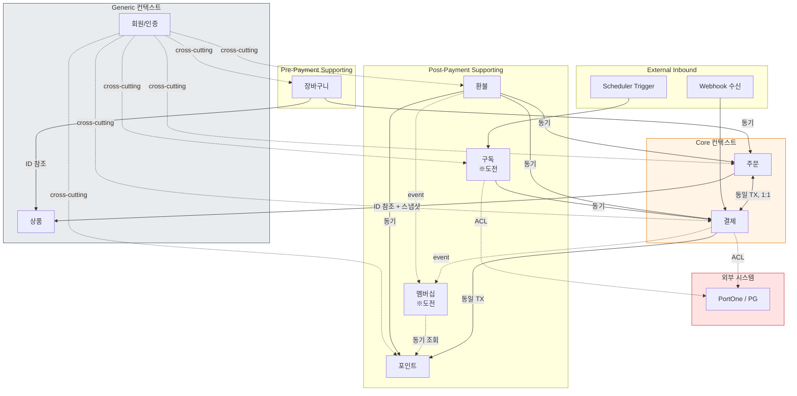

## Context Dependency Graph Topology

# Context Dependency Graph Topology

> 이 문서는 프로젝트의 **컨텍스트 의존성 그래프**를 위상(topology) 관점에서 정의한다.
Layer 2(느린 변화)에 속한다. 새 컨텍스트 추가·분할·병합 시 갱신된다.
구체 어휘(이벤트명·테이블명·클래스명·API 경로)는 의도적으로 배제했다.
>

---

## 0. One-Line Declaration

> **컨텍스트 간 결합은 ID 참조 또는 도메인 이벤트만 허용한다. JPA 연관관계는 같은 컨텍스트 내에서만 사용한다. 외부 시스템은 ACL을 통과해 그래프에 진입한다.**
>

세 원칙이 그래프의 모양을 결정한다. 이 셋이 흐려지면 컨텍스트는 이름만 남고 실제로는 거대한 단일 모델로 회귀한다.

---

## 1. 현재 컨텍스트 그래프 (초기 진단)

> 이 다이어그램은 *현재 시점의 진단*이다. Layer 2이므로 진화한다. 컨텍스트 추가·관계 변경 시 갱신.
>



**다이어그램 읽는 법**

- 실선 화살표: 동기 직접 호출
- 점선 + `event`: 도메인 이벤트 (비동기)
- 점선 + `ACL`: Anti-Corruption Layer 경유
- `동일 TX`: 같은 트랜잭션 안에서 호출됨
- `cross-cutting`: 인증/인가는 그래프의 모든 노드에 적용되는 횡단 관심사

---

## 2. 노드 — 컨텍스트 식별과 책임

### 2-1. 컨텍스트 식별 기준 (A-1)

새 컨텍스트로 분리할지 결정하는 휴리스틱. 셋 이상 만족하면 별도 컨텍스트 후보.

1. **언어 분기** — 같은 용어가 두 곳에서 다른 의미를 가짐 (예: "주문"이 장바구니 맥락의 주문 후보 ≠ 결제 맥락의 결제 대상 주문)
2. **변경 주기 분리** — 한쪽이 자주 변하는데 다른 쪽은 안정적
3. **책임의 독립성** — 한 컨텍스트의 결정이 다른 컨텍스트의 동작과 무관하게 일어남
4. **데이터의 lifecycle 차이** — 생성·갱신·소멸 주기가 명확히 다름
5. **외부 시스템 의존의 격리 필요** — 특정 외부 의존이 다른 영역으로 번지면 안 됨

### 2-2. 외부 시스템의 그래프 표현 (A-3)

- 외부 시스템은 **그래프에 노드로 표시한다.** 그러나 *항상 ACL을 통과한다.*
- 외부 시스템에 직접 연결되는 컨텍스트는 그 외부 의존을 자기 안에 격리한다 (해당 컨텍스트 외부는 외부 시스템의 존재를 모름).
- 같은 외부 시스템을 여러 컨텍스트가 사용하면, **각자 ACL을 가진다.** ACL을 공유하지 않음. (예: Payment의 PortOne ACL과 Subscription의 PortOne ACL은 별개)

### 2-3. Inbound Trigger의 위치 (A-4)

외부에서 시스템으로 들어오는 진입점의 소유권.

| Inbound Trigger | 소유 컨텍스트 | 이유 |
| --- | --- | --- |
| **REST API 요청** | 요청 의미가 속한 컨텍스트 | 자명. 각 컨텍스트가 자기 Controller를 가짐. |
| **Webhook** | Payment | PortOne의 webhook은 결제 결과 통지. Payment가 처리 후 다른 컨텍스트로 전파. |
| **Scheduler (구독 결제)** | Subscription | 정기 결제 결정은 Subscription의 책임. Payment 호출은 Subscription이 함. |

**원칙**: Inbound trigger는 *받는 의미를 결정하는 컨텍스트가 소유한다.* 받아서 단순 전달하는 게 아니라, 받은 의미를 자기 도메인 언어로 해석한 뒤 필요시 다른 컨텍스트를 호출한다.

### 2-4. 컨텍스트별 책임 (A-2)

각 컨텍스트가 책임지는 것과 **책임지지 않는 것**. 책임지지 않는 것이 경계 정의에 더 중요하다.

| 컨텍스트 | 책임 | 책임지지 않음 |
| --- | --- | --- |
| **회원/인증** | 신원 확인, 권한 부여, JWT 발급/검증 | 비즈니스 권한 (소유권 검증은 각 컨텍스트가 함) |
| **상품** | 상품 마스터 정보, 재고 상태 | 가격 결정 로직, 할인 정책, 주문/결제 |
| **장바구니** | 결제 전 임시 보관, 수량 관리 | 가격 계산, 재고 차감 |
| **주문** | 결제 대상의 확정, 주문 상태, 상품 스냅샷, 재고 차감/복구 | 결제 처리, 환불 금액 산정 |
| **결제** | PG 통신, 결제 검증, 멱등성, 결제 상태 | 환불 금액 산정, 주문 상태 변경 결정 |
| **포인트** | 포인트 잔액, 적립/사용/복구 원장, 정합성 | 적립률 결정 (멤버십이 결정) |
| **환불** | 환불 금액 산정, 부분/전액 환불 정책, PG 취소 호출 | 결제 자체, 주문 상태 직접 변경 |
| **멤버십** | 누적 금액, 등급 계산, 적립률 제공 | 포인트 적립 실행 |
| **구독** | 빌링키, 정기 결제 스케줄, 구독 상태 | 결제 처리 자체 (Payment 호출) |

---

## 3. 간선 — 의존의 종류

### 3-1. 의존 방향 규칙 (B-1)

**Upstream → Downstream** 방향 정의:

- **Upstream**: 변경의 원천. 결정을 내림.
- **Downstream**: 변경을 받음. Upstream의 결정에 영향받음.

본 프로젝트의 의존 방향 원칙:

1. **상품/회원은 모든 컨텍스트의 upstream.** 다른 컨텍스트가 Product/Auth를 의존하지만, 역방향 금지.
2. **장바구니 → 주문 단방향.** 주문이 생성되면 장바구니는 모름.
3. **주문 ↔ 결제는 *위상적으로* 양방향처럼 보이지만 *논리적으로* 단방향.** 주문이 결제를 호출, 결제 결과가 주문 상태 변경. 그러나 결제 결과 전파는 *Payment의 책임으로 단방향*. 주문이 결제 내부를 알면 안 됨.
4. **결제 → 포인트 단방향.** 결제가 포인트를 호출. 포인트는 결제의 존재를 모름 (사용/적립 이력만 받음).
5. **환불 → (결제, 주문, 포인트) 단방향.** 환불은 셋 모두를 호출. 셋은 환불의 존재를 모름.
6. **구독 → 결제 단방향.** 구독이 정기 결제를 호출.

> 일반 원칙: **시간적으로 나중에 일어나는 컨텍스트가 이전 컨텍스트를 호출한다.** (역방향은 이벤트로만)
>

### 3-2. 통신 방식의 분류 (B-2)

본 프로젝트가 인정하는 통신 방식 네 가지. 각각 다른 의미를 가짐.

| 방식 | 의미 | 사용 |
| --- | --- | --- |
| **직접 동기 호출** | 같은 프로세스, 같은 트랜잭션 가능, 즉시 결과 받음 | 기본값. 강한 정합성이 필요한 경우. |
| **도메인 이벤트 (Application Event)** | 같은 프로세스, 트랜잭션 후 처리 가능, 비동기 | 결과적 정합성이 OK인 경우. 결합 약화. |
| **외부 Port 호출** | 외부 시스템, 가급적 트랜잭션 바깥, 동기 | PortOne 등 외부 시스템 통신. |
| **공유 DB 접근** | 다른 컨텍스트의 테이블 읽기/쓰기 | **금지.** 7-2 참조. |

**기본값**: 직접 동기 호출. 다른 방식은 명시적 이유가 있을 때만.

### 3-3. 동기 vs 비동기 결정 트리 (B-3)

컨텍스트 간 호출이 필요할 때 어느 방식을 선택할지의 결정 트리.

```
Q1. 같은 트랜잭션 안에서 처리되어야 하는가? (실패 시 모두 롤백)
    YES → 직접 동기 호출
    NO  → Q2로

Q2. 호출자가 결과를 즉시 알아야 하는가?
    YES → 직접 동기 호출
    NO  → Q3로

Q3. 다운스트림 장애가 업스트림 흐름을 막아도 되는가?
    YES → 직접 동기 호출 (단순함이 유리)
    NO  → 도메인 이벤트

Q4. (참고) 외부 시스템인가?
    YES → 외부 Port 호출 (가급적 트랜잭션 밖)
```

본 프로젝트의 적용 예:

- **결제 완료 시 포인트 사용/적립**: 같은 트랜잭션 필수 → **직접 동기 호출**
- **결제 완료 시 멤버십 누적 갱신**: 트랜잭션 분리 가능, 즉각성 불필요 → **도메인 이벤트**
- **환불 시 포인트 복구**: 같은 트랜잭션 필수 → **직접 동기 호출**
- **PortOne 결제 요청**: 외부 시스템 → **외부 Port 호출**, DB 커밋과의 순서는 보상 처리 패턴 따름

### 3-4. 경계 통과 데이터의 형태 (B-4)

**아키텍처 스타일의 비대칭 결정의 직접 귀결.** JPA 연관관계 직접 사용을 허용하지만, *컨텍스트 경계에서는 다르다.*

| 형태 | 컨텍스트 내부 | 컨텍스트 경계 통과 |
| --- | --- | --- |
| **JPA 연관관계 (Entity 직접 참조)** | ✅ 허용 | ❌ **금지** |
| **ID 참조** | ✅ 허용 | ✅ **기본 형태** |
| **DTO (조회 결과)** | ✅ 허용 | ✅ Query 결과 전달 시 |
| **Value Object 공유** | ✅ 허용 | 🔶 Shared Kernel에 한해 (4-3 참조) |
| **Domain Event 페이로드** | — | ✅ 비동기 통신 |

**가장 중요한 결정**: *JPA `@ManyToOne`, `@OneToMany`가 컨텍스트 경계를 넘으면 안 된다.* 같은 컨텍스트 안에서만. 컨텍스트 경계는 ID 참조로 끊는다.

**예시**:

- ✅ Order 내부의 Order ↔ OrderItem: JPA 연관관계 사용 OK
- ❌ Order의 `@ManyToOne User user`: User는 회원 컨텍스트. ID만 (`Long userId`).
- ❌ Payment의 `@OneToOne Order order`: 같은 트랜잭션이라도 컨텍스트 경계는 끊는다. ID로 (`Long orderId`).

이 규칙이 흐려지면 결제 도메인이 회원 도메인의 테이블까지 JOIN하는 코드가 자라기 시작한다.

### 3-5. 트랜잭션 경계와의 관계 (B-5)

컨텍스트 간 호출과 트랜잭션 경계의 정렬.

- **같은 트랜잭션 안의 컨텍스트 간 호출은 허용된다.** 다만 *서비스 메서드 단위*로만. Application Service가 다른 컨텍스트의 Application Service를 호출.
- **트랜잭션 경계는 호출의 시작점이 결정한다.** 호출되는 쪽은 `REQUIRED`로 합류한다.
- **이벤트 발행은 트랜잭션 안에서, 처리는 트랜잭션 후에.** Spring의 `@TransactionalEventListener(AFTER_COMMIT)`. 발행 자체가 실패하면 이벤트는 없던 일이 됨.

> 자세한 정책은 `tx-topology.md`에서 다룬다. 이 문서는 *컨텍스트 경계*에 한해서만 다룸.
>

---

## 4. 관계 유형 — Context Map 어휘

### 4-1. 채택할 관계 유형 (C-1)

DDD의 Context Map 패턴 중 본 프로젝트가 사용하는 것만 추림.

| 패턴 | 사용 | 의미 |
| --- | --- | --- |
| **Customer-Supplier** | ✅ 기본 | 내부 컨텍스트 간 의존. 다운스트림(Customer)이 업스트림(Supplier)의 변경에 영향받지만, 협의 가능. |
| **Anti-Corruption Layer (ACL)** | ✅ 외부 전용 | PortOne 등 외부 시스템. 외부 모델이 도메인을 오염시키지 않게 격리. |
| **Shared Kernel** | ✅ 최소화 | 정말 공유해야 하는 공통 타입만 (4-3 참조). |
| **Conformist** | ❌ 사용 안 함 | 내부에서는 모두 협의 가능 (Customer-Supplier). 외부는 ACL로 처리. |
| **Open Host Service** | ❌ 사용 안 함 | 외부에 노출되는 공개 API가 본 프로젝트엔 없음. |
| **Published Language** | ❌ 사용 안 함 | 같은 이유. |
| **Separate Ways** | ❌ 사용 안 함 | 모든 내부 컨텍스트가 어떤 식으로든 결제 흐름에 얽힘. |

### 4-2. 외부 시스템(PG)과의 관계 유형 (C-2)

**PortOne과의 관계는 항상 Anti-Corruption Layer.** 다음 규칙으로 보장.

1. PortOne SDK·DTO·예외 타입이 Application Layer에 import되면 위반.
2. PortOne의 결제 상태/금액 표현이 도메인 모델에 그대로 들어오면 위반. 항상 도메인 용어로 번역됨.
3. PortOne 응답 형식의 변경이 Application 코드를 흔들면 안 됨. Adapter에서만 변경 흡수.
4. Webhook 페이로드는 *신뢰하지 않는 입력*으로 취급. 내부 결제 정보 조회로 다시 검증.

### 4-3. Shared Kernel의 범위 정책 (C-3)

공유는 *축복이 아니라 비용*이다. 공유한 것은 변경할 때 모든 컨텍스트의 합의가 필요해진다.

**Shared Kernel에 들어갈 수 있는 것**

- **금액 타입** (Money / Amount Value Object) — 모든 컨텍스트가 다루는 가장 기본적 타입
- **ID 생성 전략** (UUID 정책 등)
- **시간 다루기 기본 유틸** (clock 추상화 등)
- **공통 기반 클래스** (BaseEntity, BaseTimeEntity 등 — 최소화)

**Shared Kernel에 들어가면 안 되는 것**

- 도메인 enum (각 컨텍스트의 상태)
- 비즈니스 규칙
- DTO (각 컨텍스트가 자기 DTO)
- 도메인 이벤트 (발행자 컨텍스트 소유)

**원칙**: 의심스러우면 공유하지 말고 복제한다. *작은 중복이 잘못된 공유보다 낫다.*

---

## 5. 소유권과 안정성

### 5-1. 컨텍스트별 Public Surface (D-1)

각 컨텍스트가 외부에 노출하는 것 (= 다른 컨텍스트가 의존할 수 있는 표면).

**노출하는 것 (Public Surface)**

- **Application Service의 공개 메서드** — 유스케이스 진입점
- **공개 Query 메서드 / Query DTO** — 다른 컨텍스트가 조회 가능
- **발행하는 도메인 이벤트** — 다른 컨텍스트가 구독 가능

**노출하지 않는 것 (Internal)**

- Aggregate / Entity 자체
- Repository
- 내부 Value Object
- Domain Service의 메서드
- Domain Event를 *직접 발행할 수 있는 권한* (5-2 참조)

**원칙**: 다른 컨텍스트가 *Aggregate를 직접 받지 않는다.* 항상 Application Service 또는 Query DTO를 통한다.

### 5-2. 이벤트 소유권 규칙 (D-2)

도메인 이벤트는 컨텍스트 결합의 가장 강력한 도구이자, 가장 발산하기 쉬운 지점.

**규칙**

1. **도메인 이벤트는 발생 컨텍스트의 소유다.**
    - Payment 컨텍스트에서 발생하는 이벤트(결제 완료 등)는 Payment 소유.
2. **구독은 자유, 발행은 소유자만.**
    - 다른 컨텍스트가 Payment의 이벤트를 구독하는 것은 자유.
    - 다른 컨텍스트가 Payment의 이벤트를 *발행*하는 것 금지.
3. **이벤트 스키마 변경은 소유 컨텍스트만 할 수 있다.**
    - 변경 시 구독자에게 영향 분석 책임은 소유자.
4. **한 트랜잭션에서 자기 컨텍스트의 이벤트만 발행한다.**
    - 한 use case 안에서 여러 컨텍스트의 이벤트가 발행되면 책임 경계가 무너졌다는 신호.

**위반 신호**: Order Application Service에서 PaymentCompleted 이벤트를 발행하는 코드 → 위반. Payment가 발행해야 함.

---

## 6. 진화 정책

### 6-1. 새 컨텍스트 도입 기준 (F-1)

새 비즈니스 영역을 추가할 때, 기존 컨텍스트 확장 vs 새 컨텍스트 도입의 판단.

**새 컨텍스트로 도입하는 신호** (셋 이상 만족)

- 새 영역의 ubiquitous language가 기존 컨텍스트와 명확히 다름
- 기존 컨텍스트에 넣으면 그 컨텍스트의 책임이 두 가지 이상으로 흐려짐
- 변경 주기가 명확히 다름
- 다른 외부 시스템에 의존함
- 별도 팀이나 담당자가 다룰 가능성

**기존 컨텍스트 확장으로 충분한 신호**

- 같은 도메인 언어로 표현됨
- 기존 컨텍스트의 자연스러운 확장 (예: 기존 환불에 정책 옵션 추가)
- 기존 컨텍스트의 Aggregate와 강결합이 본질적임

### 6-2. 컨텍스트 분할 기준 (F-2)

기존 컨텍스트가 비대해질 때 분할 트리거.

1. **언어 분기 발견** — 같은 컨텍스트 내에서 같은 용어가 두 의미로 쓰이기 시작
2. **책임의 독립적 진화** — 컨텍스트 내 두 영역이 서로 다른 이유로 변경됨 (변경 빈도 차이)
3. **테스트 시간 폭발** — 한 영역 변경이 다른 영역의 테스트까지 흔들기 시작
4. **God Context 신호 발견** (7-3 참조)

분할 시 절차:

- 새 컨텍스트의 책임을 *책임지지 않는 것까지* 정의 (2-4 양식)
- Public Surface 정의 (5-1)
- 기존 컨텍스트와의 관계 유형 결정 (4-1)
- 이 문서의 다이어그램 갱신

### 6-3. 컨텍스트 병합 기준 (F-3)

분할이 잘못된 결정이었음이 발견될 때.

**병합 신호**

- 두 컨텍스트가 항상 함께 변경됨 (PR이 두 컨텍스트를 동시에 건드림)
- 한 컨텍스트가 다른 컨텍스트의 *모든* 기능을 호출함 (다른 호출자 없음)
- 두 컨텍스트가 별도 배포 단위가 아니고 별도일 이유가 사라짐
- Chatty communication 패턴 발견 (수많은 작은 호출)

**병합은 분할보다 어렵다.** 합의·코드 이동·테스트 재배치 비용이 큼. 충분한 신호가 누적된 후 결정.

### 6-4. 그래프 갱신 트리거 (PR 게이트) (F-4)

다음 변경 중 하나라도 발생하는 PR은 이 문서를 함께 갱신한다.

- [ ]  새 컨텍스트가 도입되었는가
- [ ]  컨텍스트가 분할/병합되었는가
- [ ]  컨텍스트 간 새 의존이 생겼는가 (직접 호출, 이벤트, ACL)
- [ ]  새 외부 시스템 의존이 생겼는가
- [ ]  컨텍스트의 책임이 변경되었는가 (특히 *책임지지 않는 것*이 변경)
- [ ]  새 Inbound Trigger가 추가되었는가 (새 Webhook, 새 Scheduler 등)
- [ ]  Shared Kernel에 항목이 추가/제거되었는가
- [ ]  컨텍스트의 Public Surface가 변경되었는가

이 중 하나라도 해당하면 PR 설명에 그래프 변경 사항을 포함하거나, 별도 PR로 이 문서를 먼저 갱신한다.

---

## 7. 안티패턴

### 7-1. 순환 의존 금지 (G-1)

**규칙**

1. **직접 양방향 의존 금지.** A → B 이면서 B → A 인 경우.
2. **간접 순환 금지.** A → B → C → A 같은 형태.
3. **양방향처럼 보이는 결합은 이벤트로 끊는다.** 예: Order ↔ Payment의 양방향은 *Payment → Order는 이벤트 전파, Order → Payment는 동기 호출*로 비대칭화.

**발견 시 판단 기준**: 어느 쪽이 더 *의미적으로 upstream*인지 보고, downstream → upstream 방향을 이벤트로 바꾼다.

### 7-2. DB 레벨 결합 금지 (G-2) — **본 프로젝트에서 가장 까다로운 항목**

아키텍처 스타일에서 JPA 직접 사용 + 컨텍스트 간 JPA 연관관계 금지를 결정했다. 이 결정의 일관된 운영 규칙.

**금지하는 것**

1. **다른 컨텍스트의 테이블에 JPA `@ManyToOne`, `@OneToMany` 등으로 직접 참조 금지.**
2. **다른 컨텍스트의 테이블에 FK 제약 거는 것 금지.**
    - 예외 인정 (제한적): 같은 트랜잭션 라이프사이클을 가진 강결합 컨텍스트 쌍 (예: Order ↔ Payment). 단, 이 경우에도 *Entity 참조는 안 하고 FK 컬럼만* 둘 수 있음. ADR로 박제.
3. **다른 컨텍스트의 테이블에 JOIN 쿼리 금지.**
    - QueryDSL에서도 동일.
4. **다른 컨텍스트의 Repository를 직접 주입받는 것 금지.**
    - 다른 컨텍스트에 접근하려면 그 컨텍스트의 Application Service 또는 Query 메서드 경유.

**허용하는 것**

- ID 컬럼 (`Long userId`, `Long orderId` 등 단순 Long/String 필드)
- 다른 컨텍스트의 Application Service / Query Service 주입 및 호출

**위상적 의미**: 이 규칙이 컨텍스트를 *진짜* 컨텍스트로 만든다. 깨지면 그래프 위상은 그대로지만 실제로는 하나의 거대한 모델이 된다.

**점검 방법**: ArchUnit 또는 Spring Modulith로 패키지 의존 자동 검증 (8-2 참조).

### 7-3. God Context 신호 (G-3) — **결제 도메인에서 특히 위험**

결제 도메인 프로젝트는 Payment가 god이 되는 경향이 강하다. 명시적으로 경계.

**Payment가 god이 되는 신호**

- 모든 컨텍스트가 Payment를 직접 호출함
- Payment Application Service의 메서드 수가 다른 컨텍스트의 합보다 많음
- Payment가 적립 결정, 멤버십 등급 변경, 환불 산정 등 *결제 외 비즈니스 결정*을 함
- Payment 컨텍스트의 PR이 가장 자주 발생함

**대응**

1. **결제 외 결정은 다른 컨텍스트가 한다.**
    - 적립률 결정 → Membership
    - 환불 금액 산정 → Refund
    - 구독 갱신 결정 → Subscription
    - Payment는 *결제 자체*만 책임. (PG 통신, 멱등성, 금액 검증, 결제 상태)
2. **다른 컨텍스트가 Payment를 호출하는 것은 OK.** 그러나 *Payment가 다른 컨텍스트의 비즈니스 로직을 가지면 안 됨.*
3. **Payment의 이벤트를 통해 후속 처리를 분산.** Payment는 "결제 완료"를 알리고, 그 후 처리는 각 컨텍스트가.

**일반 God Context 신호 (Payment 외에도 적용)**

- 한 컨텍스트가 그래프의 중심에 모든 의존이 모임
- 그 컨텍스트의 변경이 거의 모든 PR에 포함됨
- 새 기능 추가 시 거의 항상 그 컨텍스트가 건드려짐

---

## 8. 가시화와 자동 검증

### 8-1. 그래프 가시화 방법 (H-1)

**표준 형식**: Mermaid `flowchart`. 코드 저장소 안의 markdown에 임베드. 외부 도구 의존 최소화.

**표기 컨벤션**

- 박스: 컨텍스트
- 박스 그룹: 분류 (Core / Supporting / Generic / External)
- 실선 화살표: 동기 직접 호출
- 점선 화살표 + `event`: 도메인 이벤트
- 점선 화살표 + `ACL`: 외부 시스템 ACL
- 라벨: 결합 강도, 트랜잭션 정보, 데이터 형태 ("ID 참조", "동일 TX" 등)

**유지 정책**

- 다이어그램은 *현재 상태*를 반영. *역사적 기록*이 아님.
- 이전 상태의 다이어그램이 필요하면 git 히스토리로 충분. 문서에 여러 시점을 동시에 표현하지 않음.

### 8-2. 자동 검증 가능성 (H-2)

규칙별로 자동 검증 가능한 것과 사람이 봐야 하는 것을 구분.

| 규칙 | 자동 검증 도구 | 가능성 |
| --- | --- | --- |
| 컨텍스트 간 패키지 의존 방향 (3-1) | ArchUnit, Spring Modulith | ✅ 강함 |
| Repository 의존 (다른 컨텍스트 Repository 주입 금지) (7-2) | ArchUnit | ✅ 강함 |
| JPA 연관관계의 컨텍스트 경계 통과 (3-4, 7-2) | ArchUnit + 패키지 컨벤션 | 🔶 부분 |
| 이벤트 발행 권한 (5-2) | ArchUnit (이벤트 클래스 위치 + 발행 코드 위치) | 🔶 부분 |
| 컨텍스트 책임 (2-4) | — | ❌ 사람 검토 |
| God Context 신호 (7-3) | 코드 메트릭 (메서드 수, PR 빈도) | 🔶 정량적 신호만 |
| 통신 방식 선택 (3-3) | — | ❌ 사람 검토 (PR 리뷰) |

**원칙**: 자동 검증 가능한 것은 *반드시* 자동 검증. 사람이 매번 확인해야 하는 규칙은 결국 무너진다.

**추천 도구**: Spring Modulith를 권장. 본 프로젝트의 Spring Boot 환경과 자연스럽게 통합되고, 컨텍스트(Module) 경계 검증·이벤트 발행 검증·문서 자동 생성을 함께 제공.

---

## 9. 이 topology가 다루지 않는 것 (어휘는 어디에 있는가)

| 다루지 않는 것 | 어디에 있는가 |
| --- | --- |
| 구체 이벤트 이름·페이로드 스키마 | `event-topology.md` |
| 구체 Aggregate 구조·테이블 관계 | `data-topology.md` |
| 트랜잭션 범위 구체 정책 | `tx-topology.md` |
| API URL·필드 명세 | `api-topology.md` |
| 컨텍스트별 도메인 모델 상세 | 영역별 topology (예: `payment-topology.md`) |
| 인증/인가의 구체 메커니즘 | `auth-topology.md` |
| 구체 ErrorCode·예외 클래스 | 코딩 컨벤션 |

---

## 10. 자가 점검 질문

이 topology가 살아있는지 정기적으로 점검할 때 던지는 질문들. 하나라도 YES면 위반 또는 위반 위험.

1. 다른 컨텍스트의 Entity를 `@ManyToOne`이나 `@OneToMany`로 참조하는 코드가 있는가?
2. 다른 컨텍스트의 Repository를 직접 주입받아 사용하는 Application Service가 있는가?
3. 한 컨텍스트의 Application Service가 다른 컨텍스트의 도메인 이벤트를 발행하는가?
4. 컨텍스트 간 JOIN 쿼리가 있는가? (QueryDSL 포함)
5. Payment Application Service의 메서드 수가 다른 어떤 컨텍스트보다 두 배 이상 많은가?
6. 같은 외부 시스템(PortOne)에 대한 ACL이 컨텍스트마다 따로 있지 않고 공유되고 있는가?
7. 어떤 컨텍스트의 책임이 *책임지지 않는 것* 항목 없이 정의되어 있는가?
8. 양방향 의존이 *이벤트로 끊어지지 않고* 직접 호출로 양방향인가?
9. Shared Kernel에 도메인 enum이나 비즈니스 규칙이 들어 있는가?
10. 새 컨텍스트가 추가되었는데 이 문서의 다이어그램이 갱신되지 않았는가?

---

## 11. 변경 정책

이 문서는 Layer 2다. 변경은 발생하나 ADR 또는 PR 게이트를 통과한다.

- **자유롭게 변경 가능**: 다이어그램 시각 표현, 자가 점검 질문, 컨벤션 표기
- **PR 게이트 통과 필요** (6-4 참조): 컨텍스트 추가/분할/병합, 컨텍스트 간 의존 추가, 외부 시스템 추가, Public Surface 변경
- **ADR 필요**: 컨텍스트 식별 기준 변경, 통신 방식 분류 변경, Shared Kernel 정책 변경, DB 레벨 결합 금지 정책의 예외 추가, 컨텍스트 경계에서 JPA 연관관계 허용으로의 전환 (권장하지 않음)
- **거의 발생 안 함**: ACL 패턴 채택 여부, 이벤트 소유권 원칙

---