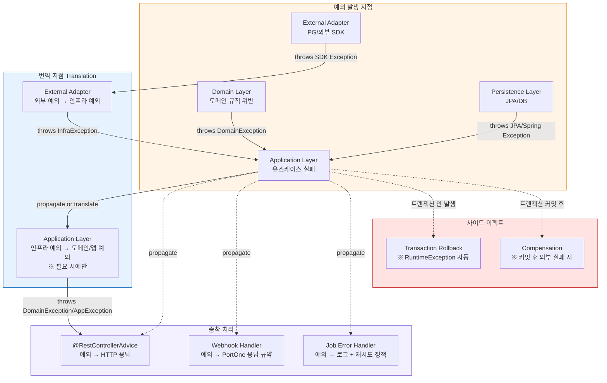

## Error Handling Topology

# Error Handling Topology

> 이 문서는 프로젝트의 에러 처리 철학을 **위상(topology) 관점**에서 정의한다.
한 번 정하면 코드베이스 전반에 영향을 미치므로 Layer 1(불변)에 속한다.
구체 어휘(예외 클래스명·에러 코드·HTTP 상태 매핑)는 의도적으로 배제했다.
>

---

## 0. One-Line Declaration

> **Exception-first + 계층별 책임 분리 + 명시적 번역 지점**
>
>
> 기본은 예외를 던진다. 도메인 예외와 인프라 예외를 분리하고, 인프라 예외는 반드시 번역 지점을 통과해 도메인/애플리케이션 예외로 변환된다. 예외는 Inbound 경계(`@RestControllerAdvice`)에서 단일하게 응답으로 변환된다. **명시적 다중 결과**가 필요한 특수 경로(웹훅 멱등 처리 등)에서만 sealed result 타입을 사용한다.
>

---

## 1. Diagram



---

## 2. Nodes — 예외 유형의 분류

세 가지 큰 분류. 각각이 다른 의미와 다른 처리 경로를 갖는다.

| 유형 | 의미 | 발생 위치 | 처리 방향 |
| --- | --- | --- | --- |
| **DomainException** | 비즈니스 규칙 위반, 도메인 불변식 깨짐 | Domain Layer | Application은 그대로 통과시킴. 클라이언트에게 의미 있는 에러로 변환. |
| **ApplicationException** | 유스케이스 실패 (인증 실패, 권한 없음, 자원 없음 등) | Application Layer | GlobalHandler가 HTTP 응답으로 변환. |
| **InfrastructureException** | 외부 시스템 호출 실패, 시스템 자원 문제 | External Adapter, (드물게) Persistence | 가능하면 Application에서 도메인 의미로 번역. 번역 불가하면 그대로 전달되어 5xx 응답. |

**부가 분류**

| 유형 | 의미 | 비고 |
| --- | --- | --- |
| **ValidationException** | 입력 검증 실패 | Spring Bean Validation이 처리. 별도 카테고리로 둠. |
| **JPA/Spring Exception** | `DataIntegrityViolationException`, `OptimisticLockingFailureException` 등 | 의미가 도메인적이면 Application에서 번역, 아니면 InfrastructureException으로 취급. |

---

## 3. Edges — 예외 전파와 번역 방향

```
[Domain]            ──throws DomainException──►          [Application]
[Persistence]       ──throws JPA/Spring Exception──►     [Application]
[External SDK]      ──throws SDK Exception──►            [External Adapter]
[External Adapter]  ──throws InfrastructureException──►  [Application]

[Application]  ──pass through or translate──►  [Inbound Layer]
[Inbound Layer]──delegates to──►               [GlobalExceptionHandler / Webhook / Job]
```

핵심 규칙:

- **번역은 한 방향**: 외부 → 인프라 → 도메인/앱. 역방향(도메인 → 인프라) 절대 없음.
- **번역 지점은 두 군데뿐**: External Adapter (SDK → Infra), Application (Infra → Domain/App, 의미가 명확할 때).
- **종착 처리는 Inbound 경계에서**: 예외가 Application을 벗어나면 반드시 Inbound 경계의 핸들러가 잡는다.

---

## 4. Boundaries — 번역과 처리의 경계

### 4-1. Domain–Application 경계

- **Domain은 자기 예외만 던진다.** DomainException 계열만.
- **Application은 도메인 예외를 잡지 않는다.** 그대로 통과시킨다 (특수한 보상 처리가 필요한 경우 제외).
- **이유**: 도메인 예외는 그 자체로 클라이언트에게 의미 있는 정보다. 잡아서 변형하면 의미가 손실된다.

### 4-2. External Adapter–Application 경계

- **External Adapter는 외부 SDK 예외를 잡아서 InfrastructureException으로 변환한다.** 외부 SDK 예외가 Application까지 도달하면 위반.
- **Application은 InfrastructureException을 받아 결정한다**:
    - 의미가 명확하면 → 도메인 예외로 번역 (예: PG 4xx → `PaymentDeclinedException`)
    - 의미가 불명확하면 → 그대로 전달 (GlobalHandler가 5xx로 변환)
    - 보상 처리가 필요하면 → 잡아서 보상 후 다시 던짐

### 4-3. Persistence–Application 경계

- **JPA/Spring 예외는 기본적으로 그대로 전달**한다. 별도 InfrastructureException으로 감싸지 않음.
- **예외**: 도메인적 의미가 명확한 경우만 번역.
    - `DataIntegrityViolationException` (unique 제약 위반) → `DuplicateXxxException`
    - `OptimisticLockingFailureException` → `ConcurrentModificationException` 또는 재시도 시그널
- **이유**: 아키텍처 스타일에서 영속성에 port를 두지 않기로 결정했다. 그 결정의 일관된 귀결.

### 4-4. Inbound 경계 (종착 처리)

- **REST API**: `@RestControllerAdvice`가 모든 예외를 잡아 HTTP 응답으로 변환.
- **Webhook**: Webhook Handler가 자체 예외 처리 — PortOne 응답 규약에 맞춰 결정 (재시도 유도 / 종료).
- **Scheduled Job**: Job Error Handler가 로그 + 재시도 정책 + 알림.
- **이유**: Inbound 형식마다 응답 규약이 다르다. 단일 핸들러로 통합하면 책임이 모호해진다.

---

## 5. Invariants

깨지면 안 되는 규칙들.

1. **Domain Layer는 외부 시스템·JPA·HTTP·Spring Framework 예외를 throw 하지 않는다.**
   Domain은 자기 예외만 던진다. 다른 예외를 import해서 던지는 코드 발견 시 위반.
2. **External Adapter는 외부 SDK 예외를 자신의 경계 밖으로 흘려보내지 않는다.**
   반드시 InfrastructureException으로 변환. SDK 예외 타입이 Application에 import되면 위반.
3. **Inbound Layer는 예외를 비즈니스 로직으로 사용하지 않는다.**
   Controller에서 `try-catch`로 분기를 만들지 않는다. 분기는 Application 또는 Domain의 책임.
4. **모든 커스텀 예외는 `RuntimeException`을 상속한다.**
   Checked exception 금지. Spring의 트랜잭션 롤백 동작과 일관성 유지.
5. **트랜잭션 안에서 발생한 예외는 반드시 롤백 후 전파된다.**`try-catch`로 예외를 삼키고 트랜잭션을 커밋시키는 패턴 금지. 의도적으로 삼켜야 한다면 `@Transactional(noRollbackFor = ...)` 명시.
6. **커밋 후 외부 호출 실패는 예외가 아닌 보상 처리로 다룬다.**
   외부 port 호출이 DB 커밋 이후에 일어나는 경우(권장 패턴), 외부 실패는 보상 트랜잭션으로 처리. 예외를 던져서 호출자에게 돌아가지 않는다.
7. **번역 없는 예외 전파는 외부 → 외부로 일어나지 않는다.**
   외부 SDK 예외가 GlobalExceptionHandler까지 도달하면 위반. 반드시 번역 지점을 통과.
8. **GlobalExceptionHandler는 모든 예외를 처리한다. fallback이 반드시 존재한다.**
   알 수 없는 예외 → 5xx 응답 + 로그. 핸들러에서 잡히지 않아 컨테이너로 빠지는 예외 금지.

---

## 6. Throw vs Result — 기본 정책과 예외 정책

### 기본: Throw

모든 에러는 예외로 처리. Spring 생태계 표준 + Spring AOP/트랜잭션과의 자연스러운 통합.

**이유**

- Spring의 트랜잭션 롤백, `@RestControllerAdvice`, `@Async` 에러 처리 등이 모두 예외 기반.
- Java/Kotlin 표준 생태계 코드와 자연스럽게 어울림.
- 행복 경로(happy path) 코드가 깔끔하게 유지됨.

### 예외적으로 Result 타입을 사용하는 경우

다음 셋 중 하나라도 해당하면 sealed result 타입(또는 명시적 결과 클래스) 사용 검토:

1. **단일 호출이 여러 expected outcome을 가짐**
   예: 웹훅 처리 → `AlreadyProcessed | NewlyProcessed | StateConflict | Failed`. 각각 다른 후속 처리가 필요하고 모두 "정상 경로"인 경우.
2. **호출자가 모든 결과 분기를 명시적으로 처리해야 함**
   예: 상태 머신 전이 검증 → 가능/불가능을 명시적으로 받고 분기.
3. **에러가 비즈니스 흐름의 일부고 예외 라기에는 너무 흔함**
   예: 멱등성 충돌, 재고 부족 (이건 도메인 예외와 Result 둘 다 가능 — 호출 빈도와 호출자 책임에 따라 결정).

### Result 타입을 쓰지 않을 곳

- 일반 비즈니스 검증 실패 (재고 부족 정도면 throw가 더 깔끔)
- 외부 시스템 호출 결과 (실패는 InfrastructureException으로 통일)
- CRUD 조작의 단순 실패 (throw)

### 결정 트리

```
이 호출의 결과가...
  ├ 성공/실패 이분법인가? → throw
  ├ 호출자가 모든 분기를 반드시 다뤄야 하는 다중 outcome인가? → Result
  └ 실패가 "흔한 정상 흐름"인가?
       ├ 호출자가 분기 처리해야 함 → Result
       └ 호출자가 그냥 실패로 다루면 됨 → throw
```

---

## 7. 누가 잡고 누가 던지는가 — 계층별 책임

각 계층의 예외 처리 책임을 명시화한다.

| 계층 | 던지는가 | 잡는가 | 비고 |
| --- | --- | --- | --- |
| **Domain** | ✅ DomainException | ❌ | 자기 예외도 잡지 않음. |
| **Persistence** | ✅ JPA/Spring 예외 자연 발생 | ❌ | Repository 메서드에 try-catch 금지. |
| **External Adapter** | ✅ InfrastructureException | ✅ 외부 SDK 예외 | 변환 책임. |
| **Application** | ✅ 번역 후 도메인/앱 예외 | 🔶 선택적 | 번역·보상이 필요한 경우만. |
| **Inbound (Controller)** | ❌ | ❌ | 분기로 사용 금지. |
| **GlobalExceptionHandler** | ❌ | ✅ 모든 예외 | 종착점. |
| **Webhook Handler** | 🔶 PortOne 응답 형식으로 변환 | ✅ 자체 처리 | 응답 규약이 특수함. |
| **Job Error Handler** | ❌ | ✅ 모든 예외 | 로그 + 재시도 + 알림. |

**Application Layer의 catch 정책 (가장 중요)**

Application은 기본적으로 잡지 않고 전달한다. 잡는 것은 다음 셋 중 하나일 때만:

1. **번역**: 인프라 예외를 도메인 의미로 변환
2. **보상**: DB 커밋 이후 외부 호출 실패 시 보상 트랜잭션 실행
3. **재시도**: 명시적 재시도 정책이 필요한 경우

이 셋 외의 `try-catch`는 위반. Application Service가 catch로 비대해지면 신호다.

---

## 8. 트랜잭션과의 결합

에러 처리는 트랜잭션 경계와 본질적으로 얽혀 있다. (자세한 정책은 `tx-topology.md`에서 다룸)

**핵심 규칙**

- 모든 커스텀 예외는 `RuntimeException` → 트랜잭션 자동 롤백
- 트랜잭션 안 발생 예외 → 롤백 → Application 밖으로 전파
- 트랜잭션 커밋 후 발생 예외 (외부 port 호출 결과) → 롤백 불가 → 보상 처리

**금지 패턴**

- 트랜잭션 안에서 예외를 `try-catch`로 삼키고 커밋 시키기 → 데이터 정합성 깨짐
- 외부 port 호출을 트랜잭션 안에 두고 외부 예외에 의존해 도메인 상태 결정하기 → 락 점유 시간 증가 + 부분 실패 시 복잡도 폭발

---

## 9. Decision History — 왜 이 철학인가

**왜 Exception-first (Result-first 아님)**

- Spring/Java 생태계 표준. 라이브러리 통합 비용 최소.
- 행복 경로 코드 가독성 우위.
- `@RestControllerAdvice` 단일 종착점으로 응답 변환 책임 집중 가능.
- Kotlin Result나 Arrow Either 등은 도입 시 학습 곡선과 팀 합의 비용 큼.

**왜 도메인/인프라 예외 분리**

- 도메인 예외는 비즈니스 의미를 담는다. 클라이언트에게 4xx로 가야 함.
- 인프라 예외는 시스템 문제다. 5xx로 가거나 재시도되어야 함.
- 같은 처리를 받으면 둘 다 손해. 도메인은 의미가 흐려지고, 인프라는 적절한 운영 대응을 못 받음.

**왜 번역 지점을 두 군데로 제한**

- External Adapter에서 SDK 예외를 InfraException으로 변환 → 외부 의존 격리.
- Application에서 InfraException을 도메인 의미로 번역 → 의미 명확성.
- 더 많은 번역 지점을 두면 예외가 어디서 어떻게 변하는지 추적 불가.

**왜 GlobalExceptionHandler 단일 종착점**

- HTTP 응답 변환 로직이 흩어지면 응답 일관성 손상.
- 에러 코드 표준, 로깅 표준, 에러 응답 형식을 한곳에서 강제.
- 단, **Inbound 종류마다 별도** (REST / Webhook / Job) — 응답 규약이 다르므로.

**왜 sealed Result는 예외적으로만**

- 모든 곳에 적용하면 Spring 통합 비용 큼.
- 그러나 명시적 다중 결과가 필요한 자리에서 throw는 부자연스럽다 (catch로 분기 = 안티패턴).
- 위 6장의 결정 트리로 적용 범위 명확화.

**대안과 안 고른 이유**

- *Result-first* — Spring 생태계 통합 비용·학습 비용 과도. 행복 경로 가독성 손상.
- *Checked Exception 사용* — Spring 트랜잭션 동작과 충돌, Lambda/Stream과 충돌, 자바 생태계에서도 anti-pattern으로 자리잡음.
- *예외 계층 없이 단일 BusinessException + ErrorCode만* — 가벼우나 catch 시 의미 분기 불가. 작은 프로젝트에선 OK, 결제 도메인엔 부족.

---

## 10. 이 topology가 다루지 않는 것 (어휘는 어디에 있는가)

| 다루지 않는 것 | 어디에 있는가 |
| --- | --- |
| 구체 예외 클래스명·상속 구조 | 코드 + 코딩 컨벤션 |
| ErrorCode enum 체계 | 별도 코드 표준 문서 |
| 예외별 HTTP 상태 매핑 | GlobalExceptionHandler 코드 또는 매핑 테이블 |
| 도메인별 예외 카탈로그 | 영역별 topology (예: `payment-topology.md`) |
| 재시도 정책의 구체 (횟수·백오프) | `tx-topology.md` 또는 운영 정책 |
| 로깅 포맷·correlation ID 전파 | 운영 topology |
| Webhook 응답 규약의 구체 | `payment-topology.md` |

---

## 11. 자가 점검 질문

이 철학이 살아있는지 정기적으로 점검할 때 던지는 질문들. 하나라도 YES면 위반 또는 위반 위험.

1. Controller 코드에 `try-catch`가 있는가? (분기로 사용하는지 점검)
2. Domain Layer 코드에 `import`된 Spring/JPA/HTTP 예외 타입이 있는가?
3. Application Service 메서드에 `try-catch`가 두세 군데 이상 있는가? (catch로 비대해지는 신호)
4. External SDK 예외 타입이 Application Layer에 import되어 있는가?
5. `RuntimeException`이 아닌 커스텀 예외(`extends Exception`)가 있는가?
6. `@Transactional` 메서드 내부에서 예외를 잡고 정상 응답을 반환하는 코드가 있는가?
7. GlobalExceptionHandler에 잡히지 않아 5xx 일반 페이지로 빠지는 예외가 있는가?
8. 외부 SDK 예외가 그대로 클라이언트 응답에 노출된 적이 있는가? (로그 점검)
9. Webhook 처리 중 발생한 예외로 PortOne이 무한 재시도하는 사례가 있는가?
10. 같은 의미의 도메인 예외가 여러 클래스로 나뉘어 있거나, 다른 의미의 예외가 한 클래스에 뭉쳐 있는가?

---

## 12. 변경 정책

이 문서는 Layer 1이다. 변경은 거의 발생하지 않아야 한다.

- **자유롭게 변경 가능**: 자가 점검 질문, 다이어그램 시각 표현, ErrorCode enum 항목
- **ADR 필요**: Result 타입 적용 범위 확장, 새로운 번역 지점 추가, GlobalExceptionHandler 분할, Checked Exception 도입(권장하지 않음)
- **거의 발생 안 함**: Exception-first 기본 방침, 도메인/인프라 예외 분리, 번역 지점의 위상

---