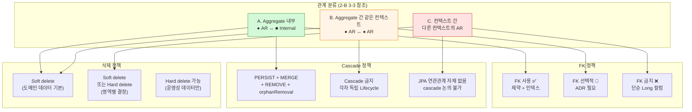

## FK Cascade Policy Topology

# FK Cascade Policy Topology — Part 1/2: 정책 정의

> 이 문서는 본 시스템의 **FK 정책 · Cascade 규칙 · Soft Delete 정책**을 위상 관점에서 정의한다.
`table-relationship-graph-topology` (2-B)의 *논리적 위상*에 *구체 메커니즘*을 박는 문서.
Layer 2에 속한다 — 새 관계 추가 또는 정책 변경 시 갱신.
구체 어휘(컬럼명·인덱스 SQL·마이그레이션 스크립트)는 의도적으로 배제. 그건 코드와 마이그레이션이 source of truth.
>
>
> **Part 1/2** (이 문서): 정책 정의 (선언·의사결정 매트릭스·FK·Cascade·Soft Delete)
> **Part 2/2**: 운영과 안티패턴 (참조 무결성·트랜잭션 결합·진화·안티패턴·점검·변경 정책·부록)
>

---

## 0. One-Line Declaration

> **FK는 Aggregate 내부에서 자유, Aggregate 간 같은 컨텍스트는 ADR 인정 시 허용, 컨텍스트 간은 금지. Cascade는 Aggregate 내부 Composition에 한정. 본 시스템의 모든 도메인 데이터는 Soft Delete가 기본이고, Hard Delete는 예외다.**
>

세 가지 결정이 이 문서의 모든 내용을 좌우한다. FK 정책, Cascade 정책, Soft Delete 정책. 셋이 *2-B의 세 단계 관계 분류*에 맞춰 일관되게 결정되어야 한다.

---

## 1. 의사결정 매트릭스

**다이어그램 읽는 법**

- 색깔: 초록(자유) → 주황(제한) → 빨강(금지)
- 한 관계의 분류가 정해지면 FK·Cascade·Delete 정책이 *자동 결정*됨
- 이 매트릭스를 *외워서* 매번 결정 비용 절감

---

## 2. FK 정책

### 2-1. DB FK 사용의 기본 정책 (A-1)

**원칙**: *관계의 종류에 따라 차등 적용.* 일괄 적용 또는 일괄 금지 둘 다 채택 안 함.

**FK의 가치 (사용 시 얻는 것)**

- DB 레벨 *참조 무결성 보장* — 고아 레코드 자동 방지
- *Cascade 정의 가능* — DB가 자식 정리 책임
- *인덱스 자동 생성* (MySQL) — 조인 성능
- *스키마 자체가 문서* — ERD 자동 생성 가능

**FK의 비용 (사용 시 치르는 것)**

- *마이그레이션 시 제약 처리* 필요 — 데이터 이동 어려움
- *분산 시스템에서 의미 없음* — 미래 분리 시 부담
- *컨텍스트 경계 무력화* 위험 — 잘못 적용 시

### 2-2. FK 가능 영역 vs 불가능 영역 (A-2)

| 관계 분류 (2-B 3-3) | FK 정책 | 근거 |
| --- | --- | --- |
| **A. Aggregate 내부** (AR ↔ Internal) | ✅ **사용** | Composition 관계. Lifecycle 함께. DB가 참조 무결성 보장. |
| **B. Aggregate 간 같은 컨텍스트** | 🔶 **선택적 (ADR 필요)** | 같은 컨텍스트라도 *독립 Lifecycle*. 함께 갱신해야 의미 있을 때만. |
| **C. 컨텍스트 간** | ❌ **금지** | 컨텍스트 경계 무력화. 미래 분리 막힘. (`context-dependency-graph-topology` 7-2와 일치) |

**원칙**: *흐려진 영역 없음*. 모든 관계는 셋 중 하나로 분류되고, 분류가 정책을 결정.

### 2-3. 컨텍스트 경계의 FK 처리 (A-3)

컨텍스트 경계의 ID 참조는 *FK 없는 단순 Long 컬럼*.

**처리 방식**

- 컬럼 타입: `Long`, `String` 등 — 외래 Entity의 ID와 같은 타입
- 컬럼 명명: `xxxId` 패턴 (예: `userId`, `orderId`) — 시각적으로 *외부 참조*임을 즉시 인지
- FK 제약: **두지 않음**
- 인덱스: 필요 시 명시적 추가 (FK 자동 인덱스 의존 안 함)

**왜 이렇게 처리하는가**

- FK가 있으면 *JPA가 자동으로 Entity 매핑 가능*해짐 — 안티패턴 유혹 발생
- FK가 있으면 *컨텍스트 분리 시 마이그레이션 어려움*
- FK가 있어도 *애플리케이션 레벨 무결성 검증*은 어차피 필요

**대신 보장하는 것**: Part 2 5-1 (FK 없는 영역의 무결성 보장 메커니즘) 참조.

### 2-4. Aggregate 간 FK 허용 범위 (A-4)

**기본**: Aggregate 간은 *FK 없음*. ID 참조만.

**예외 인정 조건 (모두 만족해야)**

1. **같은 컨텍스트 안의 두 AR**
2. **Lifecycle이 사실상 같음** — 항상 함께 생성, 함께 변경
3. **1:1 카디널리티**
4. **명시적 ADR 작성**

**본 프로젝트의 예외**: Order ↔ Payment.

> *2-B 5-4 참조.* "FK 컬럼은 둠, Entity 참조(`@OneToOne`)는 안 함."
>

**예외 적용 시 추가 의무**

- FK 컬럼만 두고 JPA 연관관계 매핑 안 함 — Entity 직접 참조 금지
- ADR에 *왜 이 쌍은 예외인가* 명시
- 다른 쌍에서 같은 예외를 만들려는 시도가 있으면 *별도 ADR* — 자동 허용 없음

**일반화하지 않는 이유**

- "비슷한 강결합 쌍은 모두 허용"으로 확장하면 *예외가 일반이 되어* 컨텍스트 경계 약화
- 명시적 ADR이 *심리적 마찰*로 작동해 남용 방지

---

## 3. Cascade 규칙

### 3-1. Cascade 종류 분류 (B-1)

JPA의 Cascade 옵션과 각각의 의미:

| 옵션 | 의미 | 본 프로젝트 정책 |
| --- | --- | --- |
| **PERSIST** | 부모 저장 시 자식도 저장 | Aggregate 내부 ✅ |
| **MERGE** | 부모 병합 시 자식도 병합 | Aggregate 내부 ✅ |
| **REMOVE** | 부모 삭제 시 자식도 삭제 | Aggregate 내부 ✅ (단, Soft delete 맥락 — 3-4 참조) |
| **DETACH** | 부모 detach 시 자식도 | 거의 사용 안 함 |
| **REFRESH** | 부모 refresh 시 자식도 | 거의 사용 안 함 |
| **ALL** | 위 모두 | *명시적으로 풀어쓰는 것 권장* — ALL은 의도 흐려짐 |
| **orphanRemoval** | 부모 컬렉션에서 자식 제거 시 자식 삭제 | Aggregate 내부 컬렉션 ✅ |

**원칙**: *Cascade는 명시적으로*. `ALL`로 한 번에 묶지 말고 *필요한 것만 명시*. 코드 리뷰 시 의도 파악 용이.

### 3-2. JPA Cascade vs DB Cascade의 두 층 (B-2)

이 둘은 *다른 메커니즘*. 혼동 시 사고.

| 층위 | 위치 | 작동 시점 | 본 프로젝트 정책 |
| --- | --- | --- | --- |
| **JPA Cascade** | 코드 (`@OneToMany(cascade = ...)`) | EntityManager가 인지 | ✅ 사용 — Aggregate 내부 |
| **DB Cascade** (`ON DELETE CASCADE`) | DB 스키마 | DB가 직접 | 🔶 거의 사용 안 함 |

**둘이 다른 이유**

- JPA Cascade는 *영속성 컨텍스트 안에 로드된 객체*만 처리. 로드 안 된 자식은 무관.
- DB Cascade는 *DB에 있는 모든 행*을 처리. 영속성 컨텍스트 무관.
- DB Cascade는 *영속성 컨텍스트와 동기화 안 됨* — JPA가 모르는 사이 데이터 변경 → 메모리 불일치

**본 프로젝트가 DB Cascade를 거의 사용 안 하는 이유**

- Soft delete가 기본. Hard delete가 드묾.
- JPA Cascade로 충분 — 영속성 컨텍스트 관점에서 일관성 유지.
- DB Cascade가 *JPA가 모르는 변경*을 발생시켜 메모리 ↔ DB 불일치 위험.

**예외 인정**: 운영성 hard delete가 필요한 영역 (로그·임시 데이터 등). 그 영역만 DB Cascade 가능. ADR.

### 3-3. Aggregate 내부 Cascade 정책 (B-3)

**기본 정책**: AR → Internal Entity 컬렉션은 `PERSIST + MERGE + REMOVE + orphanRemoval`.

**예시 적용**

- `Order` → `OrderItem` 컬렉션: 모두 적용
- `Refund` → `RefundItem` 컬렉션: 모두 적용
- `Cart` → `CartItem` 컬렉션: 모두 적용
- `Subscription` → `SubscriptionBilling` 컬렉션: 모두 적용 (도전)

**왜 이렇게 적용하는가**

- Composition 관계 — 부모 Lifecycle = 자식 Lifecycle
- AR을 통해서만 Internal 조작 (2-B 4-4) → JPA Cascade로 충분
- AR이 자식 컬렉션을 *내부적으로 관리* — 외부에서 자식 Repository로 직접 조작 안 함

**orphanRemoval의 의미와 가치**

- 부모 컬렉션에서 자식이 *빠지면 자동 삭제*
- "Order에서 OrderItem 제거 = OrderItem 행 삭제"
- AR이 자식 정리 책임 단일화

### 3-4. Aggregate 간 Cascade 금지 (B-4)

**원칙**: AR ↔ AR 사이에는 *Cascade 절대 금지*.

**근거**

- AR끼리는 *독립 Lifecycle*. Cascade하면 *한쪽 변경이 다른 쪽에 자동 파급* → 경계 무력화.
- *AR 자체의 불변식 검증*이 우회될 수 있음 — Cascade로 들어온 변경은 AR의 메서드를 거치지 않음.
- 트랜잭션 비대화 — 한 AR 작업이 다른 AR로 무한 확장.

**Order ↔ Payment 예외 적용 시에도**

- FK는 인정. 그러나 *Cascade는 금지*.
- Order 삭제 시 Payment 자동 삭제 안 됨 — 별도 처리.
- 어차피 둘 다 Soft delete라 이슈 발생 안 함.

### 3-5. Cascade DELETE 허용 영역 (B-5)

**원칙**: Cascade DELETE는 *Aggregate 내부 Composition*에서만.

**허용 영역**

- AR → Internal Entity (Composition)
- Snapshot Entity도 부모 AR과 함께 삭제 — 정상

**금지 영역**

- AR → AR (B-4와 같음)
- 컨텍스트 경계 — JPA 연관관계 자체가 없으므로 cascade 논의 불가

**Soft Delete 맥락에서의 함의**

- 본 프로젝트는 *Soft Delete 기본* — 진짜 DELETE는 거의 안 일어남
- 부모가 Soft delete되면 *자식도 Soft delete*되어야 함 (Cascade의 *논리적* 등가)
- 그러나 JPA의 `CascadeType.REMOVE`는 *DELETE*를 cascade하지 *UPDATE soft delete*를 cascade하지 않음
- → Soft delete cascade는 *별도 메커니즘*으로 처리 (4-3 참조)

### 3-6. orphanRemoval 사용 정책 (B-6)

**원칙**: Aggregate 내부 컬렉션에서 *항상* `orphanRemoval = true`.

**근거**

- AR이 자식 컬렉션을 *완전 통제* — "컬렉션에서 빠진 자식은 도메인적으로 삭제됨"
- orphanRemoval 없으면 *컬렉션에서 제거된 자식이 DB에 그대로 남음* — 고아 발생
- AR의 메서드가 자식 추가/제거를 책임 — 외부에서 자식 직접 삭제 호출 안 함

**Soft Delete 맥락**

- orphanRemoval은 *hard delete* 실행
- Soft delete가 기본이므로, *논리적으로 orphan은 발생 안 함* (자식도 함께 soft delete)
- 진짜 hard delete가 필요한 영역에서만 orphanRemoval 의미 있음

---

## 4. Soft Delete

### 4-1. Soft Delete vs Hard Delete 선택 기준 (C-1)

**본 프로젝트 표준**: **모든 도메인 데이터는 Soft Delete가 기본.** Hard Delete는 *예외*.

**Soft Delete 적용 영역 (기본)**

- 모든 비즈니스 데이터 — 회원·상품·주문·결제·환불·포인트·멤버십·구독
- *Audit trail* 가치를 가진 데이터 (`system-value-topology` Tier 1 추적성)

**Hard Delete 허용 영역 (예외)**

- 임시 데이터 (만료된 토큰·세션·캐시)
- 운영성 로그의 보관 기간 종료분
- 명세상 *명시적으로 hard delete*인 경우 (예: 장바구니 상품 삭제 — 4-2 참조)

**원칙**: 의심스러우면 *Soft Delete*. 결제 도메인에서 데이터 *완전 손실*은 거의 항상 사고.

### 4-2. Soft Delete 적용 영역 매트릭스 (C-2)

| Entity | Delete 방식 | 근거 |
| --- | --- | --- |
| **User** | Soft | 회원 탈퇴 후 데이터 보존 필요 (주문 이력 등) |
| **Product** | Soft | 판매 중지 후에도 과거 주문에서 참조 |
| **Cart** | Hard | 결제 완료 시 cart 비움 — 보존 가치 없음 |
| **CartItem** | Hard | Cart와 같이 |
| **Order** | Soft | 주문 이력 영구 보존 |
| **OrderItem** | Soft | Order와 함께 |
| **Payment** | Soft | 결제 기록 영구 보존 (법적 요구·분쟁 대응) |
| **Refund** | Soft | 환불 기록 영구 보존 |
| **RefundItem** | Soft | Refund와 함께 |
| **PointBalance** | Soft | 회원 탈퇴 후에도 잔액 이력 보존 |
| **PointTransaction** | Hard 금지 (append-only) | 원장은 *삭제 자체가 의미 없음*. 보정은 새 transaction으로. |
| **Membership** | Soft | 회원 탈퇴 후에도 등급 이력 보존 |
| **Subscription** | Soft (해지도 status 변경) | 해지 후에도 청구 이력 추적 |
| **SubscriptionBilling** | Soft 또는 Hard 금지 | 청구 원장 — PointTransaction과 같이 |

**관찰**

- *대부분이 Soft delete*. Hard delete는 Cart 한정.
- *Append-only Entity (PointTransaction, SubscriptionBilling)는 Soft/Hard 모두 금지*. 삭제 자체가 의미 없음 — 보정은 *새 transaction* 추가로.

### 4-3. Soft Delete와 Cascade의 상호작용 (C-3) — **본 문서의 가장 미묘한 결정**

**핵심 질문**: 부모가 Soft delete될 때 자식은?

**옵션 분류**

| 옵션 | 의미 | 본 프로젝트 채택 |
| --- | --- | --- |
| **Cascade Soft Delete** | 부모 soft delete 시 자식도 자동 soft delete | ✅ Aggregate 내부 Composition |
| **자식 별도 처리** | 부모와 자식을 *명시적으로* 함께 처리 | ✅ Aggregate 간 (FK 예외 영역) |
| **자식 보존** | 부모 soft delete되어도 자식은 active | 🔶 일부 케이스 (역사적 기록 보존) |
| **부모 soft delete 차단** | 자식이 active 상태면 부모 삭제 금지 | 🔶 일부 케이스 (안전성) |

**구현 방식 분류**

| 방식 | 메커니즘 | 본 프로젝트 권장 |
| --- | --- | --- |
| **Hibernate `@SQLDelete`** | DELETE 쿼리를 UPDATE로 자동 치환 | ✅ Aggregate 내부에 적용 |
| **명시적 메서드 호출** | `aggregate.softDelete()` 메서드가 자식까지 처리 | ✅ AR이 자기 자식 처리 책임 |
| **DB Trigger** | DB가 자동으로 자식 UPDATE | ❌ 사용 안 함 (JPA와 어긋남) |

**본 프로젝트 적용 원칙**

1. **AR이 자기 자식 soft delete 책임** — AR의 메서드 안에서 자식 컬렉션 순회하며 처리
2. **`@SQLDelete` 활용** — JPA의 cascade REMOVE가 자동으로 soft delete UPDATE로 치환
3. **Aggregate 간은 명시적** — Order.cancel() 호출 시 별도로 Payment.cancel()도 호출 (cascade 의존 안 함)
4. **Append-only는 soft delete 자체가 없음** — PointTransaction은 만들기만 함

**왜 미묘한가**

- JPA Cascade REMOVE + `@SQLDelete` 조합은 *코드는 hard delete처럼 보이는데 실제로는 soft delete*가 됨
- 코드 리뷰 시 *의도가 흐려질 수 있음*
- 신규 개발자가 "왜 데이터가 안 지워지지?" 혼란

**대응**

- AR의 soft delete 메서드를 *명시적으로* 구현 — `aggregate.softDelete()`가 *어떤 일이 일어나는지* 코드로 표현
- Aggregate 단위 *통합 테스트*로 soft delete 동작 검증
- `@SQLDelete` 사용을 *제한적으로* — Internal Entity에만, AR 자체는 명시적 메서드 권장

### 4-4. Soft Delete와 Unique 제약의 충돌 (C-4) — **재가입·재구독 시점에 발생**

**문제**: Soft delete된 User가 같은 이메일로 *재가입* 시도. Unique 제약 위반.

**시나리오**

- User A가 가입 (email: `a@example.com`)
- User A가 탈퇴 → soft delete (행은 남음)
- 같은 이메일로 재가입 시도 → unique 제약 위반 → 실패

**해결 방안 분류**

| 방안 | 설명 | 트레이드오프 |
| --- | --- | --- |
| **부분 인덱스 (Partial Index)** | `WHERE deleted_at IS NULL`인 행만 unique | DB 의존적 (MySQL은 미지원, PostgreSQL은 지원) |
| **복합 Unique** | `(email, deleted_at)` 복합 unique | NULL 처리에 DB별 차이. 같은 이메일 여러 번 탈퇴 시 충돌 가능 |
| **별도 식별 컬럼** | `(email, instance_id)` — 탈퇴 시마다 새 instance_id | 복잡도 증가, 외부 ID 노출 |
| **이메일에 마커 추가** | 탈퇴 시 `email`을 `a@example.com_deleted_TIMESTAMP`로 변경 | 단순하지만 *데이터 무결성* 손상 |
| **재가입 자체 금지** | 비즈니스 정책으로 재가입 불가 | 가장 단순, 사용자 편의 손실 |

**본 프로젝트 권장**

- MySQL 사용 → **복합 Unique 사용**: `(email, deleted_at)`. `deleted_at IS NULL` 행만 unique 보장하는 방식으로 처리.
- 또는 **이메일 마커 변경**: 탈퇴 시 이메일 컬럼을 변경. 데이터 무결성보다 *재가입 가능성* 우선.
- 어느 방식이든 *명시적 ADR* 작성. "왜 이 방식인가" 박제.

**다른 unique 제약 영역**

- 구독 시작: `(userId, planId)` 활성 구독 unique → 해지 시점 처리 필요
- 멤버십: `userId` unique → 보통 한 명당 한 멤버십이라 충돌 드묾

**원칙**: Soft delete를 기본으로 채택하는 순간 *모든 unique 제약에서 충돌 가능성* 발생. 매 unique 제약마다 *충돌 시 동작* 명시적으로 결정.

### 4-5. Soft Delete된 데이터의 조회 정책 (C-5)

**원칙**: 일반 조회는 *Soft delete된 행을 자동 제외*. 명시적 요청 시에만 포함.

**구현 메커니즘 분류**

| 메커니즘 | 적용 |
| --- | --- |
| **Hibernate `@SQLRestriction`** (구 `@Where`) | Entity 클래스에 `deleted_at IS NULL` 자동 추가 |
| **명시적 WHERE 조건** | Repository 메서드에 매번 명시 |
| **Query Service 단 필터링** | QueryDSL에 일관 적용 |

**본 프로젝트 권장**: `@SQLRestriction` + Query Service의 일관 필터링 *둘 다*.

**왜 둘 다인가**

- `@SQLRestriction`은 *기본 보호망*. 일반 JPA 조회에서 자동 적용.
- Query Service의 QueryDSL은 *@SQLRestriction이 안 먹는 영역*도 있음 (네이티브 쿼리 등). 명시적 필터링 필요.
- 이중 보장 — 한 곳이 누락되어도 다른 곳에서 잡힘.

**Soft delete된 데이터 명시적 조회**

- 운영 도구·관리자 도구에서 필요
- 별도 Repository 메서드 (`findIncludingDeleted`)
- 일반 API에서는 *접근 불가*

### 4-6. Soft Delete와 도메인 이벤트 (C-6)

**원칙**: *비즈니스 의미가 있는 soft delete*는 도메인 이벤트 발행.

**이벤트 발행하는 soft delete**

- User 탈퇴 → `UserWithdrawn` 이벤트 (Membership·Subscription 등에서 후속 처리)
- Order 취소 → `OrderCanceled` 이벤트 (재고 복구 트리거)
- Subscription 해지 → `SubscriptionCanceled` 이벤트 (도전)

**이벤트 발행 안 하는 soft delete**

- Internal Entity의 자동 soft delete (Cascade로 따라가는 OrderItem 등) — *AR 이벤트로 충분*
- 운영 임시 데이터의 정리

**원칙**: *AR의 soft delete*가 이벤트의 단위. Internal Entity 개별 soft delete는 이벤트 발행하지 않음 (AR 이벤트가 그것을 함의).

---

> **Part 1 종료. Part 2는 `fk-cascade-policy-topology-part2.md` 참조.**
Part 2 내용: 5장 참조 무결성 → 6장 트랜잭션 결합 → 7장 진화 정책 → 8장 안티패턴 (7개) → 9장 위반 감지 → 10장 다루지 않는 것 → 11장 자가 점검 → 12장 변경 정책 → 부록 A·B (가치 매핑 + Topology 상호 참조).
>

# FK Cascade Policy Topology — Part 2/2: 운영과 안티패턴

> **Part 1/2**: 정책 정의 (`fk-cascade-policy-topology-part1.md`)
**Part 2/2** (이 문서): 운영과 안티패턴 (참조 무결성·트랜잭션 결합·진화·안티패턴·점검·변경 정책·부록)
>

> Part 1 요약:
>
> - **FK 매트릭스**: A. Aggregate 내부 ✅ / B. Aggregate 간 같은 컨텍스트 🔶 ADR / C. 컨텍스트 간 ❌
> - **Cascade**: Aggregate 내부 Composition에만. AR ↔ AR 금지.
> - **Soft Delete**: 모든 도메인 데이터 기본. Hard Delete는 예외(임시 데이터·로그).
> - **JPA Cascade vs DB Cascade**: 둘은 다른 메커니즘. 본 프로젝트는 JPA Cascade만 사용.
> - **Soft Delete × Cascade**: AR 메서드가 자기 자식 처리 책임. `@SQLDelete`는 보조.
> - **Soft Delete × Unique**: 충돌 발생 가능. 매 unique 제약마다 명시적 해결.

---

## 5. 참조 무결성

### 5-1. FK 없는 영역의 무결성 보장 메커니즘 (D-1)

컨텍스트 경계 (분류 C, Part 1 2-2)는 FK 없음. 그러면 어떻게 *참조 무결성*을 보장하는가?

**다층 방어**

| 층위 | 메커니즘 | 보장 수준 |
| --- | --- | --- |
| **읽을 때 검증** | 참조 대상 Entity 조회 시도 → 없으면 예외 | 즉시 감지 |
| **Application Service 단 존재 확인** | 작업 시작 시 참조 대상 조회 | 사전 차단 |
| **Soft delete 정책** | 참조 대상이 hard delete되지 않음 → 고아 발생 안 함 | 구조적 방지 |
| **정기 reconciliation** | 정기 배치로 고아 ID 점검 | 사후 감지 |

**원칙**: FK가 없어도 *참조가 깨지지 않게* 다른 메커니즘이 보장. *Soft delete가 기본 보호망*.

### 5-2. 고아 레코드 처리 정책 (D-2)

**고아 발생 가능 시나리오**

- 참조 대상 hard delete (본 프로젝트에선 거의 발생 안 함 — Soft delete 기본)
- 외부 시스템 ID 변경 (PortOne 측 정책 변경 등)
- 마이그레이션 사고

**대응 정책**

- **정기 점검 배치** (운영 단계 이후) — 고아 ID 발견 시 알림
- **조회 시 graceful 처리** — 참조 대상 못 찾으면 *기본값* 또는 *"삭제된 상품" 표시*
- **이벤트로 정리** — 참조 대상 삭제 이벤트 발행 → 구독자가 정리

**원칙**: 고아는 *사후 발견*보다 *사전 방지*. Soft delete 정책이 근본 해결책.

### 5-3. 참조 대상 소멸 시 참조자의 운명 (D-3)

**User soft delete 시 그 사용자의 Order는?**

**원칙**: **역사적 기록으로 보존.** Order는 그대로 active 또는 자기 lifecycle로 진화.

**왜 보존하는가**

- 결제 기록은 *법적 보관 의무*가 있을 수 있음
- 회계·정산 데이터로 필요
- User가 *진짜로* 사라진 게 아님 — soft delete된 행은 DB에 존재

**구현 함의**

- Order 조회 시 User soft delete 여부 *별도 표시* 가능 ("탈퇴한 회원")
- User 정보를 *조회 시점에 가져옴* — Order Entity에 User 정보 스냅샷 X (OrderItem의 상품 스냅샷과 다른 결정)
- User soft delete 후에도 Order의 *userId 참조*는 유지

**예외 인정**

- *진짜 hard delete*가 필요한 경우 (GDPR Right to be Forgotten 등) — 그때는 *명시적 절차*. 본 프로젝트는 범위 외.

---

## 6. 트랜잭션 결합

### 6-1. Cascade 작업의 트랜잭션 경계 (E-1)

**원칙**: Cascade는 *같은 트랜잭션*에서 실행.

**함의**

- 부모 + 자식 작업이 *atomic* — 함께 성공 또는 함께 롤백
- 트랜잭션 길이가 *Aggregate 크기에 비례*

**Aggregate 크기와 비용**

- 자식이 많으면 cascade 비용 폭증 (대량 INSERT/UPDATE)
- 트랜잭션 길이 = 락 hold time → 동시성 저하
- *Aggregate를 작게 유지하는 것이 정합성과 성능 둘 다에 유리*

**적정 Aggregate 크기 휴리스틱**

- *수십 개* 정도의 Internal Entity까지는 OK
- *수백 개 이상*이면 Aggregate 분할 검토
- 본 프로젝트 예: Order의 OrderItem은 보통 10개 이하 — 문제없음

### 6-2. Cascade와 외부 호출의 상호작용 (E-2)

**원칙**: Cascade 중 *외부 시스템 호출 금지*.

**근거**

- Cascade는 *DB 작업의 도미노*. 외부 호출이 끼면 트랜잭션 길이 폭증.
- 외부 호출 실패 시 *cascade 중간 상태*가 됨 → 정합성 사고.
- `consistency-design-topology` 7-1 ("DB 먼저 커밋 후 외부 호출")과 일관.

**구체 적용**

- Aggregate 내부 자식 추가 중 외부 알림 발송 ❌
- Cascade delete 중 외부 시스템 통지 ❌
- 외부 호출이 필요하면 *AFTER_COMMIT 이벤트*로 분리

---

## 7. 진화 정책

### 7-1. FK 추가/제거 시 마이그레이션 정책 (F-1)

**FK 추가 시**

- *기존 데이터*가 새 FK 제약을 만족하는지 사전 점검
- 위반 데이터 발견 시 *수동 정리* 또는 *FK 추가 보류*
- 운영 중 추가는 위험 — 마이그레이션 시점에 락 발생

**FK 제거 시**

- 비교적 안전 — 제약만 풀리고 데이터는 그대로
- 그러나 *제거 후 fk 위반 데이터가 쌓일 가능성* — 애플리케이션 무결성 검증 필요

**컨텍스트 경계 FK 제거 (Part 1 2-3 적용)**

- 기존 FK가 있던 곳에서 *FK 제거 + 단순 ID 컬럼 전환*
- 마이그레이션 시점에 *데이터 검증* 후 제약만 제거

### 7-2. Soft Delete 정책 변경 시 영향 분석 (F-2)

**Hard delete → Soft delete 전환**

- 신규 컬럼 (`deleted_at` 등) 추가
- 기존 모든 조회 쿼리에 *필터 추가* — 누락 시 사고
- 기존 Unique 제약 검토 (Part 1 4-4와 같은 충돌 가능성)
- Cascade 정책 재검토

**Soft delete → Hard delete 전환**

- 거의 발생 안 함
- 발생 시 *기존 soft deleted 데이터의 운명* 결정 필요 (영구 삭제? 별도 아카이브?)

### 7-3. Cascade 규칙 변경 시 마이그레이션 (F-3)

**Cascade 추가**

- 기존 데이터에 영향 없음 (앞으로의 작업만 적용)
- 그러나 *AR 메서드 동작 변경* — 통합 테스트 필수

**Cascade 제거**

- 위험 — 기존에 자동으로 정리되던 자식들이 *고아*가 됨
- 제거 전 *명시적 정리 로직* 추가 후 제거

---

## 8. 안티패턴

### 8-1. Cascade ALL 남용 (G-1)

**증상**: 모든 컬렉션에 `CascadeType.ALL` 일괄 적용.

**예**: `@OneToMany(cascade = CascadeType.ALL)` 무지성 추가.

**왜 위험한가**

- `ALL`은 *PERSIST + MERGE + REMOVE + DETACH + REFRESH* 모두 포함
- 어떤 Cascade가 적용되는지 *코드만 봐서 의도 파악 어려움*
- DETACH·REFRESH는 거의 사용 안 함 — 불필요한 의미 포함
- *Aggregate 경계 흐려짐* — AR ↔ AR에 ALL 붙이면 cascade 사고

**대응**

- 필요한 옵션만 명시: `cascade = {CascadeType.PERSIST, CascadeType.MERGE, CascadeType.REMOVE}`
- Aggregate 내부에만 적용
- AR ↔ AR에 cascade 절대 금지

### 8-2. 컨텍스트 경계에 FK 설정 (G-2)

**증상**: 다른 컨텍스트의 AR에 FK 제약.

**예**: `Order` 테이블의 `user_id` 컬럼에 `FOREIGN KEY REFERENCES users(id)` 제약.

**왜 위험한가**

- Part 1 2-2 정책 직접 위반
- 컨텍스트 경계 무력화
- 미래 컨텍스트 분리 막힘
- *JPA 자동 매핑 유혹*으로 이어짐 — `@ManyToOne User user` 등장

**대응**

- 컨텍스트 경계는 *FK 없는 단순 Long 컬럼*
- 마이그레이션으로 기존 FK 제거
- ArchUnit/Spring Modulith로 자동 검증

### 8-3. Soft Delete + Cascade DELETE 혼용 (G-3) — **가장 위험한 안티패턴**

**증상**: 부모는 soft delete인데 자식은 *진짜 DELETE*.

**예**

- Order soft delete (`deleted_at` UPDATE)
- 그러나 OrderItem은 cascade로 *진짜 DELETE* 실행 → 행 사라짐
- *Soft delete 정책 자체가 무력화* — 부모만 흔적, 자식은 완전 소실

**왜 발생하는가**

- `@SQLDelete` 적용을 *부모에만* 하고 자식엔 안 함
- 또는 JPA `CascadeType.REMOVE`가 부모의 soft delete와 *다른 의미*로 작동
- 또는 DB `ON DELETE CASCADE`가 자식을 hard delete

**대응**

- AR 자체와 모든 Internal Entity에 *일관된 soft delete 적용*
- `@SQLDelete` 누락 점검
- AR의 soft delete 메서드를 *명시적으로 구현* — 자식을 어떻게 처리하는지 코드로 명확히
- 통합 테스트로 *AR soft delete 시 모든 자식 soft delete 검증*

### 8-4. 양방향 Cascade (G-4)

**증상**: A의 컬렉션에 cascade, B의 컬렉션에도 cascade — 양방향.

**예**

- `Order.items` 컬렉션에 cascade ALL
- `OrderItem.order`에 cascade ALL (잘못된 추가)

**왜 위험한가**

- 영속성 컨텍스트가 *어느 쪽이 진실인지* 혼란
- 무한 cascade 가능성
- 의도 파악 불가

**대응**

- Cascade는 *단방향* — AR → Internal Entity만
- Internal → AR 방향에 cascade 절대 금지

### 8-5. FK 없는데 무결성 검증도 없음 (G-5)

**증상**: 컨텍스트 경계 ID 참조를 두면서, *읽을 때나 작업할 때 존재 검증을 안 함*.

**예**: `Order.userId`를 사용해 작업하는데, *해당 User가 실제로 존재하는지* 확인 안 함.

**왜 위험한가**

- Part 1 2-3 정책의 *전제*를 위반 — "FK 없어도 다른 메커니즘으로 보장"이 안 되고 있음
- 고아 데이터 누적
- 운영 단계에서 *예상 외 NULL 참조*로 사고

**대응**

- Application Service 단 *존재 확인* — `userQueryService.findById(userId).orElseThrow()`
- 읽을 때 *graceful 처리* — 못 찾으면 명시적 예외
- 5-1의 다층 방어 적용

### 8-6. Soft Delete된 데이터를 일반 조회에 노출 (G-6) — **가장 흔한 버그**

**증상**: 일반 조회에서 *deleted_at IS NULL 필터*를 깜빡 누락.

**예**: 사용자 목록 조회 시 탈퇴한 User까지 같이 보임. 상품 목록 조회 시 판매 중지된 Product까지 보임.

**왜 발생하는가**

- 새 Repository 메서드 추가 시 필터 빼먹음
- 네이티브 쿼리에 `@SQLRestriction` 안 먹음
- QueryDSL 작성 시 일관 적용 누락

**대응**

- `@SQLRestriction` *모든 도메인 Entity에 일관 적용*
- QueryDSL에서 *공통 필터 추출* — 모든 쿼리가 거쳐가는 베이스
- 통합 테스트로 *soft deleted 데이터가 일반 조회에서 안 보임* 검증
- Part 1 4-5의 이중 보장 원칙 적용

### 8-7. Soft Delete와 Unique 제약의 충돌 방치 (G-7)

**증상**: Part 1 4-4의 충돌을 *알면서도 해결 안 함*. "사용자가 같은 이메일로 재가입 안 하겠지" 가정.

**예**: User 이메일이 unique인데 soft delete 후 처리 안 함. 재가입 시도 시 500 에러.

**왜 위험한가**

- *언젠가 반드시* 발생 — 시간 문제
- 사용자가 *왜 가입 안 되는지* 알 수 없음
- 운영자가 *수동으로 데이터 정리* 시도 시 사고

**대응**

- *모든 unique 제약*에 대해 soft delete 충돌 가능성 점검
- 해결 방안 (Part 1 4-4) 중 하나를 *명시적으로 선택*하고 ADR 박제
- 통합 테스트로 *재가입·재구독 시나리오* 검증

---

## 9. 위반 감지

| 감지 방식 | 적용 |
| --- | --- |
| **ArchUnit** | 컨텍스트 경계 FK 자동 검출 (코드 어노테이션 기준) |
| **DB 스키마 점검 스크립트** | 실제 DB의 FK가 정책과 일치하는지 |
| **PR 리뷰 체크리스트** | 새 Entity·관계 추가 시 정책 점검 |
| **통합 테스트** | Soft delete cascade·unique 충돌·조회 필터 검증 |
| **정기 reconciliation 배치** | 고아 ID·soft deleted 노출 검증 (운영 후) |

**현재 단계 적용**

- ArchUnit으로 컨텍스트 경계 검증 — 가장 critical
- 통합 테스트로 soft delete 동작 검증 — 두 번째 critical
- 정기 reconciliation은 운영 후

---

## 10. 이 topology가 다루지 않는 것

| 다루지 않는 것 | 어디에 있는가 |
| --- | --- |
| Entity의 관계 그래프 자체 | `table-relationship-graph-topology` (2-B) |
| 구체 컬럼 정의 (deleted_at 타입·기본값 등) | 코드 + 마이그레이션 |
| 인덱스 설계 | 코드 + DB 운영 가이드 |
| 트랜잭션 격리·락 전략 | `consistency-design-topology` 6장 |
| AFTER_COMMIT 이벤트 패턴 | `event-topology` (예정) |
| 도메인 이벤트 카탈로그 | `event-topology` |
| 외부 시스템 보상 트랜잭션 | `consistency-design-topology` 7-2 |
| Soft delete 보관 기간 정책 | 운영 정책 (별도 문서) |
| GDPR 등 규제 대응 | 윤리/규제 영역 (현재 보류) |

---

## 11. 자가 점검 질문

1. 컨텍스트 경계에 FK 제약이 설정된 곳이 있는가? (Part 1 2-2 위반)
2. Aggregate 간 FK 예외가 *Order ↔ Payment 외*에 슬쩍 추가되었는가? ADR 없이?
3. AR ↔ AR 사이에 JPA cascade가 걸려 있는가? (Part 1 3-4 위반)
4. `CascadeType.ALL`이 *명시적 정당화 없이* 사용되는 곳이 있는가?
5. 양방향 cascade가 존재하는가?
6. Soft delete된 부모의 자식이 *hard delete*되는 경로가 있는가? (G-3)
7. `@SQLRestriction`이 *누락된* 도메인 Entity가 있는가?
8. 일반 조회 쿼리(QueryDSL 포함)에서 *soft delete 필터가 누락*된 곳이 있는가?
9. Unique 제약과 soft delete의 충돌이 *각 unique 컬럼*에 대해 해결되었는가?
10. 컨텍스트 경계 ID 참조가 *읽을 때 존재 검증*되는가? 안 되면 다른 메커니즘은?
11. AR의 soft delete 메서드가 *자식까지 처리*하는지 통합 테스트가 있는가?
12. Append-only Entity (PointTransaction 등)가 *수정·삭제되는 코드*는 없는가?
13. Cascade 중에 *외부 시스템 호출*이 일어나는 곳이 있는가? (6-2 위반)

---

## 12. 변경 정책

이 문서는 Layer 2다. 정책 자체는 거의 변하지 않음. 적용 매트릭스(Part 1 4-2)와 영역별 결정만 진화.

- **자유롭게 변경 가능**: 자가 점검 질문, 다이어그램 시각 표현
- **PR 게이트 통과 필요**: Soft delete 적용 매트릭스(Part 1 4-2) 갱신 — 새 Entity 추가 시
- **ADR 필요**: 새 FK 예외 인정 (Aggregate 간), DB Cascade 도입, Hard delete 영역 확대, Soft delete + Unique 충돌 해결 방안 변경, `@SQLDelete`/`@SQLRestriction` 사용 정책 변경
- **거의 발생 안 함**: FK 가능 영역 분류(Part 1 2-2), Cascade 정책의 기본 원칙(Aggregate 내부 한정), Soft delete 기본 채택

---

## 부록 A: 이 문서가 구현하는 가치

`system-value-topology`의 다음 가치와 결합:

- **정합성 (Tier 1)**: Cascade가 *Aggregate 단위 atomic*. Soft delete가 *데이터 손실 방지*.
- **추적성 (Tier 1)**: Soft delete 기본 — 모든 변경 이력 보존. PointTransaction append-only — 원장 영구 보존.
- **신뢰 (Tier 1)**: FK 정책의 일관성 — 참조 무결성 보장. *컨텍스트 경계 침범 방지*가 시스템 신뢰의 일부.
- **복잡도 관리 (Tier 2)**: 의사결정 매트릭스(Part 1 1장)로 *결정 비용 절감*. 관계 분류만 알면 정책 자동 따라옴.
- **명료성 (Tier 2)**: Cascade 명시적 사용 (ALL 금지) — 코드에서 의도 즉시 파악.
- **진화 적응성 (Tier 2)**: 컨텍스트 경계 FK 없음 → 미래 분리 가능.

---

## 부록 B: 다른 Topology와의 관계

**Table Relationship Graph Topology (2-B) — 가장 직접적 관계**

- 2-B의 *세 종류 관계 (A·B·C, 3-3절)*가 본 문서의 *모든 정책의 분기점*
- 2-B의 *Aggregate Root 카탈로그*(5-1)가 본 문서의 *Cascade 적용 영역* 결정
- 2-B의 *Order ↔ Payment 강결합 예외*(5-4)가 본 문서의 *FK 예외*(Part 1 2-4)
- 2-B의 *Composition vs Association*(4-2)이 본 문서의 *Cascade 정책*(Part 1 3-3, 3-4)
- 2-B의 *Lifecycle 종속성*(4-3)이 본 문서의 *Soft delete cascade*(Part 1 4-3)

**Architecture Style Topology**

- "JPA 직접 사용 + DDD-lite" 결정의 직접 귀결
- 본 문서의 *Aggregate 내부 cascade 허용*은 architecture-style 4-2 "Persistence port 없음"의 직접 결과

**Context Dependency Graph Topology**

- 본 문서의 *컨텍스트 경계 FK 금지*(Part 1 2-2 C 분류)는 context-dependency 7-2 "DB 레벨 결합 금지"의 구체화

**Consistency Design Topology**

- 본 문서의 *Cascade 트랜잭션 결합*(6-1)은 consistency-design 6장 락·트랜잭션 정책과 직결
- 본 문서의 *Cascade 중 외부 호출 금지*(6-2)는 consistency-design 7-1 "DB 커밋 후 외부 호출"과 일관
- 본 문서의 *Soft delete + 도메인 이벤트*(Part 1 4-6)는 consistency-design 5-2 Event-converged zone과 결합

**상호 참조 매트릭스 (2-B ↔ 2-C)**

| 2-B 항목 | ↔ | 2-C 항목 |
| --- | --- | --- |
| **3-3** 세 종류의 관계 | ↔ | **Part 1 2-2** FK 가능 영역 매트릭스 |
| **4-1** Aggregate Root 식별 기준 | ↔ | **Part 1 3-4** Aggregate 간 cascade 금지 |
| **4-2** Composition vs Association | ↔ | **Part 1 3-3** Aggregate 내부 cascade 정책 |
| **4-3** Lifecycle 종속성 | ↔ | **Part 1 4-3** Soft delete와 cascade 상호작용 |
| **5-4** Order ↔ Payment 예외 | ↔ | **Part 1 2-4** Aggregate 간 FK 허용 범위 |
| **7-3** 컨텍스트 경계 안티패턴 | ↔ | **8-2** 컨텍스트 경계 FK 안티패턴 |
| **2-4** Snapshot Entity | ↔ | **Part 1 3-5** Cascade DELETE 허용 영역 (Snapshot도 부모와 함께 처리) |

이 매트릭스가 매칭 안 되면 두 문서 중 하나는 잘못 작성된 것.

---