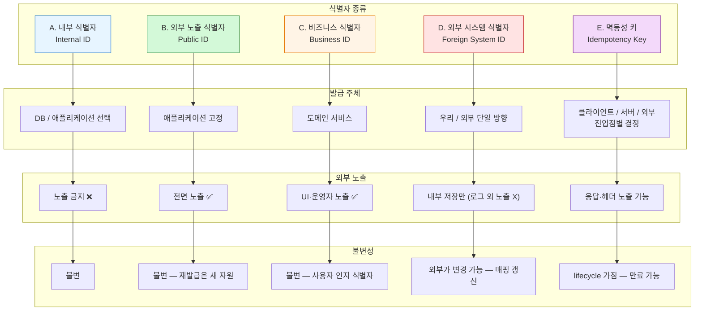

## Identifier System Topology

# Identifier System Topology — Part 1: 다섯 위상의 정의

## 0. One-Line Declaration

> **식별자는 다섯 종류로 분리되며 역할을 겸하지 않는다. 내부 PK·외부 노출 ID·비즈니스 ID·외부 시스템 ID·멱등성 키. 발급 주체와 시점은 종류별로 단일 선언되고, 외부 시스템과의 정합은 명시적 매핑으로만 이루어진다.**
>

세 가지 결정이 이 문서의 모든 내용을 좌우한다. **식별자 종류의 분리**, **발급 주체와 시점의 단일성**, **외부 시스템 식별자와 내부 식별자의 명시적 매핑**. 셋이 *도메인의 모든 ID 처리*에 일관되게 적용되어야 한다.

---

## 1. 의사결정 매트릭스



**다이어그램 읽는 법**

- 한 식별자의 종류가 정해지면 *발급 주체·노출 정책·불변성*이 줄줄이 결정됨
- 다섯 종류는 *역할이 겹치지 않음*. 한 식별자가 두 칸에 들어갈 수 없음
- 이 매트릭스 위반 시 사고 발생 — 매번 결정 비용 없이 적용

---

## 2. 식별자 종류 **

### 2-1. 다섯 종류의 정의 (A-1)

| 종류 | 정의 | 예 |
| --- | --- | --- |
| **내부 식별자 (Internal ID)** | 시스템 내부 행을 가리키는 식별자. PK. | DB의 `id` 컬럼 |
| **외부 노출 식별자 (Public ID)** | API·URL·외부 응답에 노출되는 식별자 | API URL의 자원 ID |
| **비즈니스 식별자 (Business ID)** | 도메인적으로 의미를 가지는 식별자. 사용자·운영자가 인식 | 주문번호, 환불번호 |
| **외부 시스템 식별자 (Foreign System ID)** | 외부 시스템이 발급하거나 외부와 약속한 식별자 | `portonePaymentId`, billing key |
| **멱등성 키 (Idempotency Key)** | 동일 요청의 중복 처리를 막기 위한 식별자 | 결제 확정 idempotency-key |

**원칙**: 다섯 종류는 *서로 침범하지 않음*. 한 식별자가 두 역할을 겸하면 위상 위반.

### 2-2. 종류별 역할의 직교성 (A-2)

**원칙**: 한 식별자는 하나의 역할만 맡는다.

| 조합 | 허용 여부 | 근거 |
| --- | --- | --- |
| 내부 ID = 외부 노출 ID | ❌ | 추측 가능성·내부 구조 노출·변경 격리 깨짐 |
| 내부 ID = 비즈니스 ID | ❌ | 비즈니스 의미가 PK에 결합되면 변경 어려움 |
| 비즈니스 ID = 멱등성 키 | ❌ | Lifecycle·scope 의미가 다름. 비즈니스 ID는 영구, 멱등성 키는 만료 가능 |
| 외부 시스템 ID = 내부 ID | ❌ | 외부 의존성이 PK에 박힘. 외부 변경 시 마이그레이션 |
| 외부 노출 ID = 비즈니스 ID | 🔶 일부 | 비즈니스 ID 자체가 노출 가능하면 별도 외부 노출 ID 불필요. ADR로 명시 |
| 외부 시스템 ID = 외부 노출 ID | ❌ | 외부 시스템의 정책 변경이 우리 API 계약 변경으로 전파됨 |

**원칙**: *흐려진 영역 없음*. 모든 ID는 다섯 종류 중 하나로 분류되고, 그 분류가 정책을 결정.

### 2-3. 도메인 진입 시점의 분류 의무 (A-3)

새 식별자가 도메인에 등장할 때, *즉시 분류*되어야 한다.

**분류 시점**

- 신규 Entity 추가 시 — 모든 ID 필드 분류
- 신규 API 추가 시 — 요청·응답의 모든 ID 분류
- 신규 이벤트 추가 시 — 페이로드의 모든 ID 분류
- 외부 시스템 통합 시 — 외부 식별자의 종류 분류

**분류 누락 시 위험**

- 외부 노출 의도 없이 만든 ID가 무의식적으로 노출
- 비즈니스 ID인지 멱등성 키인지 모호 → lifecycle 사고
- 외부 시스템 ID와 내부 ID 혼동 → 외부 정책 변경 시 우리 시스템 깨짐

---

## 3. 발급 주체와 시점

### 3-1. 발급 주체의 단일성 원칙 (B-1)

**원칙**: 식별자 종류별 발급 주체는 시스템 전체에서 *단일*.

| 종류 | 발급 주체 후보 | 본 프로젝트 선택 영역 |
| --- | --- | --- |
| 내부 식별자 | DB 시퀀스 / 애플리케이션 / 외부 발급기 | 도메인 전체 일관 선택 |
| 외부 노출 식별자 | 애플리케이션 (고정) | 도메인 전체 일관 |
| 비즈니스 식별자 | 도메인 서비스 (고정) | 도메인 전체 일관 |
| 외부 시스템 식별자 | 우리 / 외부 — 종류별로 단일 방향 | 외부 시스템별 ADR |
| 멱등성 키 | 클라이언트 / 서버 / 외부 — 진입점별 단일 | 진입점별 ADR |

**원칙 위반의 위험**

- 같은 종류의 ID에 두 발급 주체가 혼재하면 *충돌 검증·매핑·디버깅 비용*이 폭증
- "어떤 ID가 어디서 발급되었는가"를 매번 따져야 하는 상황 발생

### 3-2. 발급 시점과 트랜잭션 경계의 위상 (B-2)

**원칙**: 발급 시점은 *트랜잭션 경계와의 관계*가 명확해야 한다.

| 시점 | 의미 | 적용 영역 |
| --- | --- | --- |
| **트랜잭션 시작 전** | 트랜잭션 들어가기 전 ID 확보 | 외부 시스템 호출 전 필요한 ID |
| **영속화 시점** | DB INSERT 시점에 발급 | DB가 PK 발급 (auto-increment 등) |
| **영속화 직전** | 애플리케이션이 발급 후 INSERT | 애플리케이션 발급 ID (ULID/UUID) |
| **커밋 후** | 트랜잭션 성공 후 발급 | 후속 처리용 ID (예: 외부 알림 ID) |

**원칙**: 발급 시점이 정해지면 *그 시점 이전에는 ID가 존재하지 않는다*. 코드에서 그 시점 이전의 ID 참조는 위상 위반.

### 3-3. 외부 시스템 호출 전 ID 필요 케이스 (B-3)

**원칙**: 외부 시스템 호출 이전에 필요한 ID는 *호출 시점에 이미 발급 완료*.

**대표 케이스: PortOne `portonePaymentId`**

- 우리 시스템이 *외부 호출 전*에 채번
- DB INSERT보다 *먼저* 또는 *동시에* 결정
- 클라이언트에게 전달되어 결제창 호출 시 사용
- 외부에서 받은 결제 정보를 우리 시스템과 매핑하는 핵심 키

**위상 함의**

- `portonePaymentId`는 *서버 채번* (B-1의 "우리" 방향 선택)
- 결제 행 생성 시점에 이미 존재
- 클라이언트 응답에 포함되어 나가야 함 — *외부 노출 식별자의 성격도 겸함*

**다른 케이스**

- 빌링키 발급: 외부가 채번 → 우리가 수신·저장 (방향이 반대)
- 환불 요청 시 환불 ID: 우리가 채번 → 외부에 전달

**원칙**: 외부 시스템 호출 이전에 ID가 필요한지 여부는 *외부 시스템의 API 계약*이 결정. 우리 시스템은 그 계약에 맞춰 발급 시점 조정.

### 3-4. 발급 실패의 처리 (B-4)

**원칙**: 발급 실패는 *트랜잭션 실패와 동등*.

**근거**

- 발급 실패 후 부분 진행은 *데이터 정합성 파괴*
- "ID 없는 행"은 존재할 수 없음
- 발급 실패는 *재시도 안전* — 같은 작업 다시 시도 가능

**구체 적용**

- ID 발급기 장애 시: 트랜잭션 즉시 롤백
- 외부 ID 수신 실패 시: 우리 시스템 행도 롤백
- 발급 시점 락 경합: 트랜잭션 롤백 후 재시도

---

## 4. 외부 노출 식별자

### 4-1. 분리의 목적 (C-1)

내부 식별자와 외부 노출 식별자는 *분리*된다.

**분리의 세 가지 목적**

| 목적 | 의미 |
| --- | --- |
| **추측 불가능성** | 외부 노출 ID로 다른 자원의 존재를 추측할 수 없음 (non-enumerability) |
| **변경 격리** | 내부 식별자 체계 변경이 외부 계약을 깨지 않음 |
| **보안 경계** | 내부 구조·자원 개수·증가 속도 등의 정보 노출 방지 |

**원칙**: 세 목적 중 *하나라도 중요하면* 분리. 결제 도메인은 *세 목적 모두* 중요.

### 4-2. 외부 노출 지점의 정의 (C-2)

**외부 노출 지점**

- API URL (path parameter, query parameter)
- API 요청·응답 본문
- 이벤트 페이로드 (외부 시스템으로 발행되는 이벤트)
- 외부 시스템 통합 호출
- 사용자 화면에 표시되는 모든 ID

**비외부 노출 지점**

- 내부 로그 (디버깅·추적 목적)
- 내부 서비스 간 호출 (단, 마이크로서비스 분리 시 재검토 필요)
- DB 스키마 자체

**원칙**: 외부 노출 지점에서는 *외부 노출 식별자만* 사용. 내부 식별자가 외부에 새는 지점은 위상 위반.

### 4-3. 불변성과 재발급 (C-3)

**원칙**: 외부 노출 식별자는 *한 번 발급되면 불변*.

**불변성의 의미**

- 같은 자원에 대해 외부 노출 ID는 *생애 동안 동일*
- 재발급은 *새 자원의 생성*을 의미 — 기존 ID와 무관
- 변경 가능한 외부 노출 ID는 외부 캐싱·북마크·통합을 깨뜨림

**예외 인정 영역**

- 보안 사고로 ID 노출 시: 재발급 가능하나 *기존 ID 무효화 명시적 처리*
- ID 체계 자체의 마이그레이션: 일괄 변경, 외부 통합 사전 통지

### 4-4. PII 포함 금지 (C-4)

**원칙**: 외부 노출 식별자에 *어떠한 PII도 포함되지 않음*.

**PII 예시**

- 이메일, 전화번호, 이름의 부분 문자열
- 생년월일, 주민번호 일부
- 회원 가입 순번 (간접적 PII)
- 회원의 시간적 행위를 추측 가능하게 하는 패턴

**원칙**: 외부 노출 식별자는 *그 자체로 정보를 담지 않음*. 의미는 *조회를 통해서만* 획득.

### 4-5. 비즈니스 식별자와 외부 노출의 관계 (C-5)

**원칙**: 비즈니스 식별자가 *외부 노출의 성격도 겸할 수 있음* — ADR로 명시.

**겸할 수 있는 케이스**

- 주문번호: 사용자 인지용 + URL 노출용 → 비즈니스 ID = 외부 노출 ID
- 환불번호: 같음

**겸하지 못하는 케이스**

- 회원 식별자: 내부 사용 + 외부 노출 시 *별도 ID 분리* (회원 enumerable 방지)
- 결제 시도 식별자: 내부 lifecycle + 외부 노출 시 *별도 분리*

**원칙**: 비즈니스 ID가 *사용자에게 보여도 안전한 정보*면 겸할 수 있음. 의심스러우면 분리.

---

## 5. 외부 시스템 식별자 정합

### 5-1. 매핑의 위상 (D-1)

**원칙**: 외부 시스템 식별자는 *우리 시스템의 어떤 내부 자원과 매핑되는지 단일하게 정의*.

**매핑의 세 요소**

- *우리 자원* — 어떤 Entity·Aggregate에 매핑되는가
- *카디널리티* — 1:1 / 1:N / N:1
- *진실 원천* — 매핑이 깨질 수 있는 지점에서 어느 쪽이 진실인가

**본 프로젝트 매핑 카탈로그**

| 외부 시스템 식별자 | 우리 자원 | 카디널리티 | 진실 원천 |
| --- | --- | --- | --- |
| PortOne `portonePaymentId` | Payment 행 | 1:1 | 우리 시스템 (우리가 채번) |
| PortOne webhook 이벤트 ID | 처리 로그 | 1:1 | 외부 (PortOne) |
| PG 거래 ID | Payment 행 | 1:N (재시도 시 여러 PG 거래) | 외부 (PG) |
| 빌링키 (Billing Key) | 결제 수단 행 | 1:1 | 외부 (PortOne) |
| 토스 PG 시도 ID (구독 정기 결제) | 구독 청구 행 | 1:1 또는 1:N | 외부 (PG) |

**원칙**: 매핑이 *명시적으로 카탈로그화*되지 않은 외부 시스템 식별자는 시스템에 진입할 수 없음.

### 5-2. 발급 방향의 단일성 (D-2)

**원칙**: 한 종류의 외부 식별자에 대해 *발급 방향이 혼재하지 않음*.

| 방향 | 의미 | 본 프로젝트 예 |
| --- | --- | --- |
| **우리 → 외부** | 우리가 채번해서 외부에 전달 | `portonePaymentId`, 환불 요청 ID |
| **외부 → 우리** | 외부가 채번해서 우리가 수신 | webhook 이벤트 ID, 빌링키, PG 거래 ID |

**방향이 혼재되면 발생하는 문제**

- 같은 종류의 ID인데 발급자가 다르면 *충돌 검증 책임이 불명확*
- 외부 정책 변경 시 우리 시스템의 어느 코드가 영향받는지 추적 어려움
- 디버깅 시 "이 ID 어디서 왔지?" 매번 추적

**원칙**: 새 외부 시스템 통합 시 *발급 방향을 ADR로 박제*. 이후 일관 적용.

### 5-3. 신뢰 경계 (D-3)

**원칙**: 외부 시스템 식별자의 유일성 보장 책임은 *명시적으로 한쪽에 둠*.

| 책임 위치 | 의미 |
| --- | --- |
| **외부 신뢰** | 외부 시스템이 ID 유일성 보장. 우리는 그대로 사용. |
| **우리 검증** | 외부 ID 수신 후 우리 시스템에서 별도 유일성 검증. |
| **이중 보장** | 외부 신뢰 + 우리 측 unique 제약. |

**본 프로젝트 선택**

- PortOne `portonePaymentId`: *우리 채번* → 우리 unique 보장
- webhook 이벤트 ID: *외부 신뢰* + 우리 측 멱등 처리
- 빌링키: *외부 신뢰* — PortOne의 빌링키는 자체 유일성 보장

**원칙**: 외부 신뢰만으로는 *우리 도메인 행위*를 결정하지 않음. 항상 *우리 내부 자원과의 매핑*을 거침.

### 5-4. 외부 시스템 ID만으로 도메인 행위 결정 금지 (D-4)

**원칙**: 외부 시스템에서 수신한 ID *단독으로* 도메인 행위를 결정하지 않음.

**위반 예 (안티패턴)**

- webhook 수신 → `portonePaymentId`만 보고 *바로* 주문 상태 변경
- 외부 PG 거래 ID 받음 → *그 ID로* 결제 행 식별해서 처리

**올바른 패턴**

- webhook 수신 → `portonePaymentId`로 *우리 Payment 행 조회* → 검증 → 도메인 처리
- PG 거래 ID 수신 → *우리 Payment 행의 매핑 검증* → 도메인 처리

**근거**

- 외부 ID는 *외부의 진실*. 우리 도메인의 진실이 아님.
- 외부 ID로 직접 분기하면 *외부 정책 변경이 도메인 로직에 침투*
- 매핑을 거치면 *외부 변경이 매핑 계층에 격리*

---

## 6. 멱등성 키

### 6-1. 멱등성 키의 분리된 위상 (E-1)

**원칙**: 멱등성 키는 *다른 식별자와 역할이 겹치지 않음*.

**겹치면 안 되는 이유**

| 다른 식별자 | 겹치면 발생하는 문제 |
| --- | --- |
| 내부 식별자 | 멱등성 키 만료 시 PK 무효화 → 불가능 |
| 외부 노출 식별자 | 멱등성 키가 외부 노출되어 추측·재사용 위험 |
| 비즈니스 식별자 | 비즈니스 의미가 멱등성에 결합되어 lifecycle 충돌 |
| 외부 시스템 식별자 | 외부 시스템의 멱등성과 우리 멱등성이 혼동됨 |

**원칙**: 멱등성 키는 *멱등성 보장만을 위한 별도 차원*.

### 6-2. Scope의 위상 (E-2)

**원칙**: 멱등성 키의 유효 범위(scope)는 *진입점별로 명시*.

**Scope 분류**

| Scope | 의미 | 예 |
| --- | --- | --- |
| 전역 | 시스템 전체에서 unique | 거의 사용 안 함 — 너무 광범위 |
| 엔드포인트별 | 특정 API 안에서 unique | 결제 확정 API, 환불 요청 API |
| 사용자별 | 특정 사용자 안에서 unique | 회원 가입 같은 사용자 행위 |
| 자원별 | 특정 자원 안에서 unique | 같은 주문의 결제 시도 |

**본 프로젝트 적용**

| 진입점 | Scope |
| --- | --- |
| 결제 확정 API | 자원별 (Payment 행 기준) — 같은 Payment의 멱등 처리 |
| 환불 요청 API | 자원별 (Order + 환불 라인 기준) |
| webhook 수신 | 자원별 (`portonePaymentId` 기준) |
| 구독 결제 (스케줄러) | 자원별 (Subscription + 청구 기간 기준) |
| 빌링키 등록 | 사용자별 (한 사용자의 동일 카드 중복 등록 방지) |

**원칙**: Scope가 다른 멱등성 키는 *동일 값이라도 별개로 취급*. Scope를 모호하게 두면 충돌·간섭 발생.

### 6-3. Lifecycle의 위상 (E-3)

**원칙**: 멱등성 키는 *생성·활성·만료 단계*를 가진다.

| 단계 | 의미 |
| --- | --- |
| 생성 | 요청 진입 시점에 키 등록 |
| 활성 | 키가 유효하며 동일 요청 차단 |
| 만료 | 키가 더 이상 유효하지 않음 — 재사용 정책에 따라 분기 |

**만료 정책의 결정**

- 결제 확정: 영구 (만료 안 함) — 같은 Payment에 대한 멱등성은 영구
- 환불 요청: 영구
- webhook 수신: 영구 (이미 처리된 webhook은 영원히 멱등 처리)
- 구독 결제: 청구 기간 종료 시 만료 가능

**원칙**: 만료된 키의 *재사용 가능 여부*는 명시적으로 결정. 보통은 *재사용 불가* — 같은 키로 새 요청이 오면 별개 처리하지 않고 *과거 응답 재생*.

### 6-4. 충돌 시 응답의 위상 (E-4)

**원칙**: 동일 멱등성 키로 동일 요청이 재진입한 경우의 응답 정책은 *진입점별로 명시*.

**충돌 시 상태별 응답 결정**

| 이전 처리 상태 | 응답 정책 |
| --- | --- |
| 이미 완료 (성공) | 과거 응답 재생 — 200 OK + 동일 결과 |
| 처리 중 (진행 중) | 409 Conflict 또는 진행 중 표시 |
| 실패로 종료 | 과거 실패 응답 재생 또는 별개 처리 (정책 결정) |

**다른 내용의 요청이 동일 키로 오는 경우**

| 케이스 | 응답 정책 |
| --- | --- |
| 멱등성 키 동일, 본문 다름 | 4xx — 키 충돌, 본문 불일치 명시 |
| 멱등성 키 동일, 사용자 다름 | 4xx — 권한 위반 |

**원칙**: *과거 응답의 보존 기간*과 *멱등성 키의 lifecycle*은 일치. 키가 활성인 동안은 응답을 재생할 수 있어야 함.

### 6-5. 진입점 간 멱등성의 위상 (E-5)

**원칙**: 동일 도메인 액션의 두 진입점은 *동일 scope의 멱등성 키*에서 작동.

**본 프로젝트의 핵심 케이스: 결제 확정 API + webhook 수신**

- 둘 다 *결제 확정* 도메인 액션을 수행
- 같은 Payment 자원에 대한 결제 확정은 *둘 중 어느 진입점이든 한 번만* 일어나야 함
- 멱등성 키 scope: Payment 자원
- 한쪽이 먼저 처리하면 다른 쪽은 *이미 완료* 응답

**진입점이 다르면 scope도 다른 케이스**

- 결제 확정 / 환불 요청: 서로 다른 도메인 액션 — scope 분리
- 결제 확정 / 구독 결제: 서로 다른 자원 — scope 분리

**원칙**: *도메인 액션 단위로 scope 결정*. 진입점 단위가 아님.

---

## 7. 도메인 식별자 계층

### 7-1. 결제 도메인 식별자 계층 그래프 (F-1)

```
주문 (Order)
  │ 1:1 or 1:N
  ▼
결제 시도 (Payment)
  │ 1:1
  ▼
외부 결제 식별자 (portonePaymentId)
  │ 1:N (재시도 시)
  ▼
PG 거래 ID

결제 시도
  │ 1:N
  ▼
환불 (Refund)
  │ 1:N
  ▼
환불 라인 (RefundItem)

구독 (Subscription)
  │ 1:N
  ▼
구독 청구 (SubscriptionBilling)
  │ 1:1
  ▼
결제 시도

빌링키 (Billing Key)
  │ 1:N
  ▼
구독
```

### 7-2. 계층 위상 규칙 (F-2)

**원칙**: 각 계층의 식별자는 *독립적*. 상위 계층 식별자에 종속되지 않음.

**구체 규칙**

- 환불 ID는 *결제 ID와 독립적*으로 발급. "결제ID + 순번" 같은 종속 ID 금지
- 환불 라인 ID는 환불 ID에 종속되지 않음 — 자체 식별자
- 구독 청구 ID는 *구독 + 청구 기간* unique 제약만 가질 뿐, 종속적 ID가 아님

**근거**

- 종속 ID는 *상위 ID의 변경이 하위 ID에 전파*되는 위험
- 독립 ID는 *재구성·이전·복구* 시 자유

### 7-3. 카디널리티의 명시 (F-3)

**원칙**: 두 계층의 카디널리티는 *모호하게 두지 않음*.

**본 프로젝트 카디널리티 결정**

| 관계 | 카디널리티 | 결정 근거 |
| --- | --- | --- |
| Order ↔ Payment | 1:1 (재시도는 새 Order) | 명세상 "재시도는 새 주문 생성"으로 결정됨 |
| Payment ↔ portonePaymentId | 1:1 | 우리가 채번하므로 매핑 단순 |
| Payment ↔ PG 거래 ID | 1:N | PG 측에서 재시도 시 거래 ID 여러 개 |
| Payment ↔ Refund | 1:N | 부분 환불 여러 번 가능 |
| Refund ↔ RefundItem | 1:N | 한 환불에 여러 환불 라인 |
| Subscription ↔ Billing | 1:N | 정기 결제마다 청구 행 추가 |
| Subscription + 청구 기간 ↔ Billing | 1:1 (unique) | 동일 기간 중복 청구 방지 |
| BillingKey ↔ Subscription | 1:N | 한 빌링키로 여러 구독 가능 |

**원칙**: 카디널리티가 *N:M*이면 별도 매핑 테이블 필요 — 본 프로젝트는 *N:M 관계 없음*.

### 7-4. 한 자원에 여러 시도가 가능한가의 정책 (F-4)

**원칙**: 자원의 lifecycle에 *여러 시도(attempt)가 누적되는지* 명시적으로 결정.

**본 프로젝트 결정**

| 자원 | 여러 시도 가능? | 함의 |
| --- | --- | --- |
| 결제 | ❌ (재시도는 새 주문) | Order ↔ Payment 1:1 |
| 환불 | ✅ (부분 환불 여러 번) | Payment ↔ Refund 1:N |
| 구독 정기 결제 | ✅ (실패 시 재시도) | 단, 동일 기간 unique 제약 |
| 빌링키 등록 | ❌ (성공 시 1개) | 한 사용자당 활성 빌링키 |

**원칙**: 시도가 누적되는 자원은 *시도별 식별자*를 가짐. 단순한 상태 변경이 아닌 *별도 행*.

### 7-5. 부분 환불의 식별자 분리 (F-5)

**원칙**: 부분 환불은 *환불 단위 식별자 + 환불 라인 식별자*로 분리.

**근거**

- 한 환불 요청 안에 *여러 주문 상품의 부분 환불*이 묶일 수 있음
- 환불 단위는 *요청·승인·집계의 단위*
- 환불 라인은 *상품별 환불 금액·수량의 단위*

**식별자 위상**

- 환불 ID: 외부 노출 가능 (운영자가 인지)
- 환불 라인 ID: 내부 식별만 — 외부 노출 거의 없음

### 7-6. 구독·청구·결제의 계층 (F-6)

**원칙**: 구독 → 청구 → 결제는 *세 계층의 독립 식별자*.

| 계층 | 식별자 | 의미 |
| --- | --- | --- |
| 구독 (Subscription) | Subscription ID | 사용자의 구독 자체 — 활성/해지 상태 |
| 청구 (Billing) | Billing ID | 특정 기간의 청구 발생 — append-only |
| 결제 (Payment) | Payment ID | 그 청구에 대한 결제 시도 |

**왜 셋이 분리되는가**

- 구독은 *지속되는 자원* — 상태 변경의 주체
- 청구는 *발생한 사건* — append-only 원장
- 결제는 *외부 시스템 호출* — 시도 단위

**원칙**: 세 계층을 한 식별자로 합치면 *lifecycle 충돌* — 구독은 살아있는데 어느 청구에 대한 결제인지 모호.

---

## 8. 진화 정책

### 8-1. 식별자 체계 변경의 비용 (G-1)

**원칙**: 식별자 종류·발급 주체·매핑 방향의 변경은 *시스템 전체 마이그레이션*을 수반.

**변경 비용**

| 변경 영역 | 비용 |
| --- | --- |
| 내부 식별자 타입 변경 (예: BIGINT → ULID) | DB 마이그레이션 + 모든 FK 컬럼 변경 + 코드 변경 |
| 발급 주체 변경 (DB → 애플리케이션 등) | 발급 시점 변경 + 트랜잭션 경계 재설계 |
| 외부 노출 ID 도입 (없던 곳에) | API 계약 변경 + 외부 통합 통지 + 마이그레이션 |
| 외부 시스템 ID 매핑 방향 변경 | 외부 시스템과 재계약 + 데이터 정리 |
| 멱등성 키 scope 변경 | 키 저장소 마이그레이션 + 충돌 검증 재구성 |

**원칙**: Layer 1 위상이므로 *변경은 거의 일어나지 않음*. 일어난다면 *연 단위 결단*.

### 8-2. 새 외부 시스템 통합 시 (G-2)

**원칙**: 새 외부 시스템 통합 시 *식별자 매핑·발급 방향·신뢰 경계*가 ADR로 박제.

**ADR 필수 항목**

- 외부 시스템 식별자의 종류와 카디널리티
- 발급 방향 (우리 → 외부 vs 외부 → 우리)
- 신뢰 경계 (외부 신뢰 vs 우리 검증 vs 이중 보장)
- 외부 호출 전 ID 필요 여부 (B-3 적용)
- 매핑이 깨질 수 있는 지점과 진실 원천

**박제 안 하면 발생하는 일**

- 통합 다음 분기에 "이 ID 어디서 왔지?" 추적 비용
- 외부 시스템 정책 변경 시 영향 분석 불가능
- 디버깅 시 매번 코드 추적

### 8-3. 멱등성 키 정책 변경 (G-3)

**원칙**: 멱등성 키의 scope·lifecycle 변경은 *키 저장소의 진화* 필요.

**변경 시 점검 항목**

- 기존 키들이 새 정책에서 어떻게 처리되는가
- 신규 정책 적용 시점 (특정 시점 기준 cutoff)
- 만료된 키의 처리 (삭제 vs 보존)

---

## 9. 안티패턴

### 9-1. 내부 ID를 외부 노출에 사용 (H-1)

**증상**: API URL에 DB의 PK를 그대로 노출.

**예**: `/orders/{db_id}` — `db_id`가 DB의 auto-increment PK.

**왜 위험한가**

- 추측 가능성 — 다른 주문 ID 추정 가능
- 내부 구조 노출 — 회원 수·주문 수·증가 속도 추측
- 변경 격리 깨짐 — DB 마이그레이션이 API 계약 깨뜨림

**대응**

- 외부 노출 ID 별도 발급 (ULID, UUID, 또는 비즈니스 ID)
- API URL은 외부 노출 ID만 사용

### 9-2. 비즈니스 ID와 멱등성 키 혼동 (H-2)

**증상**: 주문번호를 멱등성 키로 사용. 또는 멱등성 키를 비즈니스 ID로 보존.

**왜 위험한가**

- 주문번호는 영구 — 멱등성 키 만료 정책이 적용 안 됨
- 멱등성 키는 일시적 — 비즈니스 의미 없음
- 두 lifecycle이 충돌

**대응**

- 비즈니스 ID와 멱등성 키 *명시적 분리*
- 멱등성 키 컬럼은 별도

### 9-3. 외부 시스템 ID를 직접 분기 조건으로 사용 (H-3)

**증상**: 외부 시스템에서 받은 ID 자체로 도메인 행위 결정.

**예**: webhook의 `portonePaymentId`로 *바로* 주문 상태 변경.

**왜 위험한가**

- 외부 정책 변경이 도메인 로직에 직접 침투
- 외부 시스템 이상으로 우리 도메인이 손상
- D-4 위반

**대응**

- 외부 ID → 우리 자원 조회 → 검증 → 도메인 처리
- 매핑 계층을 거치는 것을 *예외 없이* 적용

### 9-4. 외부 시스템 ID에 발급 방향 혼재 (H-4)

**증상**: 같은 종류의 외부 ID에 *우리 채번분과 외부 채번분이 섞여 있음*.

**예**: `portonePaymentId`를 어떤 케이스는 우리가 채번, 어떤 케이스는 PortOne이 채번.

**왜 위험한가**

- 검증 책임이 불명확
- 디버깅 시 "이 ID 어디서?" 매번 추적
- D-2 위반

**대응**

- ADR로 *한 방향 고정*
- 다른 방향이 필요하면 *다른 종류의 ID*로 분리

### 9-5. 멱등성 키 scope를 전역으로 (H-5)

**증상**: 모든 진입점에서 동일한 멱등성 키 풀 사용.

**왜 위험한가**

- 다른 도메인 액션의 키가 *우연히 충돌* 가능
- Scope 격리 없음 → 한 진입점의 키 누적이 다른 진입점에 영향
- 키 저장소 크기 폭증

**대응**

- 진입점·자원별 scope 명시
- 키 컬럼에 scope prefix 또는 별도 컬럼

### 9-6. 외부 노출 ID에 PII 포함 (H-6)

**증상**: 외부 노출 ID에 가입 순번·이메일 부분·전화번호 부분 포함.

**예**: 회원 외부 ID가 `user_2024_001` 형태.

**왜 위험한가**

- 가입 순번 노출 → 회원 수 추정
- 시간 패턴 노출 → 가입 시점 추정
- 다른 PII와 조합 시 신원 추측 가능

**대응**

- 외부 노출 ID는 *완전 무작위* (ULID, UUID)
- PII 부분 노출 절대 금지

### 9-7. 발급 시점이 트랜잭션 경계와 불일치 (H-7)

**증상**: 외부 호출 후에 ID 발급. 또는 트랜잭션 시작 전에 발급하지 않음.

**예**: PortOne 결제창 호출했는데 `portonePaymentId`가 아직 없음.

**왜 위험한가**

- 외부 호출 실패 시 *어디까지 진행됐는지* 추적 불가
- 재시도 시 같은 ID인지 다른 ID인지 모호
- B-2, B-3 위반

**대응**

- 발급 시점을 *트랜잭션 경계와의 관계*로 명시
- 외부 호출 전 필요한 ID는 *호출 전에 발급*

### 9-8. 환불 ID를 결제 ID에 종속 (H-8)

**증상**: 환불 ID가 `payment_id + sequence` 형태로 발급됨.

**왜 위험한가**

- 결제 ID 변경 시 환불 ID 모두 영향
- 환불의 *독립적 추적·복구·이전* 어려움
- F-2 위반

**대응**

- 환불 ID는 *독립 발급*
- 결제 ID는 환불 ID의 *외래 참조*로만 표현

---

## 10. 위반 감지

| 감지 방식 | 적용 |
| --- | --- |
| **ArchUnit** | API 응답 DTO에 내부 ID 컬럼 노출 검출 (어노테이션 기반) |
| **API 계약 검증** | OpenAPI 스펙 점검 — path/response에 내부 ID 등장 여부 |
| **PR 리뷰 체크리스트** | 새 식별자 추가 시 종류 분류 확인 |
| **외부 시스템 매핑 카탈로그 점검** | 새 외부 ID가 카탈로그(D-1)에 등록되었는지 |
| **멱등성 키 scope 검증** | 진입점별 scope 명시 여부 |
| **통합 테스트** | 동일 멱등성 키 재진입 시 응답 일관성 |

**현재 단계 적용 우선순위**

- API 계약 검증 — 가장 critical (외부 노출 사고 방지)
- 외부 시스템 매핑 카탈로그 점검 — 두 번째 critical (외부 통합 안정성)
- 멱등성 통합 테스트 — 결제 정합성 직결

---

## 11. 이 topology가 다루지 않는 것

| 다루지 않는 것 | 어디에 있는가 |
| --- | --- |
| 구체 ID 타입 선택 (ULID vs UUID vs BIGINT) | 코드 + ADR |
| 컬럼명·길이·인코딩 | 코드 + 마이그레이션 |
| 인덱스 정의·검색 최적화 | 코드 + DB 운영 가이드 |
| 멱등성 키 저장소 구현 (Redis vs DB) | 코드 + 인프라 설정 |
| ID 발급기의 분산 알고리즘 | 코드 + 운영 가이드 |
| 외부 시스템의 ID 발급 정책 | 외부 시스템 문서 |
| 시간·시점 의미 | `audit-topology` (1-B) |
| Soft delete된 ID의 재사용 | `fk-cascade-policy-topology` (2-C) 4-4 |
| 컨텍스트 경계의 ID 참조 처리 | `fk-cascade-policy-topology` (2-C) 2-3 |
| 도메인 이벤트의 ID 포함 정책 | `event-topology` (예정) |

## 13. 변경 정책

이 문서는 Layer 1이다. 위상 자체는 *거의 변하지 않음*. 변경은 *시스템 전체 마이그레이션*을 수반.

- **자유롭게 변경 가능**: 자가 점검 질문, 다이어그램 시각 표현, 안티패턴 추가
- **PR 게이트 통과 필요**: 매핑 카탈로그(5-1) 갱신 — 새 외부 시스템 통합 시
- **ADR 필요**: 새 외부 시스템의 식별자 정합 정책, 멱등성 키 scope 변경, 비즈니스 ID와 외부 노출 ID 겸하는 결정
- **거의 발생 안 함**: 다섯 종류 분류 자체, 발급 주체 단일성 원칙, 외부 노출 ID 분리 원칙

---

## 부록 A: 이 문서가 구현하는 가치

`system-value-topology`의 다음 가치와 결합:

- **정합성 (Tier 1)**: 멱등성 키가 *결제·환불·webhook의 중복 처리 방지*. 외부 시스템 매핑이 *외부 정책 변경 격리*.
- **추적성 (Tier 1)**: 식별자의 *생애 동안 불변성* — 모든 로그·이벤트·집계에서 동일 자원 식별 가능. 매핑 카탈로그가 *외부 시스템 통합의 추적 가능성*.
- **신뢰 (Tier 1)**: 외부 노출 ID 분리가 *내부 구조·자원 개수·시간 패턴 노출 방지*. PII 포함 금지가 *사용자 정보 보호*.
- **복잡도 관리 (Tier 2)**: 다섯 종류 분류로 *결정 비용 절감*. 새 ID 등장 시 분류만 하면 정책 자동 따라옴.
- **명료성 (Tier 2)**: 발급 주체·시점·매핑 방향의 *단일성* — "이 ID 어디서 왔지" 추적 비용 제거.
- **진화 적응성 (Tier 2)**: 내부·외부 ID 분리 → 내부 마이그레이션이 외부 계약 깨지 않음. 외부 시스템 매핑 격리 → 외부 시스템 교체 가능.

---

## 부록 B: 다른 Topology와의 관계

**Audit Topology (1-B) — 가장 직접적 관계**

- 외부 시스템 식별자의 수신 시점(D-1)은 audit의 *외부 인지 시간*과 같은 축
- 멱등성 키의 lifecycle(E-3)은 audit의 *보존 정책*의 한 응용
- Actor 식별(audit D-x)이 *외부 노출 식별자 정책*(본 문서 4-x)을 따름

**FK Cascade Policy Topology (2-C)**

- 본 문서의 *내부 식별자 발급 주체*가 FK 정책의 *Aggregate 내부 ID 관리* 기반
- 본 문서의 *외부 시스템 ID 매핑*이 *컨텍스트 경계 FK 금지*(2-C A-3)와 결합 — 외부 시스템 ID는 단순 컬럼

**Context Dependency Graph Topology**

- 본 문서의 *내부·외부 ID 분리*가 context-dependency의 *컨텍스트 간 통신*에서 *외부 노출 ID만 사용* 원칙으로 귀결

**Consistency Design Topology**

- 본 문서의 *멱등성 키*(6장)가 consistency-design의 *중복 처리 방지·정합성 보장* 메커니즘
- 본 문서의 *외부 호출 전 ID 필요*(B-3)가 consistency-design의 *트랜잭션 외 외부 호출 패턴*과 결합

**Event Topology (예정)**

- 본 문서의 *외부 노출 ID*가 이벤트 페이로드의 ID 원칙
- 본 문서의 *식별자 종류 분리*가 이벤트 스키마의 ID 필드 분류

**상호 참조 매트릭스 (1-A ↔ 1-B)**

| 1-A 항목 | ↔ | 1-B 항목 |
| --- | --- | --- |
| **5-1** 외부 시스템 식별자 매핑 | ↔ | **C-x** 외부 인지 시간 |
| **6-3** 멱등성 키 Lifecycle | ↔ | **H-x** 보존 기간 정책 |
| **3-2** 발급 시점과 트랜잭션 | ↔ | **E-x** 시스템 기록 시간 |
| **4-x** 외부 노출 식별자 | ↔ | **D-x** Actor 식별 |
| **5-3** 신뢰 경계 | ↔ | **C-x** 외부 시간 신뢰 정책 |

이 매트릭스가 매칭 안 되면 두 문서 중 하나는 잘못 작성된 것.

---