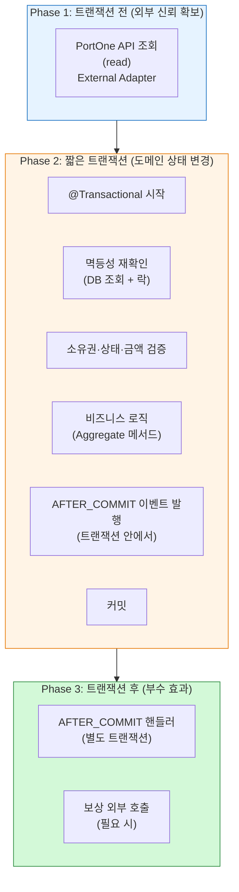

## Transaction Topology (tx-topology)

# Transaction Topology (tx-topology) — Part 1/2: 정책과 메커니즘

> 이 문서는 본 시스템의 **트랜잭션 코드 패턴**을 위상 관점에서 정의한다.
`consistency-design-topology`의 *트랜잭션 결정*과 `architecture-style-topology`의 *Application Layer 경계*를 **실제 Spring 코드 수준**으로 펼친다.
Layer 2의 Area Topology에 속한다 — 본 프로젝트의 핵심 시나리오에 특화.
구체 어휘 중 *Spring 표준 어휘*(`@Transactional`, Propagation 이름 등)는 사용. 구체 클래스명·메서드명은 배제.
>
>
> **Part 1/2** (이 문서): 정책과 메커니즘 (선언·라이프사이클·경계·전파·격리·외부 호출·이벤트·락·멱등성)
> **Part 2/2**: 본 프로젝트 시나리오와 운영 (6개 시나리오 패턴·다중 트랜잭션·안티패턴·self-invocation·테스트·점검·부록)
>

---

## 0. One-Line Declaration

> **트랜잭션은 Application Service의 public 메서드에서 시작하고 끝난다. 모든 외부 시스템 호출과 시간이 오래 걸리는 작업은 트랜잭션 *바깥*에 둔다. 한 유스케이스가 외부 호출을 포함하면 *트랜잭션이 여러 개로 분할*된다 — 이 분할이 본 프로젝트의 가장 자주 등장하는 패턴이다.**
>

트랜잭션은 *최대한 짧게, 명시적으로, 한 번에 한 가지*. 트랜잭션을 *무엇으로 묶을지*보다 *무엇을 빼낼지*가 더 중요한 결정.

---

## 1. 트랜잭션 라이프사이클 — 표준 결제 확정 시퀀스



**다이어그램 읽는 법**

- **Phase 1**: 외부 신뢰가 필요한 정보를 *트랜잭션 전에* 확보 (예: PortOne 결제 정보 재조회)
- **Phase 2**: *짧고 명시적인 트랜잭션*. DB 변경 + 이벤트 발행만. **외부 호출 절대 없음**.
- **Phase 3**: 부수 효과 처리. AFTER_COMMIT 이벤트 핸들러·보상 호출 등.

**이 시퀀스가 본 시스템 트랜잭션의 *원형*.** 다른 유스케이스도 변형된 형태로 이 패턴을 따름.

---

## 2. 트랜잭션 경계의 코드 위치

### 2-1. `@Transactional`은 어디에 붙는가

**원칙**: **Application Service의 public 메서드에만.**

| 위치 | 정책 |
| --- | --- |
| **Application Service public 메서드** | ✅ 표준 위치 |
| **Application Service 클래스 레벨** | 🔶 제한적 — 모든 메서드 일괄 적용 시. *명시성이 떨어져 권장 안 함* |
| **Application Service private 메서드** | ❌ 작동 안 함 (Spring AOP 제약) |
| **Domain Service** | ❌ 절대 금지 (architecture-style 5장) |
| **Aggregate / Entity** | ❌ 절대 금지 |
| **Repository** | ❌ 기본 금지 (Application이 트랜잭션 주인) |
| **Controller** | ❌ 절대 금지 (cross-cutting-concerns 6-4) |
| **Webhook Handler** | ❌ Application Service를 호출, 트랜잭션은 그 안에서 |
| **Scheduled Job** | ❌ 같음 — Application Service 호출 |

### 2-2. 메서드 레벨 vs 클래스 레벨

**메서드 레벨 권장**: 어떤 메서드가 트랜잭션인지 *코드에서 즉시 가시*. 누락 시 명확히 인지.

**클래스 레벨 회피**: 일괄 적용은 *의도되지 않은 메서드*까지 포함. private helper에 무의미하게 적용.

**예외**: Application Service의 *모든 public 메서드*가 트랜잭션이고, *읽기 전용 메서드가 없는* 경우만 클래스 레벨 OK.

### 2-3. Application Service의 메서드 구조 원칙

**한 메서드 = 한 유스케이스 = 한 트랜잭션 단위**

- 유스케이스가 *외부 호출을 포함*하면 → *여러 메서드로 분할* (각자 트랜잭션, Part 2 12장 참조)
- 한 메서드 안에서 다른 `@Transactional` 메서드를 호출하면 → self-invocation 문제 (Part 2 14장 참조)

---

## 3. 전파 정책 (Propagation)

### 3-1. 전파 종류 분류

| Propagation | 의미 | 본 프로젝트 정책 |
| --- | --- | --- |
| **REQUIRED** | 기존 트랜잭션 있으면 참여, 없으면 생성 | ✅ 기본값 |
| **REQUIRES_NEW** | 항상 새 트랜잭션 생성 (기존은 일시 중단) | 🔶 제한적 — 보상·로깅 등 |
| **NESTED** | savepoint 기반 중첩 | ❌ 사용 안 함 (복잡도) |
| **SUPPORTS** | 기존 있으면 참여, 없으면 트랜잭션 없이 | ❌ 사용 안 함 (의도 흐려짐) |
| **NOT_SUPPORTED** | 기존 일시 중단, 트랜잭션 없이 실행 | ❌ 사용 안 함 |
| **NEVER** | 트랜잭션 있으면 예외 | ❌ 사용 안 함 |
| **MANDATORY** | 트랜잭션 없으면 예외 | 🔶 제한적 — Domain 진입점 검증용 (4-3 참조) |

### 3-2. REQUIRED (기본)

**원칙**: *대부분의 Application Service 메서드는 REQUIRED*. 별도 명시 불필요 (기본값).

**작동**

- Application Service 메서드 진입 시 *트랜잭션이 없으면* 새로 시작
- 이미 트랜잭션이 있으면 *그 트랜잭션에 참여* (같은 트랜잭션 안에서 작동)
- 메서드 끝나면 *처음 시작한 곳에서만 커밋*

### 3-3. REQUIRES_NEW 사용 시점

**원칙**: *부모 트랜잭션과 독립적으로 커밋/롤백되어야 할 때만.*

**본 프로젝트 사용 예**

| 시나리오 | 이유 |
| --- | --- |
| **보상 트랜잭션 기록** | 부모가 롤백되어도 보상 로그는 남아야 함 |
| **운영 감사 로그** | 비즈니스 트랜잭션 실패해도 감사 기록은 보존 |
| **외부 호출 결과 기록** | 외부 호출 후 그 결과를 별도 트랜잭션으로 영속화 |

**주의**: REQUIRES_NEW는 *데드락 위험*. 같은 자원에 부모 트랜잭션과 새 트랜잭션이 동시 접근하면 자기-데드락.

### 3-4. MANDATORY의 제한적 사용

**원칙**: *반드시 트랜잭션 안에서 호출되어야 하는 메서드*를 명시.

**사용 예**

- Domain 메서드 진입점에 적용해 *트랜잭션 누락을 즉시 발견*
- 명세상 *트랜잭션 외부에서 호출되면 안 되는* 메서드

**효과**: 트랜잭션 없이 호출 시 `IllegalTransactionStateException` 발생. silent 실패 차단.

---

## 4. 격리 수준 (Isolation Level)

### 4-1. 본 프로젝트 기본 격리

**기본**: **READ_COMMITTED** (Spring 기본 + MySQL 기본).

**근거**

- 결제 도메인의 대부분 작업이 READ_COMMITTED로 충분
- 더 높은 격리(SERIALIZABLE 등)는 동시성 폭락
- *부족한 격리는 락으로 보완* — 비관적 락이 격리 격상보다 정밀

### 4-2. 격리 격상 영역

다음 영역에서만 *명시적 격상* 고려:

| 영역 | 격상 여부 | 대안 |
| --- | --- | --- |
| **재고 차감** | ❌ READ_COMMITTED + 비관적 락 | 락으로 충분 |
| **포인트 잔액** | ❌ READ_COMMITTED + 비관적 락 | 락으로 충분 |
| **결제 확정** | ❌ READ_COMMITTED + 멱등성 + 낙관적 락 | 위 조합으로 충분 |
| **(가상) 잔액 합산 정합성 검증 배치** | 🔶 REPEATABLE_READ 고려 | 일관 스냅샷 필요 시 |

**원칙**: *격리 격상 전에 락 정책 재검토*. 격리는 *대규모 범위*에 영향, 락은 *특정 자원*에만. 후자가 정밀.

---

## 5. readOnly와 타임아웃

### 5-1. readOnly 트랜잭션

**원칙**: 읽기 전용 작업에는 *반드시* `@Transactional(readOnly = true)` 명시.

**효과**

- Hibernate가 *flush 생략* — 성능 향상
- 변경 감지(dirty checking) 생략
- DB 레벨 read-only 최적화 가능 (read replica 라우팅 등)

**적용 영역**

- Query Service의 모든 조회 메서드
- Application Service의 *조회 전용* 유스케이스
- 통계·리포트 조회

**주의**

- *읽기 전용 안에서 쓰기 발생 시 예외* — silent 변경 방지
- *flush 안 함*은 변경 안 됨이 아니라 *flush 생략* — 사고 시점이 다름

### 5-2. 트랜잭션 타임아웃

**원칙**: *기본 타임아웃 사용*. 명시적 타임아웃은 *특정 영역*에만.

**기본 타임아웃 정책**

- 일반 Application Service 메서드: 30초 (Spring 기본 충분)
- *DB 락이 길게 잡힐 가능성*이 있으면 명시적 단축

**타임아웃 명시 권장 영역**

| 영역 | 권장 타임아웃 |
| --- | --- |
| 결제 확정 트랜잭션 | 10초 (락 hold time 최소화) |
| 환불 트랜잭션 | 15초 (다중 자원 락) |
| 재고 차감 | 5초 (짧고 빠르게) |
| 일반 조회 (`readOnly`) | 30초 또는 미명시 |
| Scheduled Job 본문 | 명시적 짧게 (다음 실행 전 끝나야) |

**원칙**: *외부 호출이 트랜잭션 안에 있으면 안 됨* (7장). 따라서 타임아웃은 *DB 작업 시간만* 고려.

---

## 6. 롤백 정책

### 6-1. RuntimeException은 자동 롤백

**기본**: `@Transactional`은 *RuntimeException 및 Error 발생 시 자동 롤백*.

**Checked Exception은 기본 롤백 안 함** — 그러나 본 프로젝트는 *Checked Exception 사용 안 함* (error-handling-topology 3장). 그래서 이 차이가 사실상 문제 안 됨.

### 6-2. rollbackFor / noRollbackFor 사용 정책

**원칙**: *기본 정책으로 충분*. 명시적 지정은 *예외적*.

**rollbackFor 사용 안 함** — 본 프로젝트는 Checked Exception 없음.

**noRollbackFor 사용 영역** — *특정 예외에서는 롤백하지 않고 진행*하고 싶을 때.

| 사용 예 | 시나리오 |
| --- | --- |
| **부분 처리 허용** | 일부 작업 실패해도 나머지는 커밋 (예: 알림 발송 실패가 결제 막지 않음) |
| **운영 로그 무관 처리** | 로그 기록 실패가 비즈니스 로직 막지 않음 |

**주의**: noRollbackFor는 *의도된 부분 실패*에만. *모르고 사용하면 부분 일관성 사고*.

### 6-3. 명시적 롤백 (TransactionStatus.setRollbackOnly())

**원칙**: *예외 던지지 않고 롤백하고 싶을 때만*. 거의 사용 안 함.

**사용 예**: 비즈니스 검증 실패 시 *예외 없이 결과 객체로* 응답하면서 DB 롤백 필요한 경우.

**권장**: *대부분의 경우 예외 throw가 더 명확*. 명시적 롤백은 예외적 패턴.

---

## 7. 트랜잭션과 외부 호출의 결합 — 핵심 패턴

### 7-1. 절대 원칙: 트랜잭션 안에서 외부 시스템 호출 금지

**근거** (이미 박힘)

- consistency-design 7-1: DB 커밋 vs 외부 호출 순서
- 트랜잭션 안에 외부 호출 → 락 hold time 폭증 → 동시성 폭락
- 외부 호출 실패 시 *DB 롤백 + 외부는 어떻게 됐는지 모름* 상태

### 7-2. 외부 호출 위치 분류

| 외부 호출 시점 | 트랜잭션과의 관계 | 본 프로젝트 사용 |
| --- | --- | --- |
| **트랜잭션 전 (Phase 1)** | 트랜잭션 시작 전 | ✅ 외부 정보 조회 (read) |
| **트랜잭션 후 (Phase 3)** | 트랜잭션 커밋 후 | ✅ 부수 효과·보상 |
| **AFTER_COMMIT 이벤트** | 별도 트랜잭션 또는 트랜잭션 없이 | ✅ 비동기 처리 |
| **트랜잭션 안 (Phase 2)** | 같은 트랜잭션 | ❌ **금지** |
| **REQUIRES_NEW로 분리한 새 트랜잭션 안** | 외부 호출 + DB | 🔶 매우 제한적 — 외부 호출 결과 영속화 |

### 7-3. 외부 호출 + DB 변경의 표준 시퀀스

**Read-then-Write 패턴** (결제 확정 표준)

```
Phase 1: 외부 read (트랜잭션 전)
  → PortOne API 조회 → 결제 정보 획득

Phase 2: 트랜잭션 (짧고 명확)
  → 멱등성 검사
  → 검증 (소유권·상태·금액)
  → DB 변경
  → AFTER_COMMIT 이벤트 발행
  → 커밋

Phase 3: 부수 효과 (트랜잭션 후)
  → AFTER_COMMIT 이벤트 핸들러 실행
  → 보상 외부 호출 (필요 시)
```

**Write-then-Compensate 패턴** (환불 표준)

```
Phase 1: 트랜잭션 1 (환불 기록 생성)
  → 환불 요청 INSERT
  → 상태 = PENDING
  → 커밋

Phase 2: 외부 호출 (PG 취소 API)
  → 트랜잭션 밖에서 호출
  → 결과 수신

Phase 3: 트랜잭션 2 (결과 반영)
  → 환불 상태 = SUCCESS 또는 FAILED
  → 관련 자원 갱신 (포인트 복구·재고 복구·주문 상태)
  → 커밋
```

**Pre-Allocate-then-Confirm 패턴** (주문 생성)

```
Phase 1: 트랜잭션 1 (사전 등록)
  → 주문 INSERT (status = AWAITING_PAYMENT)
  → Payment 사전 등록 (portonePaymentId 채번)
  → 재고 선차감
  → 커밋

Phase 2: 클라이언트가 portonePaymentId로 결제창 호출
  → (시스템 외부, 사용자 행동)

Phase 3: 결제 확정 (별도 유스케이스 — Read-then-Write 패턴)
```

---

## 8. AFTER_COMMIT 이벤트와 트랜잭션

### 8-1. 표준 메커니즘

**구조**

- 트랜잭션 *안*에서 `ApplicationEventPublisher.publishEvent(...)` 호출
- 이벤트 리스너는 `@TransactionalEventListener(phase = TransactionPhase.AFTER_COMMIT)` 어노테이션
- 트랜잭션이 *커밋되면 리스너 실행*
- 리스너는 *별도 컨텍스트*에서 실행

### 8-2. AFTER_COMMIT 리스너의 트랜잭션 정책

**옵션 1: 리스너 자체에 트랜잭션 없음**

- 단순 외부 호출만 하는 경우
- 부수 효과 작업

**옵션 2: 리스너에 REQUIRES_NEW 트랜잭션**

- 별도 DB 변경이 필요한 경우
- 부모 트랜잭션과 독립적으로 커밋/롤백

**원칙**: *기본은 옵션 1*. DB 변경이 필요하면 옵션 2.

### 8-3. AFTER_COMMIT 리스너의 실패 처리

**원칙**: 리스너 실패가 *부모 트랜잭션을 무효화하지 않음*. 부모는 이미 커밋됨.

**대응**

- 리스너 안에서 *명시적 try-catch* — 실패 시 로그·알림
- 보상이 필요하면 *별도 보상 로직* 트리거
- 재시도 가능한 작업은 *AOP 또는 명시적 retry*

**주의**: 리스너에서 *원본 트랜잭션 정보가 필요한 작업*은 *이벤트 페이로드에 포함*. 부모 트랜잭션의 영속성 컨텍스트는 *이미 닫힘*.

### 8-4. 이벤트 발행 시점

**원칙**: *이벤트 발행은 항상 트랜잭션 안*. 발행이 트랜잭션 밖에 있으면 *트랜잭션 롤백되어도 이벤트가 발행*되어 정합성 사고.

**구체 패턴**: Aggregate가 자기 상태 변경 메서드 안에서 *이벤트를 발행*하는 패턴 (Domain Event). Application Service가 *그것을 publishEvent로 외부에 전파*.

---

## 9. 트랜잭션과 락의 결합

### 9-1. 락 획득 시점

**원칙**: *트랜잭션 시작 직후, 다른 작업 전에 락 획득*.

**비관적 락 패턴**

```
1. 트랜잭션 시작
2. SELECT FOR UPDATE → 자원 락 획득
3. 검증 + 비즈니스 로직
4. UPDATE
5. 커밋 (락 해제)
```

**낙관적 락 패턴**

```
1. 트랜잭션 시작
2. SELECT → 자원 조회 (version 포함)
3. 검증 + 비즈니스 로직
4. UPDATE WHERE version = ? → 충돌 시 OptimisticLockException
5. 커밋 또는 충돌 시 롤백 + 재시도
```

### 9-2. 락 hold time 최소화 원칙

**원칙**: *락 안에서 외부 호출 절대 금지* (7-1과 같은 이유).

**규칙**

1. 락 안에서 외부 호출 금지
2. 락 안에서 느린 작업 금지 (대량 조회·복잡한 계산)
3. 락 hold time = 트랜잭션 시간 ≤ 짧음
4. 락 획득 후 *최단 경로로* 작업 완료 후 커밋

### 9-3. 다중 자원 락의 순서

**원칙**: *항상 같은 순서*로 락 획득 (consistency-design 6-3).

**본 프로젝트 표준 순서**: Order → Payment → Point → Inventory

이 순서를 *코드 리뷰에서 강제*. 어기는 코드는 데드락 위험.

### 9-4. 트랜잭션과 락의 충돌

**시나리오**: 비관적 락 획득 후 *외부 호출이 필요하다고 발견*했을 때.

**잘못된 패턴**

```
@Transactional
public void confirm() {
    var payment = paymentRepo.findByIdForUpdate(id);  // 락 획득
    var portoneInfo = portoneClient.fetch(...);        // ❌ 락 안에서 외부 호출
    payment.confirm(portoneInfo);
}
```

**올바른 패턴**

```
// 외부 호출 먼저 (트랜잭션 전)
var portoneInfo = portoneClient.fetch(...);

// 그 다음 트랜잭션
@Transactional
public void confirm(PortoneInfo info) {
    var payment = paymentRepo.findByIdForUpdate(id);  // 락 획득
    payment.confirm(info);
    // 락 짧게 해제
}
```

---

## 10. 트랜잭션과 멱등성의 결합

### 10-1. 이중 검사 패턴 (idempotency-design 8-2 적용)

**핵심**: *트랜잭션 전 검사 + 트랜잭션 안 재확인*.

**Phase 1 (트랜잭션 전): 빠른 거부**

- 멱등 키 사전 조회
- 이미 처리됨이면 바로 응답 (외부 호출 비용 절감)
- *race 가능성 있음*

**Phase 2 (트랜잭션 안): race-safe 보장**

- 트랜잭션 시작
- 멱등 키 재조회 *with 락* (`SELECT FOR UPDATE`)
- 또는 DB UNIQUE 제약 + INSERT 시도
- 동시 진입한 경우 두 번째는 여기서 차단

### 10-2. UNIQUE 제약을 활용한 멱등성

**패턴**

```
@Transactional
public void process(String idempotencyKey) {
    try {
        record = new IdempotencyRecord(idempotencyKey);
        repo.save(record);  // UNIQUE 위반 시 예외
    } catch (DataIntegrityViolationException e) {
        // 이미 처리됨 — Idempotent response
        return existingResult(idempotencyKey);
    }
    // 처리 진행
}
```

**원칙**: DB UNIQUE 제약이 *race-safe S+급 보장*. 트랜잭션과 결합하면 가장 강력한 멱등성.

### 10-3. 멱등성과 외부 호출

**시나리오**: 외부 호출 후 DB 업데이트인데, 멱등성 키가 있을 때.

**올바른 패턴**

```
1. (트랜잭션 전) 멱등 키로 사전 조회 → 이미 처리됨이면 바로 응답
2. (트랜잭션 전) 외부 호출 (PortOne 등) — 외부 시스템 자체도 멱등 보장
3. @Transactional 시작
4. (트랜잭션 안) 멱등 키 재조회 + 락 — 동시 진입 차단
5. 외부 호출 결과 + DB 변경
6. 커밋
```

**원칙**: *외부 시스템 멱등 보장 + 우리 측 트랜잭션 안 멱등 검사 = 이중 안전망*.

# Transaction Topology (tx-topology) — Part 2/2: 본 프로젝트 시나리오와 운영

---

## 11. 본 프로젝트의 핵심 트랜잭션 시나리오

각 시나리오를 패턴으로 박제. 새 유스케이스 도입 시 *이 중 어느 패턴인지* 분류.

### 11-1. 주문 생성 (Pre-Allocate 패턴)

**전체 흐름**: 단일 트랜잭션 + 외부 호출 없음

```
@Transactional
public OrderCreatedResponse createOrder(...) {
    // 1. 사용자·상품 검증 (Application Service)
    // 2. 비관적 락: 재고 차감 (Product context)
    // 3. Order Aggregate 생성 (with OrderItems, snapshot)
    // 4. Payment 사전 등록 (portonePaymentId 채번)
    // 5. Cart 비움
    // 6. 커밋 → 자동으로 트랜잭션 종료
    return response;
}
```

**특징**

- 외부 호출 없음 → 단일 트랜잭션 충분
- 여러 컨텍스트 자원 잠금 → 락 순서 표준 적용
- 재고·Order·Payment·Cart 모두 같은 트랜잭션 안에서 변경

**Zone (consistency-design 3-2)**: TX-bound

### 11-2. 결제 확정 — Confirm API 경로 (Read-then-Write 패턴)

**전체 흐름**: 외부 read → 짧은 트랜잭션 → AFTER_COMMIT 이벤트

```
public PaymentConfirmedResponse confirmPayment(String portonePaymentId) {
    // Phase 1: 트랜잭션 전 - 외부 신뢰 확보
    portoneInfo = portoneClient.fetch(portonePaymentId);  // 외부 API

    // Phase 2: 짧은 트랜잭션
    return doConfirmInTransaction(portonePaymentId, portoneInfo);
}

@Transactional
private PaymentConfirmedResponse doConfirmInTransaction(...) {
    // 1. 멱등성 재확인 (with 락)
    // 2. 검증 (소유권·상태·금액)
    // 3. Payment Aggregate 메서드 호출 → 상태 변경
    // 4. Order 상태 갱신
    // 5. Point 적립 (PointBalance + PointTransaction)
    // 6. AFTER_COMMIT 이벤트 발행 (PaymentConfirmed)
    // 7. 커밋
    return response;
}

@TransactionalEventListener(phase = AFTER_COMMIT)
public void handle(PaymentConfirmed event) {
    // Phase 3: 부수 효과
    // - Membership 누적 갱신 (Event-converged zone)
    // - 알림 발송
}
```

**self-invocation 주의**: 위 코드는 *같은 클래스의 다른 메서드를 호출*하므로 self-invocation 문제 가능 (14장). *Phase 1·2를 별도 클래스로 분리*하거나 *외부 호출을 외부 메서드에서 먼저 수행*.

### 11-3. 결제 확정 — Webhook 경로

**핵심**: Confirm API 경로와 *같은 도메인 서비스*를 호출 (consistency-design 7-3).

```
public void handleWebhook(WebhookPayload payload) {
    // Phase 0: 서명 검증 (트랜잭션 외부)
    verifyHmac(payload);

    // Phase 1: 페이로드에서 portonePaymentId 추출 + 재조회
    portoneInfo = portoneClient.fetch(payload.portonePaymentId);

    // Phase 2: 같은 도메인 서비스 호출 (Confirm API와 공유)
    paymentDomainService.confirmIfNotYet(payload.portonePaymentId, portoneInfo);
    // 멱등 처리 → 이미 처리됨이면 silent OK

    // Phase 3: AFTER_COMMIT 이벤트는 자동
    return webhookOkResponse();
}
```

**원칙**: Confirm API와 Webhook이 *다른 진입점이지만 같은 트랜잭션 로직*. 분기는 *진입점*에서만, 트랜잭션 안은 공유.

### 11-4. 환불 (Write-then-Compensate 패턴)

**전체 흐름**: 트랜잭션 1 (기록) → 외부 호출 → 트랜잭션 2 (반영)

```
public RefundResponse requestRefund(RefundRequest req) {
    // 트랜잭션 1: 환불 요청 기록
    refundId = recordRefundRequest(req);  // @Transactional

    // 외부 호출 (트랜잭션 밖)
    try {
        pgResult = portoneClient.cancel(req);
    } catch (Exception e) {
        markRefundFailed(refundId, e);  // @Transactional 2
        throw new RefundFailedException(...);
    }

    // 트랜잭션 2: 결과 반영
    finalizeRefund(refundId, pgResult);  // @Transactional
}

@Transactional
private Long recordRefundRequest(RefundRequest req) {
    // 1. 잔여 환불 가능 수량 검증 (with 락)
    // 2. Refund Aggregate 생성 (status = PENDING)
    // 3. 커밋
    return refundId;
}

@Transactional
private void finalizeRefund(Long refundId, PgResult result) {
    // 1. Refund 조회 + 상태 변경 (SUCCESS or FAILED)
    // 2. Order 상태 갱신 (부분/전액 환불)
    // 3. Point 복구 (사용분 반환·적립분 차감)
    // 4. 재고 복구
    // 5. AFTER_COMMIT 이벤트 발행
    // 6. 커밋
}
```

**원칙**: 환불 *기록*과 *반영*이 분리. 외부 호출 실패 시 *기록은 남고 상태가 FAILED*로 진화. 부분 실패 가능성을 trace로.

### 11-5. 구독 정기 결제 — Scheduled Job (도전 기능)

**전체 흐름**: 활성 구독 조회 → 각각 결제 처리 → 결과 반영

```
@Scheduled(...)
public void processSubscriptionBilling() {
    // 트랜잭션 없이 — 활성 구독 ID 목록만 조회
    var subscriptionIds = subscriptionQueryService.findDueBillings();

    for (var id : subscriptionIds) {
        try {
            processOne(id);  // 각각 독립 처리
        } catch (Exception e) {
            log.error("Billing failed for {}", id, e);
            // 다음 구독으로 진행
        }
    }
}

public void processOne(Long subscriptionId) {
    // 멱등성: (subscriptionId, billing_cycle) UNIQUE

    // 트랜잭션 전: 구독 정보 조회
    sub = subscriptionQueryService.findById(subscriptionId);

    // 외부 호출: PortOne 빌링키 결제 요청
    pgResult = portoneClient.billingPay(sub.billingKey, sub.amount);

    // 트랜잭션: 결과 반영
    recordBillingResult(subscriptionId, pgResult);  // @Transactional
}

@Transactional
private void recordBillingResult(...) {
    // UNIQUE 위반 시 → 이미 처리됨, silent skip
    // 정상 시 → SubscriptionBilling INSERT + Subscription 상태 갱신
    // 커밋
}
```

**원칙**

- Scheduled Job 본문에 `@Transactional` 금지 — 전체가 한 트랜잭션이 되어 락 hold 폭증
- 각 구독을 *독립적으로* 처리. 한 실패가 다른 진행 막지 않음
- 멱등성으로 *동시 실행* 또는 *재실행* 안전

### 11-6. 포인트 사용/적립

**원칙**: *결제 확정의 일부로 처리*. 별도 트랜잭션 아님.

**위치**: `confirmPayment` 트랜잭션 안에서:

- PointBalance UPDATE (비관적 락) — 잔액 갱신
- PointTransaction INSERT — append-only 원장

**Zone**: TX-bound (결제 확정 zone에 흡수).

### 11-7. 재고 차감/복구

**원칙**: *주문 생성 / 주문 취소 / 환불 트랜잭션의 일부*. 별도 트랜잭션 아님.

**락**: 비관적 락 (`SELECT FOR UPDATE`).

**원칙**: 재고 차감과 주문 생성이 *같은 트랜잭션*이어야 함. 분리되면 *재고 차감 후 주문 생성 실패 시 재고 누락*.

---

## 12. 다중 트랜잭션 패턴 (보상)

### 12-1. 왜 단일 트랜잭션으로 해결 안 되는가

**근본 이유**: *외부 시스템 호출은 트랜잭션 안에 못 둠*. 따라서 외부 호출이 있는 유스케이스는 *반드시 다중 트랜잭션*.

### 12-2. Saga 패턴 (간단 버전)

본 프로젝트는 *간단한 2-3 단계 보상*만 사용. 본격 Saga 프레임워크 도입 안 함.

**기본 형태**

```
Step 1 (Transaction 1): 사전 기록 또는 자원 예약
Step 2 (External Call): 외부 호출
Step 3 (Transaction 2): 결과 반영 또는 보상

실패 시:
  Step 2 실패 → Step 1 보상 (별도 트랜잭션)
  Step 3 실패 → Step 2 보상 + Step 1 보상
```

### 12-3. 보상 트랜잭션의 멱등성

**원칙**: 보상도 *멱등*이어야 함. 보상 호출 자체가 재시도될 수 있음.

**예**: PG 취소 호출은 멱등 (PortOne 보장). 우리 측 환불 상태 변경도 *상태 기반 멱등*으로 처리.

### 12-4. 보상 실패 시 처리

**원칙**: *자동 재시도 N회 후 운영 알림*. 완전 자동 회복은 어려움.

**구체**

1. 보상 호출 시도
2. 실패 시 exponential backoff로 재시도 (최대 N회)
3. 모두 실패 → *수동 개입 대상*으로 마킹 + 알림
4. 운영자가 *별도 도구로 정정*

---

## 13. 안티패턴

### 13-1. 트랜잭션 안에서 외부 호출

**증상**: `@Transactional` 메서드 안에서 PortOne API 호출.

**왜 위험한가**

- 락 hold time 폭증
- 외부 응답 못 받으면 *DB는 어떻게 됐는지 모름*
- 외부 호출 실패 시 *부분 일관성*

**대응**: 외부 호출을 *트랜잭션 전·후*로 분리 (Part 1 7장 패턴).

### 13-2. 한 트랜잭션이 너무 많은 자원 만짐

**증상**: 한 메서드가 5개 이상 컨텍스트의 자원을 변경.

**왜 위험한가**

- 트랜잭션 시간 폭증
- 락 충돌 가능성 폭증
- 데드락 위험

**대응**

- 비즈니스 *불변식 단위*로 트랜잭션 크기 결정
- 부수 효과는 AFTER_COMMIT 이벤트로 분리

### 13-3. private 메서드에 @Transactional

**증상**: Spring AOP가 *프록시 기반*이라 private 메서드 어노테이션 작동 안 함.

**문제**: silent 실패 — 트랜잭션 없이 실행되는데 컴파일·테스트에서 안 잡힘.

**대응**: `@Transactional`은 *public 메서드*에만. private에 붙은 어노테이션은 *무의미한 noise*.

### 13-4. self-invocation으로 트랜잭션 무력화

**증상**: 같은 클래스의 다른 `@Transactional` 메서드를 *this로 호출* → AOP 우회 → 트랜잭션 작동 안 함.

**14장 참조.**

### 13-5. readOnly 누락

**증상**: 읽기 전용 작업에 `readOnly = true` 누락.

**왜 손실인가**

- Hibernate flush 수행 → 불필요한 dirty checking
- read replica 라우팅 불가
- 성능 손실

**대응**: 조회 전용 메서드에 *항상* `readOnly = true`.

### 13-6. Controller·Domain에 @Transactional

**증상**: 트랜잭션 경계 결정 위반.

**대응**: cross-cutting-concerns 6-1, 6-4 참조.

### 13-7. 이벤트 발행을 트랜잭션 밖에서

**증상**: `applicationEventPublisher.publishEvent(...)`를 트랜잭션 *밖*에서 호출.

**문제**: 트랜잭션 롤백되어도 이벤트가 *이미 발행됨* → 후속 처리가 안 일어났어야 할 일을 함.

**대응**: 이벤트 발행은 *트랜잭션 안*에서. 처리는 AFTER_COMMIT 리스너로 자동 지연.

### 13-8. AFTER_COMMIT 리스너에서 부모 트랜잭션 영속성 가정

**증상**: AFTER_COMMIT 리스너가 *이벤트의 Entity 참조*에서 lazy 필드를 접근.

**문제**: 부모 트랜잭션 *이미 닫힘* → LazyInitializationException.

**대응**: 이벤트 페이로드에 *필요한 모든 정보를 명시 포함* (ID만이 아니라 값도). 또는 리스너에서 새로 조회.

### 13-9. Scheduled Job 전체에 @Transactional

**증상**: `@Scheduled` 메서드 자체에 `@Transactional` 적용.

**문제**: 모든 항목 처리가 *하나의 트랜잭션* → 락 hold 폭증, 한 실패가 전체 롤백.

**대응**: Scheduled 메서드는 *조율 역할*. 각 항목 처리만 트랜잭션.

---

## 14. self-invocation 문제

### 14-1. 문제 시나리오

Spring AOP는 *프록시 기반*. 외부에서 호출되어야 AOP 어드바이스(트랜잭션 시작 등)가 적용됨.

```
class PaymentService {
    public void publicMethod() {
        this.transactionalMethod();  // ❌ self-invocation, AOP 우회
    }

    @Transactional
    public void transactionalMethod() {
        // 트랜잭션 시작 안 됨
    }
}
```

이건 *@Transactional뿐 아니라 모든 Spring AOP에 해당* — `@Cacheable`, `@Async`, `@Retryable` 등.

### 14-2. 해결 방안

**방안 1: 클래스 분리 (권장)**

- 두 메서드를 *다른 클래스*로 분리
- 외부 호출과 트랜잭션 메서드를 *다른 컴포넌트*로

**방안 2: Self-injection**

- 자기 자신을 의존성 주입 (proxy 받음)
- `applicationContext.getBean(self)` 또는 lazy `@Resource`
- *권장 안 함* — 코드가 헷갈림

**방안 3: AspectJ 사용**

- 컴파일 타임 위빙 — self-invocation도 잡힘
- *권장 안 함* — 학습·빌드 비용 (cross-cutting-concerns 4-4)

### 14-3. 본 프로젝트 표준: 방안 1

**구체 패턴**

| 외부 호출이 있는 유스케이스 | 분리 방식 |
| --- | --- |
| **Application Service (조율)** | 외부 호출 + 트랜잭션 메서드 호출 |
| **Application Service (트랜잭션)** | `@Transactional` 메서드만 가짐 |

또는

| 컴포넌트 | 역할 |
| --- | --- |
| **Use Case Orchestrator** | 외부 호출 + 트랜잭션 메서드 호출 |
| **Transactional Service** | DB 작업만, `@Transactional` 메서드 |

**원칙**: 외부 호출과 트랜잭션을 *같은 클래스에 두지 않음*. self-invocation 자체를 피함.

---

## 15. 테스트와 트랜잭션

### 15-1. 통합 테스트의 트랜잭션

**원칙**: 통합 테스트에 `@Transactional` 적용 시 *자동 롤백*. DB 정리 자동.

**주의**

- AFTER_COMMIT 리스너가 *작동 안 함* (테스트가 롤백되므로 커밋 안 됨)
- AFTER_COMMIT 리스너 테스트는 별도 패턴 (TestTransaction 등)

### 15-2. 테스트에서 트랜잭션 분리 검증

**원칙**: *외부 호출과 DB 트랜잭션의 분리*를 통합 테스트로 검증.

**방법**: PortOne client를 mock으로 두고 *호출 시점이 트랜잭션 외부*임을 검증.

### 15-3. 동시성 테스트

**원칙**: 락·멱등성·트랜잭션 동시성은 *통합 테스트에서 다중 스레드*로 검증.

**예**: 같은 멱등 키로 동시 호출 → 한 번만 처리됨 검증.

---

## 16. 위반 감지

| 감지 방식 | 적용 |
| --- | --- |
| **ArchUnit** | `@Transactional`이 Application Layer 외부에 있는지 검출 |
| **ArchUnit** | Domain Layer에 트랜잭션 관련 import 검출 |
| **정적 분석** | self-invocation 패턴 검출 |
| **통합 테스트** | 트랜잭션 동작·롤백·이벤트 발행 |
| **부하 테스트 (운영 후)** | 락 hold time·트랜잭션 길이 |

**현재 단계 적용**

- ArchUnit으로 `@Transactional` 위치 자동 검증 — 가장 critical
- 통합 테스트로 핵심 시나리오 (결제 확정·환불·구독) 검증
- self-invocation은 *PR 리뷰*로 잡음 (정적 분석은 미래)

---

## 17. 이 topology가 다루지 않는 것

| 다루지 않는 것 | 어디에 있는가 |
| --- | --- |
| 트랜잭션 zone 분류 (TX-bound vs Event-converged) | `consistency-design-topology` 3장 |
| 락 전략의 의사결정 | `consistency-design-topology` 6장 |
| 멱등성 키의 출처·메커니즘 | `idempotency-design-topology` |
| 외부 호출 결과 검증·재조회 | `trust-design-topology` |
| 도메인 이벤트 카탈로그 | `event-topology` (예정) |
| 분산 트랜잭션 (XA, 2PC) | 본 프로젝트 범위 외 |
| Saga 프레임워크 (Axon, Eventuate) | 본 프로젝트 범위 외 |
| 격리 수준의 SQL 표준 의미 | DB 운영 가이드 + 외부 자료 |

---

## 18. 자가 점검 질문

1. `@Transactional`이 Application Service 외의 레이어에 붙어 있는가?
2. private 메서드에 `@Transactional`이 붙어 있는가?
3. 트랜잭션 안에서 *외부 시스템 호출*이 일어나는 코드가 있는가?
4. 트랜잭션 안에서 *느린 작업* (대량 조회·복잡한 계산)이 일어나는가?
5. 조회 전용 메서드에 `readOnly = true`가 누락되어 있는가?
6. self-invocation으로 *트랜잭션 무력화*되는 코드가 있는가?
7. 같은 클래스에 *외부 호출 메서드*와 *트랜잭션 메서드*가 공존하는가?
8. AFTER_COMMIT 리스너가 *부모 트랜잭션 영속성*을 가정하고 있는가? (Lazy 접근)
9. 이벤트 발행이 *트랜잭션 밖*에서 일어나는가?
10. Scheduled Job 본문 전체에 `@Transactional`이 적용되어 있는가?
11. 다중 자원 락의 *순서가 통일*되어 있는가? (Order → Payment → Point → Inventory)
12. 보상 트랜잭션이 *멱등*인가? 실패 시 처리는?
13. 한 트랜잭션이 *5개 이상 컨텍스트*의 자원을 변경하는가?
14. REQUIRES_NEW가 *의도된 위치*에만 사용되는가? 남용은 아닌가?
15. 11장의 패턴 6개 중 *어떤 패턴*에 속하는지 새 유스케이스가 분류되는가?

---

## 19. 변경 정책

이 문서는 Layer 2 Area Topology다. 트랜잭션 코드 패턴은 비교적 안정적이지만 새 시나리오 추가 시 갱신.

- **자유롭게 변경 가능**: 자가 점검 질문, 다이어그램 시각 표현, 안티패턴 표현 디테일
- **PR 게이트 통과 필요**: 새 유스케이스가 어느 패턴(11장)에 속하는지 명시, 시나리오 카탈로그 갱신
- **ADR 필요**: 새 Propagation 패턴 도입 (NESTED 등), 격리 수준 격상, AspectJ 도입, Saga 프레임워크 도입, REQUIRES_NEW 적용 영역 확대
- **거의 발생 안 함**: "트랜잭션은 Application Service만", "외부 호출은 트랜잭션 외부", 6개 시나리오 패턴, self-invocation 회피 원칙

---

## 부록 A: 이 문서가 구현하는 가치

`system-value-topology`의 다음 가치와 결합:

- **정합성 (Tier 1)**: 트랜잭션의 atomic 보장. 외부 호출 분리로 *부분 실패 명시화*. 락 정책으로 동시성 정합성.
- **신뢰 (Tier 1)**: 트랜잭션 안 검증 + 멱등성 결합으로 *위변조 입력 차단*.
- **멱등성 (Tier 1)**: 트랜잭션 안 재확인 + DB UNIQUE 제약 = S+급 멱등성.
- **추적성 (Tier 1)**: 보상 패턴의 *기록 먼저 + 결과 반영* — 모든 단계 영속화.
- **명료성 (Tier 2)**: 6개 시나리오 패턴으로 *새 유스케이스 분류 가능*. 트랜잭션 결정 비용 절감.
- **복잡도 관리 (Tier 2)**: 트랜잭션 작게 유지 원칙. 외부 호출 분리로 영향 지역화.

---

## 부록 B: 다른 Topology와의 관계

**Consistency Design Topology — 가장 직접적 관계**

- 본 문서는 consistency-design의 *코드 패턴화*
- consistency-design 3장 Zone 매핑 → 본 문서 11장 시나리오 패턴
- consistency-design 6장 락 정책 → 본 문서 Part 1 9장 트랜잭션-락 결합
- consistency-design 7-1 DB 커밋 vs 외부 호출 → 본 문서 Part 1 7장 전체

**Idempotency Design Topology**

- idempotency-design 8장 트랜잭션 결합 → 본 문서 Part 1 10장 트랜잭션-멱등성
- idempotency-design 5-2 메커니즘 (S+급) → 본 문서 Part 1 10-2 UNIQUE 패턴

**Architecture Style Topology**

- architecture-style 5장 Invariant → 본 문서 Part 1 2장 위치 결정
- architecture-style 4-5 Application 책임 → 본 문서 Part 1 2-3 메서드 구조 원칙

**Cross-Cutting Concerns Location Topology**

- cross-cutting 3-3 트랜잭션 → 본 문서 Part 1 2장의 추상 결정을 코드로
- cross-cutting 6-4 Controller 트랜잭션 안티패턴 → 본 문서 13-6

**Error Handling Topology**

- error-handling 5장 RuntimeException 정책 → 본 문서 Part 1 6-1 자동 롤백
- error-handling 4장 종착 처리 → 본 문서 12장 보상 트랜잭션

**FK Cascade Policy Topology**

- fk-cascade 6장 cascade 트랜잭션 결합 → 본 문서 Part 1 2장 Aggregate atomic
- fk-cascade 6-2 cascade 중 외부 호출 금지 → 본 문서 Part 1 7-1 절대 원칙

**Trust Design Topology**

- trust-design 8-1 3대 조건 검증 → 본 문서 11-2 결제 확정 시나리오
- trust-design 7-3 Webhook 재조회 → 본 문서 11-3 Webhook 경로

---

---

> **Part 1 종료. Part 2는 `tx-topology-part2.md` 참조.**
Part 2 내용: 11장 본 프로젝트 핵심 트랜잭션 시나리오 (7개 유스케이스 패턴) → 12장 다중 트랜잭션 패턴 (Saga) → 13장 안티패턴 (9개) → 14장 self-invocation 문제 → 15장 테스트와 트랜잭션 → 16장 위반 감지 → 17장 다루지 않는 것 → 18장 자가 점검 → 19장 변경 정책 → 부록 A·B (가치 매핑 + 7개 Topology와의 관계).
>